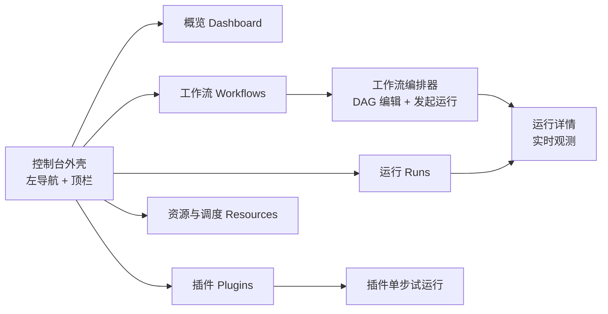
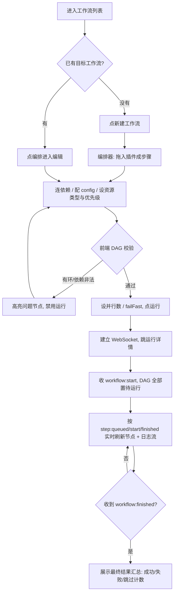
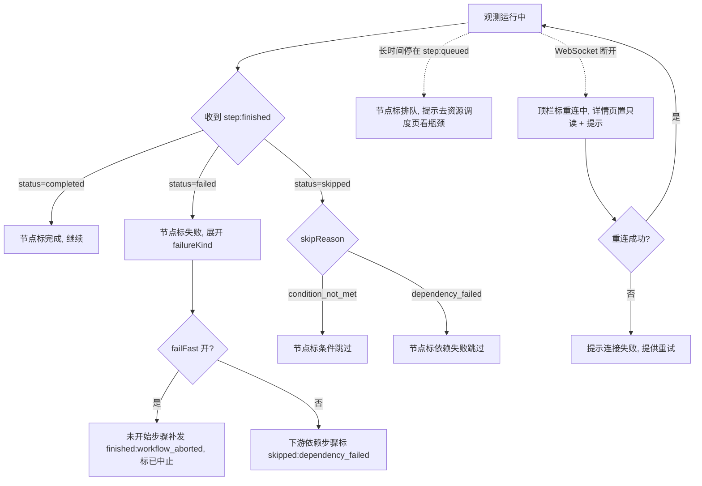
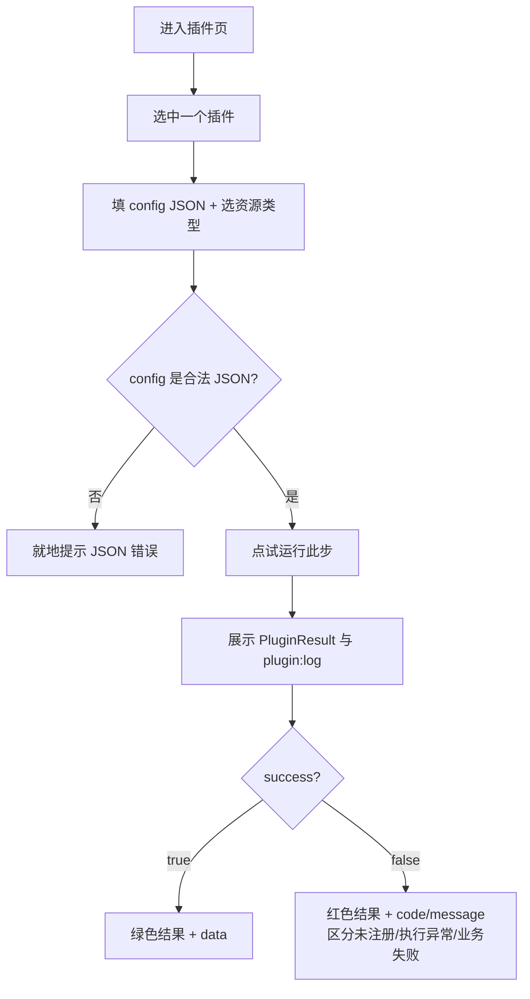

# MONAI DevOps 运维控制台 原型设计稿

> 本稿基于仓库 `README.md` 与 `packages/core-engine` 的真实领域模型撰写,描述「插件化工作流编排平台」的 Web 控制台前端原型。**只写产品 / 体验方案,不绑定具体前端框架或组件库**;线框图均为示意,不代表像素级布局。

---

## 1. 需求概述

- **目标用户**:
  - **DevOps / 平台工程师**(主):编排工作流、跑流水线、盯运行状态、排障。专业、高频、要信息密度。
  - **插件开发者**(次):验证自己写的插件能否被正确调用,关注单步执行、配置入参、`plugin:log` 日志、失败码。
- **核心场景**:
  1. 工程师把若干插件按 `dependsOn` 串成一个 DAG 工作流,设置并行度 / failFast / 资源类型,**跑一次并实时盯着每步状态和日志**。
  2. 运行出问题时,快速定位**是哪一步失败、属于哪类失败(plugin / resource / internal)、为什么被跳过**,看该步的插件日志与配置。
  3. 插件开发者注册 / 查看插件,挑一个插件**单步试运行**,确认配置与返回结果符合预期。
  4. 关注资源池占用与调度队列,理解「为什么我的步骤卡在排队没开始」。
- **要解决的痛点 / 设计目标**:
  - 目前内核能力强(DAG、调度、资源池、结构化事件),但前端只有一个 `/test` 验证页,**能力不可见、不可操作、不可观测**。
  - 让「编排 → 运行 → 观测 → 排障」形成**闭环**,把内核已经发出的 `workflow:* / step:* / plugin:log` 事件**变成人能看懂的实时界面**。
  - 排障要快:从「一次运行失败」到「定位到具体步骤的失败原因和日志」尽量不超过 2 次点击。
- **范围与边界**:
  - **本期(MVP)做**:工作流列表与编排、发起运行、运行列表、**运行详情(DAG 状态视图 + 实时事件 / 日志流)**、插件列表与单步试运行。这是把内核能力跑通成闭环的最小集合。
  - **本期不做 / 后续做**:工作流持久化与版本管理(README「后续规划」尚未落地)、表达式级 `condition`、运行中取消(`AbortSignal` 内核尚未支持)、多租户 / 权限体系、告警与通知。
- **关键约束**(来自现有实现,设计必须吻合):
  - 运行是**实时事件驱动**的:控制台通过 WebSocket 接 `{type:"event"|"done"|"error"}`,事件类型固定为 `workflow:start / step:queued / step:start / plugin:log / step:finished / workflow:finished`。**失败只发 `step:finished`(带 `failureKind`),没有单独的 error 事件**——UI 不能假设有独立错误事件。
  - 步骤三态:`completed / skipped / failed`;失败分类 `plugin / resource / internal`;跳过原因 `condition_not_met / dependency_failed / workflow_aborted`。UI 配色与文案必须能表达这套语义。
  - **并行步骤的 `step:finished` 顺序不保证**,前端需按 `runId + stepId` 聚合,不能假设顺序。
  - 调度优先级**数值越小越优先**(与直觉相反),涉及优先级输入处必须有显式说明。
  - 资源不足时步骤**挂起排队而非失败**,会停在 `step:queued`——UI 必须能表达「排队中」这个中间态,否则用户会误以为卡死。

---

## 2. 信息架构 & 页面布局

### 2.0 整体信息架构

控制台采用「左侧主导航 + 右侧内容区」的经典后台结构。一级导航对应五个核心区域,运行详情是从「运行」下钻进去的二级页面。



**导航层级**:

- **概览**:平台健康度快照(进行中运行、近期成功率、资源占用)。次要,放最前作为落地页。
- **工作流**:工作流列表 → 进入**编排器**(可视化 DAG 编辑)→ 发起运行。
- **运行**:所有运行记录列表 → 进入**运行详情**(核心观测页)。
- **插件**:已注册插件列表 → **单步试运行**(插件开发者主战场)。
- **资源与调度**:资源池占用、调度队列、并发配置可视化。

---

### 2.1 控制台外壳(全局框架)

**布局策略**:左侧固定主导航(窄,图标 + 文字),顶部全局栏放「环境标识 / 后端连接状态 / 新建工作流入口」。连接状态是这个平台的关键全局信息——所有实时数据都依赖 WebSocket,断连必须全局可见。

```
┌──────────────────────────────────────────────────────────────────────┐
│ MONAI DevOps        env: local   ● 已连接 ws        [ + 新建工作流 ]    │ ← 顶栏
├────────────┬─────────────────────────────────────────────────────────┤
│ ▣ 概览      │                                                          │
│ ▤ 工作流    │                                                          │
│ ▷ 运行      │                内容区(各页面在此渲染)                    │
│ ⊞ 插件      │                                                          │
│ ⛁ 资源调度  │                                                          │
│            │                                                          │
│────────────│                                                          │
│ ◷ 最近运行  │                                                          │
│  · demo #12 │                                                          │
│  · build #9 │                                                          │
└────────────┴─────────────────────────────────────────────────────────┘
```

**分区说明**:
- **顶栏**:左侧产品名 + 环境(local / staging…);中部 **WebSocket 连接状态**(已连接 / 重连中 / 断开),全局常驻;右侧高频动作「新建工作流」。
- **左导航**:五个一级入口;下方「最近运行」快捷区,方便从任意页一键回到正在盯的那次运行。

---

### 2.2 工作流列表

**布局策略**:典型「顶部操作 + 主列表」。列表是入口而非重点,所以保持轻;每行直接给「运行」按钮,让「想跑就跑」成为一键动作。

```
┌──────────────────────────────────────────────────────────────────────┐
│  工作流                              [搜索框 🔍]      [ + 新建工作流 ]  │
├──────────────────────────────────────────────────────────────────────┤
│  名称              步骤数  最近运行       最近状态     操作              │
│ ─────────────────────────────────────────────────────────────────────│
│  Demo Pipeline      3      2 分钟前       ● 成功      [运行] [编排] ⋮  │
│  Build & Deploy     6      1 小时前       ✕ 失败      [运行] [编排] ⋮  │
│  Nightly E2E        4      昨天           ⊘ 部分跳过   [运行] [编排] ⋮  │
│  ...                                                                    │
│                                                   [ 分页 1 2 3 > ]      │
└──────────────────────────────────────────────────────────────────────┘
```

**分区说明**:
- **顶部**:搜索(按名称即时过滤)+ 新建。
- **主列表**:每行展示工作流名、步骤数、最近运行时间与**最近状态**(成功 / 失败 / 部分跳过)。状态用图标 + 颜色双重编码(不只靠颜色,照顾可达性)。
- **操作**:`运行`(直接发起一次运行并跳到运行详情)、`编排`(进编辑器)、`⋮`(复制 / 导出 JSON / 删除)。

---

### 2.3 工作流编排器(DAG 编辑 + 发起运行)

**布局策略**:三栏——**左插件库**(可拖入的步骤来源)、**中画布**(可视化 DAG)、**右属性面板**(选中步骤的配置)。画布是核心,占最大视觉权重。顶部是运行级配置与「试运行 / 运行」。这是工程师停留最久的页面。

```
┌──────────────────────────────────────────────────────────────────────┐
│  ← Demo Pipeline      并行数[2▾] failFast[✔]  默认优先级[0]  [试运行][▶运行]│
├──────────┬───────────────────────────────────────────┬───────────────┤
│ 插件库     │  DAG 画布                                  │ 步骤属性        │
│ [搜索🔍]  │                                            │  (选中: step B) │
│ ─────────│        ┌─────┐                              │ ───────────────│
│ • echo    │        │  A  │                              │ ID     [b____] │
│ • build   │        └──┬──┘                              │ 名称   [B____] │
│ • test    │     ┌─────┴─────┐                          │ 插件   [echo ▾]│
│ • deploy  │     ▼           ▼                           │ 依赖   [A ✕][+]│
│ • notify  │  ┌─────┐     ┌─────┐                        │ 优先级 [0]     │
│           │  │  B  │     │  C  │   ← 拖拽连线建依赖      │ 资源类型[gpu▾] │
│  拖入画布 →│  └──┬──┘     └──┬──┘                        │ 条件   [+ 添加] │
│           │     └─────┬─────┘                           │───────────────│
│           │        ┌──▼──┐                              │ config (JSON)  │
│           │        │  D  │                              │ {              │
│           │        └─────┘                              │  "value": 1    │
│           │                                            │ }              │
│           │  [自动布局] [⊕缩放] [校验DAG]               │                │
└──────────┴───────────────────────────────────────────┴───────────────┘
```

**分区说明**:
- **顶部运行级配置**:`maxParallelSteps`(并行数)、`failFast` 开关、`默认优先级`(对应 run 级 `context.priority`)。`试运行` = 用当前草稿发起一次运行;`▶运行` = 正式发起。
- **左·插件库**:列出已注册插件(来自插件注册表),拖入画布即新增一个使用该插件的步骤。
- **中·画布**:节点 = 步骤,连线 = `dependsOn` 依赖。拖拽连线建依赖;**实时做环检测**(对应内核启动前的 `WorkflowValidationError`),非法时高亮成环的节点并禁用运行。
- **右·属性面板**:选中步骤后编辑 `id / name / plugin / dependsOn / priority / resourceType / condition / config`。
  - `优先级` 旁必须标注「**数值越小越先调度**」。
  - `condition` 用结构化表单 `when / equals / exists`(对应 `StepCondition`),不暴露表达式(内核暂不支持表达式)。
  - `config` 提供 JSON 编辑;若插件声明了配置 schema,可渲染成表单(见 Backlog V2)。

> 复杂区块放大:**新建 / 编辑步骤的属性面板**(右栏)结构如下,单独示意:

```
┌────────────── 步骤属性:B ──────────────┐
│ ID        [ b                  ]        │  ← 同工作流内唯一,重复则报错
│ 名称       [ B                  ]        │
│ 插件       [ echo            ▾ ]        │  ← 仅可选已注册插件
│ 依赖于     [ A ✕ ] [ + 添加依赖 ]       │
│ 优先级     [ 0 ]   (数值越小越先调度)   │
│ 资源类型   [ default ▾ ]  (空=默认池)   │
│ ── 条件(可选,满足才执行)──────────── │
│   when   [ A ▾ ]  ⦿exists ○equals[__] │
│ ── config(插件入参 JSON)───────────── │
│   { "value": 1 }                        │
│                       [ 取消 ] [ 保存 ] │
└─────────────────────────────────────────┘
```

---

### 2.4 运行列表

**布局策略**:左侧筛选 + 右侧主表格。运行是高频查询对象,筛选(状态 / 工作流 / 时间)要好用;**进行中的运行置顶并带动态指示**,因为那才是用户当下最想盯的。

```
┌──────────────────────────────────────────────────────────────────────┐
│  运行                                              [搜索 runId / 工作流] │
├──────────────┬─────────────────────────────────────────────────────────┤
│ 筛选          │  状态   工作流          runId        开始时间   步骤进度  │
│ 状态 ▾        │ ───────────────────────────────────────────────────────│
│  □ 进行中     │ ◔运行中 Build&Deploy   a1b2…  刚刚       ▓▓▓░░ 3/6      │
│  □ 成功       │ ●成功   Demo Pipeline  550e…  2 分钟前   ▓▓▓▓▓ 3/3      │
│  □ 失败       │ ✕失败   Build&Deploy   77c0…  1 小时前   ▓▓✕░░ 失败于④  │
│  □ 部分跳过   │ ⊘跳过   Nightly E2E    9f1a…  昨天       ▓▓⊘⊘  2 跳过    │
│ 工作流 ▾      │ ...                                                      │
│ 时间范围      │                                                          │
│ [查询][重置]  │                                       [ 分页 1 2 3 > ]    │
└──────────────┴─────────────────────────────────────────────────────────┘
```

**分区说明**:
- **左·筛选**:状态多选、工作流下拉、时间范围。
- **主表格**:状态徽标、工作流名、`runId`(截断 + 悬停看全 + 可复制)、开始时间、**步骤进度条**(完成/总数,失败标在第几步)。点任意行进运行详情。
- 进行中运行用动态图标(◔)并自动刷新,无需手动刷新页面。

---

### 2.5 运行详情(核心观测页)★

**布局策略**:这是整个控制台的心脏,要在一屏内同时回答「整体到哪了 / 每步什么状态 / 现在在发生什么」。采用**上(运行摘要)+ 中左(DAG 状态视图)+ 中右 / 下(实时事件 & 日志流)**。DAG 视图与日志流并重:看全局靠 DAG,看细节靠日志。

```
┌──────────────────────────────────────────────────────────────────────┐
│ ← Build & Deploy   runId a1b2c3…⧉   ◔ 运行中   并行2 failFast✔  ⏱ 00:42 │
│   进度 ▓▓▓░░░ 3/6   ✓2 ✕0 ⊘0 ◔1 ⌛2(排队)                              │
├───────────────────────────────┬──────────────────────────────────────┤
│  DAG 状态视图                   │  事件 / 日志流   [全部▾][仅日志][仅错误]│
│                                │ ──────────────────────────────────────│
│      ┌─────┐ ✓                 │ 00:01 workflow:start  run a1b2…        │
│      │  A  │完成               │ 00:01 step:queued     A                │
│      └──┬──┘                   │ 00:02 step:start      A  (res default-0)│
│    ┌────┴────┐                 │ 00:02 [A] log.info    开始执行 type=x   │
│    ▼         ▼                 │ 00:04 step:finished   A  completed ✓    │
│ ┌─────┐✓ ┌─────┐◔             │ 00:04 step:queued     B                │
│ │  B  │  │  C  │运行中         │ 00:04 step:start      B  (res gpu-1)    │
│ └──┬──┘  └──┬──┘               │ 00:05 [B] log.info    building…        │
│    └───┬────┘                  │ 00:05 step:queued     C ⌛ 等待 gpu      │
│   ┌────▼────┐                  │ ...                                    │
│   │  D  │⌛排队  ┌────┐⌛       │ (实时滚动,可暂停/自动滚动开关)         │
│   └─────┘      │ E  │排队     │                                        │
│                └────┘         │ [▮暂停] [⤓自动滚动] [导出日志]          │
│ 图例 ✓完成 ◔运行 ⌛排队 ✕失败 ⊘跳过                                     │
└───────────────────────────────┴──────────────────────────────────────┘
```

**分区说明**:
- **顶·运行摘要**:工作流名、`runId`(可复制)、整体状态、运行参数(并行数 / failFast)、计时;一行**状态计数**(完成 / 失败 / 跳过 / 运行中 / 排队)。「排队」单独计数,直接回答「为什么没动」。
- **左·DAG 状态视图**:复用编排器的图形,但节点上叠加**实时状态徽标**。状态来自事件流:`step:queued`→排队、`step:start`→运行中、`step:finished`→按 `status` 显示完成/失败/跳过。点节点联动右侧日志过滤到该步。
- **右·事件 / 日志流**:把 `workflow:* / step:* / plugin:log` 按时间渲染成可读流。
  - 顶部过滤:全部 / 仅插件日志 / 仅错误。
  - `plugin:log` 以 `[步骤] 级别 内容` 呈现;`step:finished` 失败时直接展开 `failureKind` 与 error 信息。
  - 实时滚动,可「暂停 / 自动滚动」,长跑任务也能回看。

> 单步下钻(点 DAG 节点或日志里某步)弹出/侧滑**步骤详情**,放大示意:

```
┌──────────── 步骤详情:C(失败)──────────────┐
│ 状态     ✕ failed                            │
│ 失败分类 failureKind = resource              │  ← plugin/resource/internal
│ 资源     等待 gpu 资源超时被取消              │
│ 跳过原因 —                                   │  ← 跳过时显示 reason
│ ── 插件返回(pluginResult)──────────────── │
│   { success:false, code:"...", message:"..."}│
│ ── 该步日志(plugin:log)─────────────────  │
│   00:05 [C] log.info  acquiring gpu…         │
│   00:35 [C] log.warn  still waiting          │
│                          [复制] [仅看此步]    │
└───────────────────────────────────────────────┘
```

---

### 2.6 插件管理 + 单步试运行

**布局策略**:左列表 + 右详情 / 试运行。插件开发者来这里确认「我的插件注册成功了吗、传这个 config 会返回什么」。右侧的**单步试运行**是核心——直接对应内核 `executeStep` 能力。

```
┌──────────────────────────────────────────────────────────────────────┐
│  插件                       [搜索🔍]            共 5 个已注册            │
├──────────────────┬─────────────────────────────────────────────────────┤
│  echo    v1.0.0  │  echo  v1.0.0                                        │
│ ▸build   v2.1.0  │  描述:回显输入(示例插件)                          │
│  test    v1.3.0  │ ─────────────────────────────────────────────────── │
│  deploy  v0.9.0  │  ── 单步试运行 ─────────────────────────────────────│
│  notify  v1.0.0  │  config (JSON)                                       │
│                  │  ┌───────────────────────────────────┐              │
│                  │  │ { "value": 1 }                    │              │
│                  │  └───────────────────────────────────┘              │
│                  │  资源类型 [ 无 ▾ ]            [ ▶ 试运行此步 ]        │
│                  │ ─── 结果 ───────────────────────────────────────────│
│                  │  ✓ success: true                                    │
│                  │  data: { "stepId":"adhoc", "value":1 }              │
│                  │  日志:[adhoc] log.info 开始执行                      │
└──────────────────┴─────────────────────────────────────────────────────┘
```

**分区说明**:
- **左·列表**:已注册插件(name + version),来自插件注册表。搜索过滤。
- **右·详情 + 试运行**:插件元数据;填 `config`(JSON)与可选资源类型,点「试运行此步」走单步执行,返回 `PluginResult`(success / data / code / message)与 `plugin:log` 日志。
- 失败时明确区分**业务失败**(`success:false` + `code`,如 `PLUGIN_EXECUTION_ERROR`)与**未注册**(`PLUGIN_NOT_FOUND`),帮开发者对号入座。

---

### 2.7 资源与调度(可视化)

**布局策略**:上「资源池占用」+ 下「调度队列」。这是排障辅助页,帮用户理解「步骤为什么排队」。信息以可视化卡片 + 列表为主。

```
┌──────────────────────────────────────────────────────────────────────┐
│  资源与调度                                                            │
├──────────────────────────────────────────────────────────────────────┤
│  资源池占用                                                            │
│  default  ▓▓▓▓░  4/5 已分配     gpu  ▓▓░  2/3      cpu ░░░ 0/4         │
│ ─────────────────────────────────────────────────────────────────────│
│  调度队列(等待资源的步骤,按优先级排序;数值越小越先)                 │
│   优先级  步骤            runId      资源类型   等待时长               │
│   0       C  (Build&D)    a1b2…      gpu        00:30                  │
│   0       E  (Build&D)    a1b2…      gpu        00:12                  │
│   5       k  (Nightly)    9f1a…      cpu        00:03                  │
│ ─────────────────────────────────────────────────────────────────────│
│  调度器  最大并发 5   重试 3 次 / 间隔 1000ms   运行中任务 2  排队 3   │
└──────────────────────────────────────────────────────────────────────┘
```

**分区说明**:
- **资源池占用**:每种 `resourceType` 一条占用条(已分配 / 总槽位),直观看出哪种资源是瓶颈。
- **调度队列**:列出当前挂起等待资源的步骤,按 `priority`(数值小优先)+ FIFO 排序,并显式标注规则,解释「谁先拿到资源」。
- **调度器状态**:并发上限、重试策略、运行中 / 排队任务数(对应 `getQueueStatus`)。

---

## 3. 用户操作路径(User Flow)

### 3.1 主路径:编排 → 运行 → 实时观测(最高频)



### 3.2 关键分支:运行中出现失败 / 排队 / 断连



### 3.3 插件开发者:单步试运行



---

## 4. 关键交互说明

只列「不写清楚就会做错」的点,其余按常规后台体验处理。

| 场景 | 行为 |
| --- | --- |
| **实时连接状态** | 所有实时数据依赖 WebSocket,顶栏常驻连接状态;断开时运行详情页置只读并提示「重连中」,自动重连成功后恢复刷新。 |
| **事件 → 状态映射** | 节点状态严格由事件驱动:`step:queued`=排队、`step:start`=运行中、`step:finished`=按 `status` 终态。**失败无单独事件**,必须从 `step:finished` 的 `failureKind` 读取。 |
| **乱序处理** | 并行步骤 `step:finished` 顺序不保证,前端按 `runId+stepId` 聚合落位,不能按到达顺序渲染。 |
| **排队中态** | `step:queued` 久不 `step:start` 时,节点显式标「排队等待 `<资源类型>`」并引导到资源调度页,避免被误判为卡死。 |
| **DAG 实时校验** | 编排器拖拽连依赖时即时做环检测与依赖合法性检查;非法时高亮问题节点、禁用「运行」,对应内核启动前的 `WorkflowValidationError`。 |
| **优先级反直觉** | 所有 `priority` 输入旁固定标注「数值越小越先调度」,避免用户填反。 |
| **危险操作二次确认** | 删除工作流、清空插件等需二次确认。运行**暂不支持中途取消**(内核 `AbortSignal` 未实现),按钮置灰并注明原因,不做假取消。 |
| **JSON 校验时机** | `config` 编辑为失焦 / 运行前校验,非法 JSON 就地提示,绝不把非法配置发给后端。 |
| **空状态** | 无工作流 / 无运行 / 无插件时给引导式空状态(一句价值说明 + 主行动按钮),而非空白表格。 |
| **runId 处理** | `runId` 一律截断展示 + 悬停看全 + 一键复制,方便对日志 / 排障。 |

---

## 5. Feature Backlog(功能优先级)

| 功能 | 版本 | 优先级 | 价值 / 理由 |
| --- | --- | --- | --- |
| 控制台外壳 + 导航 + WebSocket 连接状态 | MVP | P0 | 一切实时能力的底座,断连可见是观测的前提 |
| 工作流列表(增删 / 搜索 / 一键运行) | MVP | P0 | 管理与发起运行的主入口 |
| 工作流编排器:DAG 画布 + 步骤属性 + 依赖连线 + 前端环检测 | MVP | P0 | 平台核心价值「可视化编排」,且必须吻合内核校验 |
| 发起运行(配并行数 / failFast)+ WebSocket 建连 | MVP | P0 | 没有它编排无法变成运行,闭环断裂 |
| **运行详情:DAG 状态视图 + 实时事件 / 日志流 + 单步下钻** | MVP | P0 | 整个控制台的心脏,把内核事件变成可观测界面 |
| 运行列表(筛选 / 进度 / 进行中置顶) | MVP | P0 | 查询历史与盯进行中运行的入口 |
| 插件列表 + 单步试运行 | MVP | P1 | 插件开发者主场;P1 因可先靠运行详情间接验证 |
| 资源与调度可视化 | MVP | P1 | 解释「为什么排队」,排障关键但非发起运行必需 |
| 概览 Dashboard(成功率 / 进行中 / 资源快照) | V2 | P1 | 提升全局感知,但不影响核心闭环 |
| 插件 config schema 驱动的表单化编辑 | V2 | P1 | 比手写 JSON 更友好,依赖插件先声明 schema |
| 工作流持久化 + 版本历史 / 回滚 | V2 | P1 | 依赖后端持久化 API(README 标注尚未落地) |
| 运行中取消(单步 / 整 run) | V2 | P2 | 依赖内核 `AbortSignal`(后续规划),内核就绪前不做 |
| 表达式级 condition 编辑 | V2 | P2 | 依赖内核表达式条件(当前仅结构化条件) |
| 工作流 import / export(JSON) | V2 | P2 | 迁移与分享便利,非核心 |
| 权限 / 多租户 / 告警通知 | V3 | P2 | 平台成熟后的企业化能力,本期明确不做 |

---

## 设计取舍 & 待复核

- **MVP 砍掉了什么、为什么**:持久化与版本管理、运行中取消、表达式条件、权限告警都**依赖后端 / 内核尚未提供的能力**(README「后续规划」明确未落地),MVP 不做以免设计悬空;改为先把「编排→运行→观测→排障」这条已被内核支撑的闭环做扎实。
- **核心赌注**:把**运行详情页(DAG 状态视图 + 实时日志流)**定为 P0 心脏,因为内核最强的差异化能力是结构化生命周期事件,只有把它可视化才体现平台价值。
- **需要你复核的假设**:
  1. 「插件库可拖拽」假设前端能拿到**已注册插件列表**及其元数据——当前 server 仅暴露 `test-devops` 测试端点,可能需要补一个「列插件」接口(否则编排器插件库 / 插件页要先做成手填)。
  2. 单步试运行假设 server 暴露 `executeStep` 能力;当前只有整工作流的 HTTP / WS 端点,这条可能要等后端补接口,故标 P1。
  3. 资源池 / 调度队列可视化假设后端能查询实时占用与队列;内核有 `getQueueStatus` 但**未必经 server 暴露**,需确认。
  4. 默认落地页设为「概览」还是直接「工作流列表」?概览在 MVP 仅是占位,若你希望 MVP 更聚焦,可让「工作流」做落地页、概览延后到 V2。

---

> 本稿覆盖页面:控制台外壳、工作流列表、**工作流编排器**、运行列表、**运行详情(核心)**、插件管理 + 单步试运行、资源与调度,共 7 个视图;以及编排→运行→观测、失败/排队/断连分支、插件单步试运行 3 条用户流。全程使用产品 / 体验语言,未绑定具体框架与组件库。
