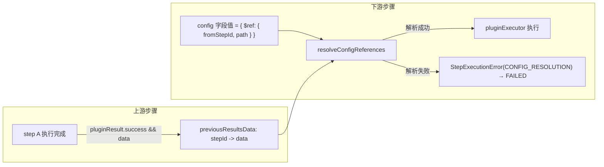

# 上游插件结果注入下游 config · 设计与实施计划

> 目标：前端编排工作流时，下游步骤的 `config` 字段除了手填，还可以「引用上游步骤执行结果（`PluginResult.data`）」。
> 引用的解析（把引用替换成真实值）发生在 `core-engine` 的 `executor` 层，插件侧完全无感知。

**关联文档**

- 内核说明：[packages/core-engine/README.md](../../packages/core-engine/README.md)
- 已知问题归档：[core-engine.md](./core-engine.md)
- 服务侧设计：[server-api.md](../../apps/server/README.md)
- 前端设计：[web-ui.md](../../apps/server/README.md)
- SDK 说明：[packages/plugin-sdk/README.md](../../packages/plugin-sdk/README.md)

---

## 0. 已确认的关键决策（对话记录）

| #   | 决策点                         | 结论                                                                                                                                                                     |
| --- | ------------------------------ | ------------------------------------------------------------------------------------------------------------------------------------------------------------------------ |
| 1   | `previousResults` 是否直接改造 | **不改**。保留现有语义（`StepCondition` 求值 + 向后兼容），新增独立字段专门承载「注入用数据」                                                                            |
| 2   | 新字段内容                     | 仅包含 **上游 `COMPLETED` 且 `pluginResult.success === true`** 步骤的 **`pluginResult.data`**（`stepId -> data`）                                                        |
| 3   | `resultSchema` 约束范围        | 只描述 `PluginResult.data` 的结构，不描述整个 `PluginResult`                                                                                                             |
| 4   | 路径表示                       | 数组路径 `string[]`，且直接作为 `ContextRef.$ref.path` 的表示形式（无需再设计单独的点+下标字符串语法，见 §2.3）                                                          |
| 5   | 解析发生位置                   | `core-engine` 的 `executor` 层，在调用 `pluginExecutor` 之前                                                                                                             |
| 6   | 引用语法粒度                   | **结构化 `$ref` 对象、整字段替换**（`{ $ref: { fromStepId, path: string[] } }`）；**不支持**字符串模板/混合插值（修订：最初讨论过字符串模板方案，后改回本方案，见 §2.3） |
| 7   | 解析失败的失败类型             | 新增 `StepFailureKinds.CONFIG_RESOLUTION`，与 `PLUGIN` / `RESOURCE` / `INTERNAL` 并列                                                                                    |
| 8   | dry-run 场景下含引用的 config  | 直接判定为解析失败（`FAILED`），不做特殊兼容                                                                                                                             |
| 9   | 未声明 `resultSchema` 的插件   | **不允许**被其他步骤选为注入来源（工作流校验阶段拦截）                                                                                                                   |
| 10  | 上游可达性                     | 引用的 `fromStepId` 必须是当前步骤的（直接或间接）祖先；否则视为非法引用（工作流校验阶段拦截）                                                                           |
| 11  | 缺失/找不到时的行为            | 直接判定为**解析失败 → 步骤 `FAILED`**，不做「静默降级为 undefined」                                                                                                     |

> 以上均已与用户确认，作为本文档的设计前提，不再展开讨论；若实现中发现与前提冲突，需回到用户确认，不要自行更改。

---

## 1. 现状盘点（与本次改动相关的事实）

### 1.1 `previousResults` 当前实现

- `packages/core-engine/executor/types.ts`：`ExecutionContext.previousResults?: Record<string, unknown>`
- `packages/core-engine/executor/index.ts`：
  - `toPreviousResults(results)`：遍历 `Map<stepId, ExecutionResult>`，**排除 `FAILED`**，其余（`COMPLETED` / `SKIPPED`）写入 `acc[stepId] = r.result`
  - `checkCondition(condition, previousResults)`：`StepCondition` 求值的唯一数据源
  - 每步执行时注入：`previousResults: toPreviousResults(results)`（`runStep` 内）
- `packages/core-engine/executor/helpers.ts`：`buildCompletedResult` 中 `result: pluginResult.data ?? pluginResult`；`buildSkippedResult` 中 `result: { skipped: true, reason }`

**结论**：`previousResults` 承担「条件求值」职责，语义是「非 FAILED 步骤的 result（COMPLETED 时约等于 data，SKIPPED 时是 skipped 占位对象）」。本次改动**不动它**。

### 1.2 插件 Schema 现状

- `packages/plugin-sdk/base/index.ts`：`PluginDefinition.configSchema?: z.ZodType`；`createPlugin` 两个重载（带/不带 `configSchema`）
- `apps/server/src/plugins/plugin-config-schema.ts`：`toPluginConfigJsonSchema`（`zod-to-json-schema`）
- `apps/server/src/engine/engine.service.ts`：`getPluginConfigJsonSchema` / `getAllPluginConfigJsonSchemas`
- `apps/web/src/shared/ui/json-schema-form/*`：基于 JSON Schema 渲染表单、`validateAgainstSchema`、`coerceValidatedValues`
- 全仓库**没有** `resultSchema` 的任何实现（已确认）

### 1.3 编排/校验现状

- `packages/core-engine/executor/index.ts` 的 `validateDag`：结构校验（重复 id、悬空 `dependsOn`）+ Kahn 环检测，`throw WorkflowValidationError`
- `apps/server/src/common/validation/validate-workflow.ts`：**独立重复实现**了一份 DAG 校验（未复用 core-engine 内部的 `validateDag`，因其未导出）—— 这是既有技术债，本次新增校验时需注意不要再制造第三份重复实现（见 §6.3）
- `apps/web/src/features/editor/dag-utils.ts`：前端第三份 DAG 校验（环检测），供编辑器实时校验用

### 1.4 执行链路（`executeStep`，`packages/core-engine/executor/index.ts`）

```
条件求值(previousResults) → onStepStart(资源acquire) → emit step:start
→ 构造 pluginContext(注入 logger/signal) → pluginExecutor(step.plugin, step.config, pluginContext)
→ 结果映射(COMPLETED/SKIPPED/FAILED) → emit step:finished
```

当前**没有任何**「配置解析/占位符替换」步骤，`step.config` 原样传给插件。

---

## 2. 总体设计

### 2.1 数据流



### 2.2 新增字段：`previousResultsData`

在 `ExecutionContext` 新增（与 `previousResults` **并存**，互不影响）：

```ts
export interface ExecutionContext extends PluginContext {
  // ...existing fields...
  previousResults?: Record<string, unknown>; // 不变
  previousResultsData?: Record<string, unknown>; // 新增：仅 COMPLETED && pluginResult.success 的 data
}
```

填充规则（`toPreviousResultsData`，与 `toPreviousResults` 并列的新函数）：

- 遍历 `results: Map<stepId, ExecutionResult>`
- 仅当 `r.status === StepStatuses.COMPLETED && r.pluginResult?.success === true` 时，`acc[stepId] = r.pluginResult.data`
- `SKIPPED` / `FAILED` **不写入**（含 `pluginResult.data === undefined` 的情况也不写入 —— 用「key 是否存在」表达「是否可注入」）

`WorkflowContextKeys` 同步新增 `previousResultsData: 'previousResultsData'`。

### 2.3 引用语法：结构化 `$ref` 对象（整字段替换）

> 本节为**修订版**：最初讨论过字符串模板插值方案（`"{{ stepA.field }}"`），后改回本方案 —— 字段值要么是字面量，要么整体是一个引用描述对象，**不支持字符串模板/混合插值**。

```ts
type ContextRef = {
  $ref: {
    fromStepId: string;
    path: string[]; // 数组路径；对象属性用 key 本身，数组下标用数字的字符串形式（如 "0"）
  };
};
```

**config 中的写法示例**（对应 §「引用语法粒度」举例场景）：

```json
{
  "answer": { "$ref": { "fromStepId": "step-a", "path": ["answer"] } },
  "usageInfo": { "$ref": { "fromStepId": "step-a", "path": ["usage"] } },
  "firstChoice": { "$ref": { "fromStepId": "step-a", "path": ["choices", "0", "content"] } }
}
```

**语法规则**

- 一个 config 字段的值，**要么是字面量**（字符串/数字/布尔/对象/数组/`null`，原样使用），**要么整体恰好是一个 `{ $ref: {...} } ` 对象**（被替换为解析结果）
- **不支持**把引用嵌入更大的字符串中做拼接（如「已知答案是 {ref}，请…」这种混合场景不支持；如需拼接，交给插件自己基于已注入的完整字段去拼）
- `path` 是 `string[]`，**每个元素是原样字符串**，不需要任何转义/引号语法 —— 这是相比字符串模板方案的直接收益：属性名包含空格、`.`、中文等特殊字符时也天然支持，无需处理转义
- 取值时按 `path` 逐段下钻：当前值是**数组**时，把该段解析为整数下标；当前值是**普通对象**时，把该段当作 key 直接取值；其他情况（如当前值是原始类型，无法继续下钻）视为解析失败（见 §2.4）
- `path: []`（空数组）表示引用整个 `data`

**结构判定（用于识别一个 JSON 值是否是 `ContextRef`）**：

```ts
function isContextRef(value: unknown): value is ContextRef {
  return (
    typeof value === 'object' &&
    value !== null &&
    !Array.isArray(value) &&
    '$ref' in value &&
    typeof (value as any).$ref === 'object' &&
    (value as any).$ref !== null &&
    typeof (value as any).$ref.fromStepId === 'string' &&
    Array.isArray((value as any).$ref.path) &&
    (value as any).$ref.path.every((p: unknown) => typeof p === 'string')
  );
}
```

**遍历范围**：递归遍历整个 `step.config`（对象的每个属性值、数组的每个元素），对每个节点做 `isContextRef` 判定；命中则替换为解析结果，不命中则递归其子节点（字面量对象/数组）或原样保留（字符串/数字/布尔/null）。

### 2.4 解析失败即 `FAILED`

解析阶段任一环节失败，直接判定该步骤为：

```ts
throw new StepExecutionError(message, StepFailureKinds.CONFIG_RESOLUTION);
```

失败场景枚举：

| 场景                                                                         | 示例 message                                                                                    |
| ---------------------------------------------------------------------------- | ----------------------------------------------------------------------------------------------- |
| `fromStepId` 不在 `previousResultsData` 中（未执行/被跳过/失败/未产出 data） | `步骤 "${stepId}" 的 config 引用了步骤 "${fromStepId}"，但该步骤没有可用的执行结果`             |
| path 中间不是对象/数组，无法继续取值                                         | `步骤 "${stepId}" 的 config 引用路径 "${path.join('.')}" 在步骤 "${fromStepId}" 的结果中不存在` |
| path 指向的 key/下标不存在                                                   | 同上                                                                                            |

> `null` 视为「存在」的合法值（不算失败）；只有「key/下标不存在」才算失败。这里维持与 §0 决策 11 的一致性：**「找不到」才失败，「找到了是 null」不失败**。

### 2.5 工作流级静态校验（启动前 / 编排保存前）

新增校验函数（建议命名 `validateWorkflowContextReferences`），在 `validateDag` 之后、`workflow:start` 之前调用，递归扫描每个 `step.config`，用 §2.3 的 `isContextRef` 结构判定提取出全部 `ContextRef`（建议同步导出一个纯函数 `extractContextReferences(config): ContextRef[]` 供 §2.6 与本节共用），逐条检查：

1. **`fromStepId` 必须存在**于 `workflow.steps`
2. **`fromStepId` 必须是当前步骤的祖先**（沿 `dependsOn` 反向可达，不允许引用自己、兄弟节点或下游节点）
3. **`fromStepId` 对应插件必须已注册，且声明了 `resultSchema`**（否则不允许被引用，对应 §0 决策 9）

任一失败 → `throw new WorkflowValidationError(...)`（复用现有错误类型，不新增）。

**关键实现问题**：此校验需要「插件名 → 是否有 `resultSchema`」的查询能力，而 `validateDag` 是不依赖插件注册表的纯函数。需要给 `executor` 新增一个可选依赖：

```ts
// ExecutorOptions 新增
resolvePluginResultSchema?: (pluginName: string) => z.ZodType | undefined;
```

由 `engine/index.ts` 在创建 executor 时用插件管理器实现：

```ts
resolvePluginResultSchema: (name) => plugins.getPlugin(name)?.resultSchema,
```

**避免第三份重复实现**：`apps/server/src/common/validation/validate-workflow.ts` 目前已经是一份独立于 core-engine 的 DAG 校验实现（历史遗留）。本次新增的引用校验**不要**在 server 再复制一份，而是：

- `core-engine` 导出 `validateWorkflowContextReferences`（纯函数，接收 `resolvePluginResultSchema` 回调）
- `executor.executeWorkflow` 内部调用它（运行时兜底）
- server 的 `validateWorkflowDefinition` 在其现有校验之后，调用从 core-engine 导入的同一个函数（并通过 `EngineService` 提供 `resolvePluginResultSchema`），**保存/校验接口才能提前暴露该错误**，不必等到真正运行

### 2.6 解析时机（`executeStep` 内的插入点）

在 `packages/core-engine/executor/index.ts` 的 `executeStep` 中，于构造 `pluginContext` 之后、调用 `pluginExecutor` 之前插入：

```ts
const resolvedConfig = resolveConfigReferences(step.config, context.previousResultsData ?? {});
// 若失败，resolveConfigReferences 内部 throw StepExecutionError(..., CONFIG_RESOLUTION)
// 沿用现有 catch 块 → finalizeFailure(..., failureKind: StepExecutionError.kind)

// 原：pluginExecutor(step.plugin, step.config, pluginContext)
// 改：pluginExecutor(step.plugin, resolvedConfig, pluginContext)
```

**放在 `step:start` 事件之后**（与现有 `PLUGIN_CONFIG_INVALID` 语义保持一致 —— 该失败也是在 `step:start` 之后、`execute` 调用阶段发生）。

**dry-run 天然满足「reject」诉求**：`apps/server/src/engine/engine.service.ts` 的 `dryRunPlugin` 构造的 `ExecutionContext` 不会填充 `previousResultsData`（默认 `undefined` → 解析时视为 `{}`）。因此任何包含 `ContextRef` 的 config 在 dry-run 时都会因为 `fromStepId` 查不到而**自动解析失败**，无需额外分支代码。建议在 `PluginsService.dryRun` 层面提前用 `extractContextReferences` 做一次「配置含引用」的快速检测并给出更友好的报错文案（体验优化，非必须）。

---

## 3. 错误模型扩展

`packages/core-engine/errors.ts`：

```ts
export const StepFailureKinds = {
  PLUGIN: 'plugin',
  RESOURCE: 'resource',
  INTERNAL: 'internal',
  CONFIG_RESOLUTION: 'config_resolution', // 新增
} as const;
```

**需要同步更新的地方**（避免遗漏，逐一过一遍）：

- `packages/core-engine/README.md`：错误模型表格、`StepFailureKinds` 常量说明
- `apps/server` 序列化层：`serialize-workflow-event.ts` 不需要改（`failureKind` 是字符串枚举，原样透传）
- `apps/web`：`RunDetailPage.tsx` 等展示失败原因的地方，若有针对 `failureKind` 的文案映射（如「插件失败」「资源失败」），需要补充 `config_resolution → "配置引用解析失败"` 的展示文案
- 测试：`packages/core-engine/__tests__/errors.test.ts`

---

## 4. `resultSchema`（`PluginResult.data` 的结构声明）

### 4.1 plugin-sdk

`packages/plugin-sdk/base/index.ts`：

```ts
export interface PluginDefinition extends PluginManifest {
  execute: PluginExecuteFn;
  hooks?: PluginHooks;
  configSchema?: z.ZodType;
  resultSchema?: z.ZodType; // 新增：描述 PluginResult.data 的结构，供前端选择注入字段
}
```

`CreatePluginOptionsWithSchema` / `CreatePluginOptionsWithoutSchema` 均新增可选 `resultSchema?: z.ZodType`，原样透传到返回的 `PluginDefinition`，**不参与** `execute` 的类型推断、**不做运行时校验**（即：`createPlugin` 不会拿 `resultSchema` 去校验 `execute` 实际返回的 `data`，这是文档/前端选择用的声明，MVP 不做「声明与实际不符」的运行时一致性校验，作为后续可选增强记录在 §8）。

`plugins/test-plugin`、`plugins/model-call-plugin`、`scripts/create-plugin.mjs` 模板需补充 `resultSchema` 示例（否则这两个插件按 §0 决策 9 **不能**被下游引用，示例场景会缺失注入功能的演示）。

### 4.2 server

镜像 `plugin-config-schema.ts`，新增 `apps/server/src/plugins/plugin-result-schema.ts`：

```ts
export function toPluginResultJsonSchema(schema: ConfigSchema): Record<string, unknown> {
  return zodToJsonSchema(schema as never, { $refStrategy: 'none' }) as Record<string, unknown>;
}
```

`EngineService` 新增：

- `getPluginResultJsonSchema(name)` → 镜像 `getPluginConfigJsonSchema`
- `getAllPluginResultJsonSchemas()` → 镜像 `getAllPluginConfigJsonSchemas`
- `getPlugins()` / `getPlugin(name)` 返回体新增 `hasResultSchema: Boolean(plugin.resultSchema)`
- 新增 `resolvePluginResultSchema(name)` 供 `validateWorkflowContextReferences` 使用（§2.5）

`PluginsService` / `PluginsController` 新增端点（镜像 `config-schema` 的两个端点）：

| 方法  | 路径                           | 说明                                                                                         |
| ----- | ------------------------------ | -------------------------------------------------------------------------------------------- |
| `GET` | `/plugins/result-schemas`      | 全量 `{ name, resultJsonSchema }[]`                                                          |
| `GET` | `/plugins/:name/result-schema` | 单个 `{ name, resultJsonSchema }`；无声明返回 404（文案：`插件不存在或未声明 resultSchema`） |

`apps/server/src/common/validation/validate-workflow.ts` 扩展调用 §2.5 的 `validateWorkflowContextReferences`（通过 `EngineService.resolvePluginResultSchema` 注入）。

### 4.3 web

- `shared/types/index.ts` 新增 `PluginResultSchemaResponse`（结构同 `PluginConfigSchemaResponse`，字段名 `resultJsonSchema`）
- `shared/api/misc.ts` 的 `pluginsApi` 新增 `listResultSchemas()`
- `PluginInfo` 新增 `hasResultSchema?: boolean`

---

## 5. 前端编排体验（`apps/web`）

> 本节给出方案与改动点清单，具体交互细节（弹层样式等）留给实现阶段迭代，不在本文档做像素级设计。

### 5.1 可选上游的确定

`apps/web/src/features/editor/dag-utils.ts` 新增祖先计算：

```ts
export function getAncestorIds(
  nodeId: string,
  steps: Array<{ id: string; dependsOn?: string[] }>,
): Set<string>;
```

编辑器中，「可引用的上游步骤」= `getAncestorIds(当前节点)` ∩ `{ 声明了 resultSchema 的插件对应的步骤 }`（后者需要前端已加载 `listResultSchemas()` 的结果做过滤，对应 §0 决策 9）。

### 5.2 字段级「引用模式」交互

- `PluginConfigForm` / `JsonSchemaForm`（`apps/web/src/shared/ui/json-schema-form/`）为每个表单字段增加一个**「手填 / 引用上游」二态切换**（而非在文本框内插入片段 —— 因为 §2.3 已改为整字段替换，不支持混合插值，字段值要么是字面量，要么整体是一个 `ContextRef`）
- 切到「引用上游」模式后，该字段渲染为一个选择器（而不是原来类型对应的输入控件）：第一层选「可引用的上游步骤」（见 §5.1），第二层基于该步骤插件的 `resultJsonSchema` 渲染字段树（支持对象/数组下钻），点击叶子节点即把该字段的值整体设为 `{ $ref: { fromStepId, path } }`
- 已处于「引用上游」模式的字段，UI 上建议用一个只读的「引用标签」展示（如 `🔗 step-a → choices[0].content`），而不是把原始 `{ $ref: {...} } ` JSON 暴露给用户
- 由于是整字段替换，**不再需要**区分字段声明类型是否为 `string` —— 任意类型字段（`number` / `boolean` / `object` / `array` / `string`）都可以切到引用模式，因为解析后会保留引用目标的原始类型

### 5.3 设计时校验的放宽

`apps/web/src/features/editor/step-config-validation.ts` 与 `shared/ui/json-schema-form/schema-utils.ts` 的 `validateAgainstSchema` / `coerceValidatedValues` 需要「识别引用字段」：

- 对某字段的值，用 §2.3 的 `isContextRef` 结构判定；命中则：
  - **跳过该字段的类型/格式校验**（因为实际类型要运行时才知道）
  - 仍然计入「字段已填」（不触发 `required` 缺失错误）
  - **不做** `coerceValidatedValues` 的类型转换（原样保留 `ContextRef` 对象，等 core-engine 运行时解析）
- 由于不支持混合插值，不存在「引用与非 string 类型冲突」的场景，无需额外的类型冲突校验

### 5.4 保存前校验

`assertWorkflowReady`（`WorkflowEditorPage.tsx`）在现有 DAG / config 校验之后，追加一次「引用合法性」检查（复用 §2.5 的规则，前端可以自己实现一份轻量版用于即时反馈，但**最终权威校验**在保存请求打到 server 后由 core-engine 的 `validateWorkflowContextReferences` 兜底，前端版本仅做 UX 优化，允许有漏检）。

---

## 6. 分层改动清单（汇总）

### 6.1 `packages/plugin-sdk`

- [ ] `base/index.ts`：`PluginDefinition` / 两个 `CreatePluginOptions*` 新增 `resultSchema?: z.ZodType`
- [ ] `README.md`：补充 `resultSchema` 说明与示例
- [ ] `__tests__/create-plugin.test.ts`：补充 `resultSchema` 透传的用例

### 6.2 `packages/core-engine`

- [ ] `errors.ts`：新增 `StepFailureKinds.CONFIG_RESOLUTION`
- [ ] `context-keys.ts`：新增 `WorkflowContextKeys.previousResultsData`
- [ ] `executor/types.ts`：`ExecutionContext` 新增 `previousResultsData?`；`ExecutorOptions` 新增 `resolvePluginResultSchema?`
- [ ] `executor/index.ts`：
  - [ ] 新增 `toPreviousResultsData(results)`，在 `runStep` 内与 `previousResults` 一起注入
  - [ ] 新增引用解析模块（建议拆文件 `executor/context-reference.ts`）：`isContextRef` 结构判定、`extractContextReferences`、按 `path: string[]` 逐段取值、`resolveConfigReferences`
  - [ ] `executeStep` 中调用 `resolveConfigReferences`，失败转 `StepExecutionError(CONFIG_RESOLUTION)`
  - [ ] 新增 `validateWorkflowContextReferences`（校验祖先可达性 + `resultSchema` 声明），在 `executeWorkflow` 内 `validateDag` 之后调用；同时作为导出 API
- [ ] `engine/index.ts`：`createWorkflowExecutor` 调用处新增 `resolvePluginResultSchema: (name) => plugins.getPlugin(name)?.resultSchema`
- [ ] `index.ts`：导出新增的类型/函数（`validateWorkflowContextReferences`、`ContextReference` 等）
- [ ] `README.md`：
  - [ ] `ExecutionContext` 字段表新增 `previousResultsData`
  - [ ] 错误模型表新增 `CONFIG_RESOLUTION`
  - [ ] 新增一节说明「上下文引用语法与解析规则」
- [ ] 测试：新增 `__tests__/context-reference.test.ts`（见 §7）

### 6.3 `apps/server`

- [ ] `src/plugins/plugin-result-schema.ts`（新增，镜像 `plugin-config-schema.ts`）
- [ ] `src/engine/engine.service.ts`：`getPluginResultJsonSchema` / `getAllPluginResultJsonSchemas` / `resolvePluginResultSchema` / `getPlugins/getPlugin` 补 `hasResultSchema`
- [ ] `src/plugins/plugins.service.ts`：`listResultSchemas` / `getResultSchema`
- [ ] `src/plugins/plugins.controller.ts`：新增两个路由
- [ ] `src/common/validation/validate-workflow.ts`：调用核心 `validateWorkflowContextReferences`（通过 `EngineService` 注入 `resolvePluginResultSchema`）—— **注意其调用方需要能拿到 EngineService 实例**，若当前 `validateWorkflowDefinition` 是纯函数被多处直接 `import` 调用，需要评估改造为接收回调参数或迁移到一个可注入 EngineService 的 service 方法
- [ ] `apps/server/__tests__/plugin-config-schema.test.ts` 同款新增 `plugin-result-schema.spec.ts`
- [ ] `plugins/test-plugin`、`plugins/model-call-plugin` 补充 `resultSchema`（否则示例插件在编辑器里选不到可注入来源，功能演示会显得「装了但用不了」）

### 6.4 `apps/web`

- [ ] `shared/types/index.ts`：`PluginResultSchemaResponse`、`PluginInfo.hasResultSchema`
- [ ] `shared/api/misc.ts`：`pluginsApi.listResultSchemas()`
- [ ] `shared/ui/json-schema-form/`：新增「手填 / 引用上游」字段级切换 + 上游字段树选择器
- [ ] `features/editor/dag-utils.ts`：`getAncestorIds`
- [ ] `features/editor/step-config-validation.ts` + `shared/ui/json-schema-form/schema-utils.ts`：`ContextRef` 字段识别、跳过类型校验
- [ ] `features/editor/WorkflowEditorPage.tsx`：`assertWorkflowReady` 追加引用合法性检查
- [ ] `features/run-detail/RunDetailPage.tsx`：`failureKind === 'config_resolution'` 的展示文案

---

## 7. 测试计划

### `packages/core-engine`

- [ ] `toPreviousResultsData`：`COMPLETED+success` 写入 data；`SKIPPED`/`FAILED`/`success:false` 不写入；`data === undefined` 不写入
- [ ] `isContextRef` 结构判定：正例/反例（缺 `fromStepId`、`path` 非字符串数组、误把普通对象当 `$ref` 等）
- [ ] 整字段替换：类型保留（注入结果可以是 object/array/number/boolean/null/string）
- [ ] 路径穿透：对象属性（含特殊字符的 key，如空格/中文/`.`）、数组下标（字符串数字段自动转 index）、对象与数组混合下钻（多级路径）
- [ ] `path: []`：引用整个 `data`
- [ ] 嵌套 `ContextRef`：config 中对象/数组任意深度嵌套的 `$ref` 均能被递归替换
- [ ] 解析失败：`fromStepId` 缺失（上游被跳过/失败/未执行）→ `FAILED / CONFIG_RESOLUTION`
- [ ] 解析失败：path 不存在 → `FAILED / CONFIG_RESOLUTION`
- [ ] `null` 值不是失败（能正确取到 `null` 并继续）
- [ ] `validateWorkflowContextReferences`：
  - [ ] 引用非祖先节点（兄弟/下游/自身）→ `WorkflowValidationError`
  - [ ] 引用不存在的 `fromStepId` → `WorkflowValidationError`
  - [ ] 引用未声明 `resultSchema` 的插件对应步骤 → `WorkflowValidationError`
  - [ ] 合法引用 → 不抛错
- [ ] `executeStep` 独立调用（dry-run 场景）：含引用但无 `previousResultsData` → 解析失败

### `packages/plugin-sdk`

- [ ] `createPlugin` 透传 `resultSchema` 到 `PluginDefinition`（带/不带 `configSchema` 两种重载）

### `apps/server`

- [ ] `toPluginResultJsonSchema` 单测（镜像现有 `plugin-config-schema.spec.ts`）
- [ ] `validateWorkflowDefinition` 新增引用校验分支的单测
- [ ] `PluginsController`/`PluginsService` 新增端点的单测

### `apps/web`

- [ ] `dag-utils.getAncestorIds` 单测
- [ ] `step-config-validation`：`ContextRef` 字段跳过类型校验、仍计入「已填」

---

## 8. 明确排除在 MVP 范围外（后续可选增强）

- `resultSchema` 与插件 `execute` 实际返回 `data` 的**运行时一致性校验**（本次只做「声明供前端选字段用」，不做强制校验）
- `resultSchema` 对引用 `path` 的**静态字段存在性校验**（即在保存工作流时，不仅检查「插件是否声明了 resultSchema」，还进一步检查「path 是否真的在 resultSchema 声明的结构里」）—— 涉及 Zod → JSON Schema 后再做深路径校验（`oneOf`/`anyOf`/`additionalProperties` 等场景复杂），先不做
- 循环引用/自引用以外的更复杂静态分析（当前用「祖先可达性」已经排除了自引用、兄弟引用、下游引用、环）
- 字符串模板/混合插值（如「已知答案是 {ref}，请…」）—— §2.3 已改为整字段替换，若后续确有拼接需求，需重新评估语法方案（不属于当前范围）

> 附注：改用 `path: string[]` 后，「属性名含特殊字符（空格/`.`/中文）」不再是需要额外转义语法的问题 —— 数组元素本身就是原样字符串，天然支持，无需 MVP 之外的扩展。

---

## 9. 分阶段实施顺序

```
阶段 1 · core-engine 内核能力（可独立发布验证）
  errors.ts / context-keys.ts 新增常量
  toPreviousResultsData + 注入
  resolveConfigReferences（`isContextRef` 结构判定、路径取值、整字段类型保留替换）
  executeStep 接入解析 + CONFIG_RESOLUTION 失败路径
  validateWorkflowContextReferences（祖先可达性 + resultSchema 声明）
  engine/index.ts 接线 resolvePluginResultSchema
  单测覆盖 §7 全部 core-engine 用例
  验收：脱离 server/web，用 core-engine 单测和一个手写脚本即可验证端到端注入

阶段 2 · plugin-sdk + 示例插件
  PluginDefinition.resultSchema 透传
  test-plugin / model-call-plugin 补 resultSchema
  验收：两个示例插件的 resultSchema 能被 zod-to-json-schema 正确转换

阶段 3 · server 暴露能力
  plugin-result-schema.ts + EngineService 方法
  PluginsController/Service 新增两个端点
  validate-workflow.ts 接入引用校验
  验收：POST /workflows/validate 对非法引用返回 400，GET /plugins/result-schemas 正常返回

阶段 4 · web 编排体验
  types + api client
  dag-utils.getAncestorIds
  json-schema-form 「手填 / 引用上游」字段切换交互
  step-config-validation 识别 ContextRef 字段并放宽校验
  RunDetailPage 展示 config_resolution 失败文案
  验收：编辑器里选中下游步骤字段，能从上游插件结果树选字段插入，保存/运行链路打通
```

---

## 10. 遗留的不确定点（实现中需要留意，非阻塞性）

以下是设计推演中发现的细节问题，倾向性建议已给出，但由于影响面较小、可以在实现阶段随时调整，未逐一发起确认；如实现时发现与预期不符，请再次确认：

1. **`apps/server` 的 `validateWorkflowDefinition` 从纯函数改为需要 `resolvePluginResultSchema` 回调**，会改变它当前「零依赖纯函数」的调用方式，需要梳理所有调用点（`workflows.service.ts` 等）如何拿到 `EngineService` 实例或回调。
2. **前端「引用上游字段」选择器的具体交互形式**（Popover / 侧边栏 / 下拉级联）未做 UI 细节设计，实现时按现有设计系统（`shared/ui`）风格自行决定。
3. **`resultSchema` 的 JSON Schema 转换对 `z.union` / `z.discriminatedUnion` 等复杂 Zod 结构的字段树展示**，`zod-to-json-schema` 会产出 `oneOf`/`anyOf`，前端字段树选择器如何呈现暂未设计，可先只良好支持 `z.object` / `z.array` / 基础类型，复杂类型降级为「不可展开，仅整体引用」。
