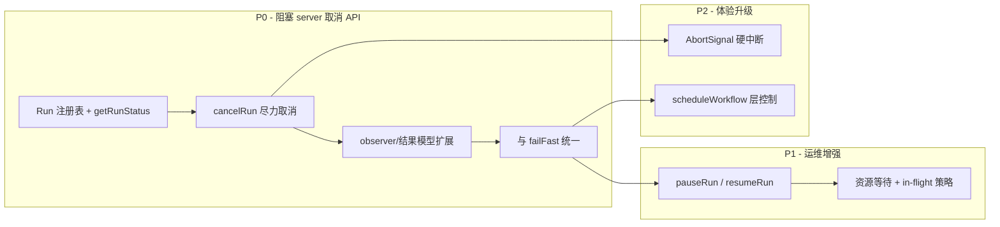

# core-engine 开发计划

> 本文档收录 `@monai-devops/core-engine` 的**未完成**阶段性开发计划。
>
> **已完成（不再收录详情）**：执行实例 ID 与事件寻址（`workflowRunId` 三入参 API、启动前校验、事件顶层寻址、server/web 适配）。详见 [`packages/core-engine/README.md`](../packages/core-engine/README.md)。
>
> **当前焦点**：[计划 A · 运行控制（中断 / 暂停 / 继续）](#计划-a--运行控制中断--暂停--继续)

---

## 计划 A · 运行控制（中断 / 暂停 / 继续）

> 从编排内核自身的工程视角，规划单个工作流 Run 的**主动控制**能力。
> 本文只描述**需要开发的功能与语义边界**，不涉及具体实现细节。
>
> 关联文档：[server-api.md](./server-api.md) 决策 F（取消语义）、[web-ui.md](./web-ui.md) 运行详情交互。

**前置依赖（已满足）**：实例主键 `workflowRunId` 已由调用方显式注入，事件顶层携带 `workflowRunId`，`RunManager` 等消费方已改用顶层字段路由。

---

### 1. 现状盘点

#### 1.1 已有能力（起点）

`@monai-devops/core-engine` 通过 `createEngine()` 暴露 `runWorkflow(workflowRunId, workflow, context?)` / `scheduleWorkflow(workflowRunId, workflow, context?)`，执行模型仍为**一次性 Promise**：调用方提交后只能等待终态，无法从外部对指定 `workflowRunId` 施加控制。

与「中止」相关的**内部机制**已部分存在，但**未形成对外 API**：

| 机制 | 位置 | 现状 |
| --- | --- | --- |
| `failFast` 中止 | `executor` | 某步骤失败后停止调度新步骤，未开始步骤补发 `SKIPPED / workflow_aborted` |
| `onWorkflowAbort(workflowRunId)` | `ExecutorOptions` → `engine` | 仅在 `failFast` 路径触发，用于联动 `resourceScheduler.cancelByWorkflowRunId` |
| `cancelByWorkflowRunId(workflowRunId)` | `resource-scheduler` | 取消同 run 下**仍在资源等待队列**的步骤，抛出 `ResourceQueueCancelledError` |
| `SkipReasons.WORKFLOW_ABORTED` | `errors` | 跳过原因枚举已定义，observer 可观测 |
| 生命周期事件 | `observer` | 6 种事件（`workflow:start/finished`、`step:queued/start/finished`、`plugin:log`），顶层含 `workflowRunId`；**无** pause/cancel 专属事件 |
| 实例 ID 契约 | `executor` / `engine` | `assertValidWorkflowRunId` 内联校验；非法 ID 先于 DAG 校验拒绝 |

#### 1.2 明确缺失

| 能力 | 说明 |
| --- | --- |
| **Run 注册表** | 无按 `workflowRunId` 索引的运行中实例；`executeWorkflow` 返回 Promise 后即不可寻址 |
| **主动取消 API** | 无 `cancelRun(workflowRunId)` 或等价入口；服务层无法调用内核完成「用户点取消」 |
| **进行中步骤中断** | 插件执行无 `AbortSignal`；已在跑的步骤只能等其自然结束（[README](../packages/core-engine/README.md) 后续规划已提及） |
| **暂停 / 继续** | 调度循环无 gate；就绪队列与 `inFlight` 步骤无法冻结与恢复 |
| **控制结果与幂等** | 无统一的「控制操作返回值」模型（成功 / 已终态 / 不支持 / 尽力完成） |
| **控制态生命周期事件** | observer 无法区分「失败中止」「用户取消」「用户暂停」 |
| **`WorkflowRunResult` 终态** | 无 `cancelled` 状态字段；取消与 `finished` / `failed` 无法区分 |

#### 1.3 与服务层的契约缺口

[server-api.md](./server-api.md) 已定义 Run 状态机含 `cancelled`，并约定 `POST /runs/:runId/cancel` 为**尽力取消**。当前 **server 侧** `RunManager.cancelRun` 仅调用 `engineService.cancelQueuedSteps`（底层 `cancelByWorkflowRunId`），并**直接写库**标记 `cancelled`——**未经过内核 Run 控制 API**：

- 无法阻止 executor 继续调度尚未开始的步骤
- 无法让内核发出 `workflow:cancelled` 或带 `cancelled` 标记的终态事件
- 已在执行的步骤只能跑完；`workflow:finished` 仍可能以 `success: true/false` 覆盖 server 侧的 `cancelled` 标记

---

### 2. 目标与边界

#### 2.1 内核应负责什么

| 负责 | 不负责 |
| --- | --- |
| 单个 Run 的 cancel / pause / resume 语义与执行 | HTTP/WS 协议、Run 持久化、多租户鉴权 |
| Run 控制操作的幂等与竞态（重复 cancel、终态后操作） | UI 按钮态、操作审计日志存储 |
| 控制动作向 observer 发事件 | 前端 DAG 渲染 |
| 向插件上下文注入 `AbortSignal`（取消升级项） | 插件内部如何响应 signal（由 plugin-sdk 约定） |

#### 2.2 设计原则

1. **诚实暴露能力**：区分「尽力取消（best-effort）」与「硬中断（hard abort）」两个阶段，API 形态稳定、语义可升级。
2. **Run 寻址**：一切控制操作以 `workflowRunId` 为主键；与 `runWorkflow` 第一参及事件顶层字段对齐。
3. **不破坏现有执行路径**：`runWorkflow` 默认行为保持不变；控制为 opt-in（Run 注册 + 控制 API）。
4. **observer 优先**：控制导致的状态变迁必须可观测，供 server 缓冲/回放/扇出。

---

### 3. 待开发功能

#### 3.1 Run 注册与寻址（基础）— P0

**目标**：让引擎能回答「这个 workflowRunId 是否还在跑、处于什么控制态」。

待开发：

- **Run 控制上下文**：每个 `executeWorkflow` 实例绑定 `workflowRunId`，在内核维护活跃 Run 表（`workflowRunId → RunHandle`）。
- **Run 控制态枚举**（建议）：`running` | `pausing` | `paused` | `cancelling` | `cancelled` | `finished` | `failed`。
- **查询 API**：`getRunStatus(workflowRunId)` 或 `RunHandle.getStatus()`，返回控制态 + 简要进度（可选：已完成步骤数 / 总步骤数）。
- **Run 结束清理**：workflow 到达终态后从活跃表移除；`destroy()` 时批量终止所有活跃 Run。
- **并发安全**：同一 `workflowRunId` 的控制操作串行化；控制操作与步骤调度之间的 happens-before 关系需明确。

#### 3.2 取消（Cancel）— P0

**目标**：支持调用方主动请求终止一个 Run，语义与 server 决策 F 对齐并可升级。

##### 3.2.1 阶段 A · 尽力取消（优先交付）

待开发：

- **对外 API**：`cancelRun(workflowRunId, options?)`（暴露于 `createEngine` 返回值）。
- **行为**：
  - 停止向就绪队列调度**尚未开始**的步骤。
  - 调用 `resourceScheduler.cancelByWorkflowRunId(workflowRunId)` 取消资源等待中的步骤。
  - **已在执行中**的步骤允许跑完（不注入 AbortSignal 的阶段）。
  - 未开始步骤补发 `step:finished`，`skipReason: workflow_aborted`。
  - Run 终态标记为 `cancelled`（而非普通 `finished`）。
- **返回值**：标明 `mode: 'best-effort'`；列出仍 in-flight 的 stepId（若有）。
- **幂等**：已 `cancelled` / `finished` / `failed` 的 Run 再次 cancel 返回当前态，不抛错。
- **observer 事件**（新增）：`workflow:cancelled` 或在 `workflow:finished` 中增加 `cancelled: true` 字段（需与 server 序列化层对齐）。

##### 3.2.2 阶段 B · 硬中断（依赖 AbortSignal，后续迭代）

待开发：

- **步骤级 AbortSignal**：`executeStep` / 插件执行路径向 `PluginContext` 注入 `signal`。
- **cancel 升级**：`cancelRun` 对 in-flight 步骤调用 `AbortSignal.abort()`；插件协作退出。
- **超时兜底**：signal 后若步骤在 configurable 超时内仍未结束，标记为 `failed / cancelled` 并继续收尾。
- **plugin-sdk 约定**：文档化插件应监听 `signal` 并优雅退出；未协作插件的行为定义（强制 failed vs 孤立任务）。

#### 3.3 暂停（Pause）— P1

**目标**：冻结 Run 的**新步骤调度**，已开始的步骤可配置为「跑完再停」或「下一阶段与 cancel 共用 signal 立刻停」。

待开发：

- **对外 API**：`pauseRun(workflowRunId, options?)`。
- **调度 gate**：在 executor 主循环入口检查 Run 控制态；`paused` 时不从 `ready` 队列取新步骤、不启动新的 `inFlight`。
- **资源等待行为**：已在 `resource-scheduler` 队列中等待的步骤——明确是「保持排队」还是「挂起出队」；建议默认保持排队，pause 只阻塞「拿到资源后的执行」。
- **in-flight 策略**（可配置）：
  - `waitInFlight`（默认）：当前步骤跑完后进入 `paused`，不再调度下游。
  - `abortInFlight`（阶段 B）：对 in-flight 发 AbortSignal，与 cancel 共用机制。
- **observer 事件**：`workflow:paused`（含 `inFlightSteps` 快照）。
- **非法态处理**：已终态 / 已在 `pausing` 时幂等或拒绝。

#### 3.4 继续（Resume）— P1

**目标**：从 `paused` 恢复调度，不重复已完成步骤。

待开发：

- **对外 API**：`resumeRun(workflowRunId)`。
- **行为**：
  - 控制态 `paused` → `running`。
  - 恢复 executor 主循环：从现有 `ready` / 依赖图状态继续，**不**重新执行已成功步骤。
  - 若 pause 期间有步骤因超时/外部因素失败，resume 前需校验 DAG 一致性。
- **observer 事件**：`workflow:resumed`。
- **与 cancel 互斥**：`cancelling` / `cancelled` 态不可 resume。

#### 3.5 与 failFast 的交互 — P0

**目标**：避免「步骤失败自动中止」与「用户主动 cancel/pause」语义冲突。

待开发：

- **统一 abort 入口**：failFast 触发与用户 cancel 共用 Run 控制态迁移逻辑（避免两套并行分支）。
- **优先级约定**：用户 cancel 优先于 failFast 后续调度；用户 pause 与 failFast 同时发生时的终态定义。
- **skipReason 区分**（可选）：是否需要 `user_cancelled` 与 `workflow_aborted`（failFast）分枚举；至少文档说明二者映射。

#### 3.6 scheduleWorkflow 层控制 — P2

**目标**：经 `createTaskScheduler` 提交的工作流也能被控制。

待开发：

- 排队中的 Task（尚未进入 `runWorkflow`）支持 `cancelScheduledTask(taskId)`。
- Task 已开始后，`taskId` ↔ `workflowRunId` 映射，控制操作落到 Run 层。
- 与 `MAX_ACTIVE_RUNS` 等服务层限流策略的协作点说明。

#### 3.7 observer 与结果模型扩展 — P0

**目标**：控制操作对上游（server / web）可见且可序列化。

待开发：

| 项 | 内容 |
| --- | --- |
| 新事件类型 | `workflow:paused`、`workflow:resumed`、`workflow:cancelled`（或扩展现有 `workflow:finished`） |
| `WorkflowRunResult` | 增加 `status: 'success' \| 'failed' \| 'cancelled'` 或等价字段 |
| 控制操作回执类型 | `RunControlResult { workflowRunId, action, previousStatus, currentStatus, mode?, inFlightSteps? }` |
| README / 导出 | 更新公共导出与文档 |

#### 3.8 测试与验收场景 — 贯穿各阶段

待覆盖（功能级）：

- 单 Run cancel：仅排队步骤被 skip；in-flight 跑完后终态为 cancelled。
- 并行步骤：部分 in-flight + 部分 ready 时的 cancel/pause 行为。
- 重复 cancel / pause / resume 的幂等。
- pause → resume 后 DAG 正确续跑，无重复执行。
- pause 期间依赖链不被错误解锁。
- failFast 与用户 cancel 交叉场景。
- `destroy()` 时活跃 Run 全部进入 cancelled 或 rejected。
- observer 事件顺序：控制事件相对 `step:finished` / `workflow:finished` 的顺序契约。
- （阶段 B）插件响应 AbortSignal 后的资源释放与 `onStepComplete` 钩子。

---

### 4. 建议开发顺序

| 阶段 | 交付物 | 解锁的上层能力 |
| --- | --- | --- |
| **P0** | Run 注册表 + `cancelRun`（best-effort）+ 事件/结果扩展 | server `POST /runs/:runId/cancel` 改调内核 API；Run 终态 `cancelled` 由内核驱动 |
| **P1** | `pauseRun` / `resumeRun` + 调度 gate | 运行详情页「暂停 / 继续」；长跑任务人工介入 |
| **P2** | AbortSignal + 调度层 cancel | 取消升级为硬中断；队列中 Task 可撤销 |

---

### 5. 与 server / web 的接口预期

内核 P0 完成后，服务层将 `RunManager.cancelRun` 从「直接写库 + `cancelQueuedSteps`」改为「调 Engine 控制 API」：

| 服务 API | 内核 API（规划） | 备注 |
| --- | --- | --- |
| `POST /runs/:runId/cancel` | `engine.cancelRun(workflowRunId)` | P0；响应 `cancelled: 'best-effort'` |
| `POST /runs/:runId/pause`（待定义） | `engine.pauseRun(workflowRunId)` | P1 |
| `POST /runs/:runId/resume`（待定义） | `engine.resumeRun(workflowRunId)` | P1 |
| `GET /runs/:runId` 状态字段 | `engine.getRunStatus(workflowRunId)` | P0 起 |

web 层运行详情「取消 / 暂停 / 继续」按钮的启用条件，应直接反映内核控制态与 `mode`（best-effort vs hard-abort）。

---

### 6. 非目标（本期不做）

- 跨进程 / 分布式 Run 迁移与持久化 checkpoint（属 server 或更上层）。
- 修改 DAG 定义后「从中断点热更新继续」（需另立变更执行语义）。
- 自动策略（失败自动 pause、超时自动 cancel）——可由 server 策略层调用内核 API 实现，不进内核。
- 多 Engine 实例间的 Run 协调。

---

### 7. 开放问题（实现前需定案）

1. **pause 时 resource-scheduler 队列**：挂起出队 vs 保持排队，对「为什么排队」UI 的影响。
2. **cancel 终态**：`WorkflowRunResult.success` 在 cancelled 时恒为 `false`，还是「部分成功」算 success？
3. **skipReason 细分**：是否新增 `user_cancelled`，还是复用 `workflow_aborted`。
4. **AbortSignal 传递路径**：仅 executor → plugin，还是经 plugin-sdk 类型正式暴露。
5. **单 Engine 多 Run 并行控制**：控制 API 是否需要全局锁，还是 per-run 锁足够。

定案后即可拆分为实现 issue；建议保持「先 P0 尽力取消闭环，再 P1 暂停继续，最后 P2 硬中断」的节奏。
