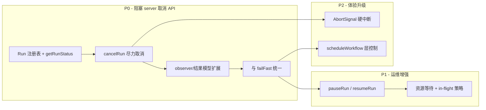
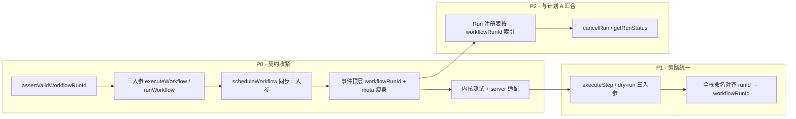

# core-engine 开发计划

> 本文档收录 `@monai-devops/core-engine` 的阶段性开发计划。各计划相互独立，可分期落地；其中**执行实例 ID 与事件寻址**为**运行控制**的前置契约，建议优先交付。
>
> - [计划 A · 运行控制（中断 / 暂停 / 继续）](#计划-a--运行控制中断--暂停--继续)
> - [计划 B · 执行实例 ID 与事件寻址](#计划-b--执行实例-id-与事件寻址)

---

## 计划 A · 运行控制（中断 / 暂停 / 继续）

> 从编排内核自身的工程视角，规划单个工作流 Run 的**主动控制**能力。
> 本文只描述**需要开发的功能与语义边界**，不涉及具体实现细节。
>
> 关联文档：[server-api.md](./server-api.md) 决策 F（取消语义）、[web-ui.md](./web-ui.md) 运行详情交互。

---

### 1. 现状盘点

#### 1.1 已有能力（起点）

`@monai-devops/core-engine` 当前通过 `createEngine()` 暴露 `runWorkflow` / `scheduleWorkflow`，执行模型为**一次性 Promise**：调用方提交后只能等待终态，无法从外部对指定 `runId` 施加控制。

与「中止」相关的**内部机制**已部分存在，但**未形成对外 API**：

| 机制                           | 位置                         | 现状                                                                                                            |
| ------------------------------ | ---------------------------- | --------------------------------------------------------------------------------------------------------------- |
| `failFast` 中止                | `executor`                   | 某步骤失败后停止调度新步骤，未开始步骤补发 `SKIPPED / workflow_aborted`                                         |
| `onWorkflowAbort(runId)`       | `ExecutorOptions` → `engine` | 仅在 `failFast` 路径触发，用于联动 `resourceScheduler.cancelByRunId`                                            |
| `cancelByRunId(runId)`         | `resource-scheduler`         | 取消同 run 下**仍在资源等待队列**的步骤，抛出 `ResourceQueueCancelledError`                                     |
| `SkipReasons.WORKFLOW_ABORTED` | `errors`                     | 跳过原因枚举已定义，observer 可观测                                                                             |
| 生命周期事件                   | `observer`                   | 6 种事件（`workflow:start/finished`、`step:queued/start/finished`、`plugin:log`），**无** pause/cancel 专属事件 |

#### 1.2 明确缺失

| 能力                   | 说明                                                                                                                 |
| ---------------------- | -------------------------------------------------------------------------------------------------------------------- |
| **Run 注册表**         | 无按 `runId` 索引的运行中实例；`executeWorkflow` 返回 Promise 后即不可寻址                                           |
| **主动取消 API**       | 无 `cancelRun(runId)` 或等价入口；服务层无法调用内核完成「用户点取消」                                               |
| **进行中步骤中断**     | 插件执行无 `AbortSignal`；已在跑的步骤只能等其自然结束（[README](../packages/core-engine/README.md) 后续规划已提及） |
| **暂停 / 继续**        | 调度循环无 gate；就绪队列与 `inFlight` 步骤无法冻结与恢复                                                            |
| **控制结果与幂等**     | 无统一的「控制操作返回值」模型（成功 / 已终态 / 不支持 / 尽力完成）                                                  |
| **控制态生命周期事件** | observer 无法区分「失败中止」「用户取消」「用户暂停」                                                                |

#### 1.3 与服务层的契约缺口

[server-api.md](./server-api.md) 已定义 Run 状态机含 `cancelled`，并约定 `POST /runs/:runId/cancel` 为**尽力取消**。当前内核能力不足以支撑该契约的完整语义——服务层只能间接调用 `getResourceScheduler().cancelByRunId`，且**无法阻止已在执行的步骤、无法上报真正的 cancelled 终态**（只能等 workflow 自然 `finished`）。

---

### 2. 目标与边界

#### 2.1 内核应负责什么

| 负责                                                | 不负责                                        |
| --------------------------------------------------- | --------------------------------------------- |
| 单个 Run 的 cancel / pause / resume 语义与执行      | HTTP/WS 协议、Run 持久化、多租户鉴权          |
| Run 控制操作的幂等与竞态（重复 cancel、终态后操作） | UI 按钮态、操作审计日志存储                   |
| 控制动作向 observer 发事件                          | 前端 DAG 渲染                                 |
| 向插件上下文注入 `AbortSignal`（取消升级项）        | 插件内部如何响应 signal（由 plugin-sdk 约定） |

#### 2.2 设计原则

1. **诚实暴露能力**：区分「尽力取消（best-effort）」与「硬中断（hard abort）」两个阶段，API 形态稳定、语义可升级。
2. **Run 寻址**：一切控制操作以 `runId` 为主键；与现有 `WorkflowRunMeta.runId` 对齐。
3. **不破坏现有执行路径**：`runWorkflow` 默认行为保持不变；控制为 opt-in（Run 注册 + 控制 API）。
4. **observer 优先**：控制导致的状态变迁必须可观测，供 server 缓冲/回放/扇出。

---

### 3. 待开发功能

#### 3.1 Run 注册与寻址（基础）

**目标**：让引擎能回答「这个 runId 是否还在跑、处于什么控制态」。

待开发：

- **Run 控制上下文**：每个 `executeWorkflow` 实例绑定唯一 `runId`，在内核维护活跃 Run 表（`runId → RunHandle`）。
- **Run 控制态枚举**（建议）：`running` | `pausing` | `paused` | `cancelling` | `cancelled` | `finished` | `failed`。
- **查询 API**：`getRunStatus(runId)` 或 `RunHandle.getStatus()`，返回控制态 + 简要进度（可选：已完成步骤数 / 总步骤数）。
- **Run 结束清理**：workflow 到达终态后从活跃表移除；`destroy()` 时批量终止所有活跃 Run。
- **并发安全**：同一 `runId` 的控制操作串行化；控制操作与步骤调度之间的 happens-before 关系需明确。

#### 3.2 取消（Cancel）— P0

**目标**：支持调用方主动请求终止一个 Run，语义与 server 决策 F 对齐并可升级。

##### 3.2.1 阶段 A · 尽力取消（与现状兼容，优先交付）

待开发：

- **对外 API**：`cancelRun(runId, options?)`（命名待定，暴露于 `createEngine` 返回值）。
- **行为**：
  - 停止向就绪队列调度**尚未开始**的步骤。
  - 调用 `resourceScheduler.cancelByRunId(runId)` 取消资源等待中的步骤。
  - **已在执行中**的步骤允许跑完（不注入 AbortSignal 的阶段）。
  - 未开始步骤补发 `step:finished`，`skipReason: workflow_aborted`。
  - Run 终态标记为 `cancelled`（而非普通 `finished`）。
- **返回值**：标明 `mode: 'best-effort'`；列出仍 in-flight 的 stepId（若有）。
- **幂等**：已 `cancelled` / `finished` / `failed` 的 Run 再次 cancel 返回当前态，不抛错。
- **observer 事件**（新增）：`workflow:cancelled` 或在 `workflow:finished` 中增加 `cancelled: true` 字段（需与 server 序列化层对齐）。

##### 3.2.2 阶段 B · 硬中断（依赖 AbortSignal，后续迭代）

待开发：

- **步骤级 AbortSignal**：`executeStep` / 插件执行路径向 `PluginContext` 注入 `signal`。
- **cancel 升级**：`cancelRun` 对 in-flight 步骤调用 `AbortSignal.abort()`；插件协作退出。
- **超时兜底**：signal 后若步骤在 configurable 超时内仍未结束，标记为 `failed / cancelled` 并继续收尾。
- **plugin-sdk 约定**：文档化插件应监听 `signal` 并优雅退出；未协作插件的行为定义（强制 failed vs 孤立任务）。

#### 3.3 暂停（Pause）— P1

**目标**：冻结 Run 的**新步骤调度**，已开始的步骤可配置为「跑完再停」或「下一阶段与 cancel 共用 signal 立刻停」。

待开发：

- **对外 API**：`pauseRun(runId, options?)`。
- **调度 gate**：在 executor 主循环入口检查 Run 控制态；`paused` 时不从 `ready` 队列取新步骤、不启动新的 `inFlight`。
- **资源等待行为**：已在 `resource-scheduler` 队列中等待的步骤——明确是「保持排队」还是「挂起出队」；建议默认保持排队，pause 只阻塞「拿到资源后的执行」。
- **in-flight 策略**（可配置）：
  - `waitInFlight`（默认）：当前步骤跑完后进入 `paused`，不再调度下游。
  - `abortInFlight`（阶段 B）：对 in-flight 发 AbortSignal，与 cancel 共用机制。
- **observer 事件**：`workflow:paused`（含 `inFlightSteps` 快照）。
- **非法态处理**：已终态 / 已在 `pausing` 时幂等或拒绝。

#### 3.4 继续（Resume）— P1

**目标**：从 `paused` 恢复调度，不重复已完成步骤。

待开发：

- **对外 API**：`resumeRun(runId)`。
- **行为**：
  - 控制态 `paused` → `running`。
  - 恢复 executor 主循环：从现有 `ready` / 依赖图状态继续，**不**重新执行已成功步骤。
  - 若 pause 期间有步骤因超时/外部因素失败，resume 前需校验 DAG 一致性。
- **observer 事件**：`workflow:resumed`。
- **与 cancel 互斥**：`cancelling` / `cancelled` 态不可 resume。

#### 3.5 与 failFast 的交互 — P0

**目标**：避免「步骤失败自动中止」与「用户主动 cancel/pause」语义冲突。

待开发：

- **统一 abort 入口**：failFast 触发与用户 cancel 共用 Run 控制态迁移逻辑（避免两套并行分支）。
- **优先级约定**：用户 cancel 优先于 failFast 后续调度；用户 pause 与 failFast 同时发生时的终态定义。
- **skipReason 区分**（可选）：是否需要 `user_cancelled` 与 `workflow_aborted`（failFast）分枚举；至少文档说明二者映射。

#### 3.6 scheduleWorkflow 层控制 — P2

**目标**：经 `createTaskScheduler` 提交的工作流也能被控制。

> **前置**：计划 B §3.2 已将 `scheduleWorkflow` 定为三入参并调度时绑定 `workflowRunId`；本节在此基础上增加 Task 级取消与 `taskId` ↔ `workflowRunId` 映射。

待开发：

- 排队中的 Task（尚未进入 `runWorkflow`）支持 `cancelScheduledTask(taskId)`。
- Task 已开始后，`taskId` ↔ `workflowRunId` 映射，控制操作落到 Run 层（不再使用易混淆的 `runId` 指代 Task 键）。
- 与 `MAX_ACTIVE_RUNS` 等服务层限流策略的协作点说明。

#### 3.7 observer 与结果模型扩展 — P0

**目标**：控制操作对上游（server / web）可见且可序列化。

待开发：

| 项                  | 内容                                                                                       |
| ------------------- | ------------------------------------------------------------------------------------------ | -------- | ----------------------- |
| 新事件类型          | `workflow:paused`、`workflow:resumed`、`workflow:cancelled`（或扩展现有 finished）         |
| `WorkflowRunResult` | 增加 `status: 'success'                                                                    | 'failed' | 'cancelled'` 或等价字段 |
| 控制操作回执类型    | `RunControlResult { runId, action, previousStatus, currentStatus, mode?, inFlightSteps? }` |
| README / 导出       | 更新 `@monai-devops/core-engine` 公共导出与文档                                            |

#### 3.8 测试与验收场景 — 贯穿各阶段

待覆盖（功能级，不写实现）：

- 单 Run cancel：仅排队步骤被 skip；in-flight 跑完后终态为 cancelled。
- 并行步骤：部分 in-flight + 部分 ready 时的 cancel/pause 行为。
- 重复 cancel / pause / resume 的幂等。
- pause → resume 后 DAG 正确续跑，无重复执行。
- pause 期间依赖链不被错误解锁。
- failFast 与用户 cancel 交叉场景。
- `destroy()` 时活跃 Run 全部进入 cancelled 或 rejected。
- observer 事件顺序：控制事件相对 `step:finished` / `workflow:finished` 的顺序契约。
- （阶段 B）插件响应 AbortSignal 后的资源释放与 `onStepComplete` 钩子。

---

### 4. 建议开发顺序



| 阶段   | 交付物                                               | 解锁的上层能力                                                   |
| ------ | ---------------------------------------------------- | ---------------------------------------------------------------- |
| **P0** | Run 寻址 + `cancelRun`（best-effort）+ 事件/结果扩展 | server `POST /runs/:runId/cancel` 真实生效；Run 终态 `cancelled` |
| **P1** | `pauseRun` / `resumeRun` + 调度 gate                 | 运行详情页「暂停 / 继续」；长跑任务人工介入                      |
| **P2** | AbortSignal + 调度层 cancel                          | 取消升级为硬中断；队列中 Task 可撤销                             |

---

### 5. 与 server / web 的接口预期

内核完成后，服务层**无需重写**状态机，只需从「绕过内核直接调 scheduler」改为「调 Engine 控制 API」：

| 服务 API                             | 内核 API（规划）             | 备注                                         |
| ------------------------------------ | ---------------------------- | -------------------------------------------- |
| `POST /runs/:runId/cancel`           | `engine.cancelRun(runId)`    | P0 即可对接；响应 `cancelled: 'best-effort'` |
| `POST /runs/:runId/pause`（待定义）  | `engine.pauseRun(runId)`     | P1                                           |
| `POST /runs/:runId/resume`（待定义） | `engine.resumeRun(runId)`    | P1                                           |
| `GET /runs/:runId` 状态字段          | `engine.getRunStatus(runId)` | P0 起                                        |

web 层运行详情「取消 / 暂停 / 继续」按钮的启用条件，应直接反映内核控制态与 `mode`（best-effort vs hard-abort）。

---

### 6. 非目标（本期不做）

- 跨进程 / 分布式 Run 迁移与持久化 checkpoint（属 server 或更上层）。
- 修改 DAG 定义后「从中断点热更新继续」（需另立变更执行语义）。
- 自动策略（失败自动 pause、超时自动 cancel）——可由 server 策略层调用内核 API 实现，不进内核。
- 多 Engine 实例间的 Run 协调。

---

### 7. 开放问题（实现前需定案）

1. **pause 时 resource-scheduler 队列**：挂起出队 vs 保持排队，对「为什么排队」UI 的影响。
2. **cancel 终态**：`WorkflowRunResult.success` 在 cancelled 时恒为 `false`，还是「部分成功」算 success？
3. **skipReason 细分**：是否新增 `user_cancelled`，还是复用 `workflow_aborted`。
4. **AbortSignal 传递路径**：仅 executor → plugin，还是经 plugin-sdk 类型正式暴露。
5. **单 Engine 多 Run 并行控制**：控制 API 是否需要全局锁，还是 per-run 锁足够。

以上问题确定后，可再拆分为实现任务/issue，仍建议保持「先 P0 尽力取消闭环，再 P1 暂停继续，最后 P2 硬中断」的节奏。

---

## 计划 B · 执行实例 ID 与事件寻址

> 从编排内核自身的工程视角，收紧**工作流执行实例**的身份契约：由调用方显式注入实例 ID、内核校验合法性、observer 事件在顶层携带实例 ID 供服务层路由。
> 本文只描述**需要开发的功能与语义边界**，不涉及具体实现细节。
>
> 关联文档：[server-api.md](./server-api.md) Run 领域模型、[api-list.md](../dev-logs/api-list.md) WS 出站协议；为 [计划 A](#计划-a--运行控制中断--暂停--继续) 中 Run 注册表与 `cancelRun(runId)` 的前置依赖。

---

### 1. 现状与问题

#### 1.1 当前行为

| 环节 | 现状 |
| --- | --- |
| `executeWorkflow` 入参 | `(workflow, context?)`；`context.runId` **可选**，未传时 `buildRunMeta` 内部 `randomUUID()` |
| `runWorkflow` / `scheduleWorkflow` | 门面与 executor 同形 `(workflow, context?)`；`scheduleWorkflow` 闭包 `execute: () => runWorkflow(workflow, context)`，实例 ID 依赖 context 透传或缺失 |
| 事件寻址字段 | 实例 ID 仅存在于 `event.meta.runId`（`WorkflowRunMeta` 内） |
| 服务层注入 | `RunManager` 已先生成 UUID 再调 `runWorkflow`，实际上从不依赖内核自造 ID |
| 并行区分 | 功能正确：共享 observer 靠 `meta.runId` 分流至各 `RunRecord` |
| 消费方 | Web `workflow-run-client` 需 `message.runId ?? event.meta?.runId` 双层兜底 |

#### 1.2 契约问题

| 问题 | 影响 |
| --- | --- |
| **身份混在 context** | `runId` 与 `traceId`、`priority` 同属 `Partial<ExecutionContext>`，必填性无法从类型表达 |
| **双重所有权** | 类型允许不传 ID，内核却能静默生成；上层持久化与内核事件可能对不上 |
| **寻址键埋藏过深** | 路由是第一消费动作，却必须钻 `meta`；序列化/WS 层需额外补字段 |
| **scheduleWorkflow 闭包泄漏** | Task `execute` 回调未显式绑定实例 ID，调度层与 Run 层身份容易脱节 |
| **命名歧义** | `workflowId`（定义）与 `runId`（实例）易混淆；`dry-run`、资源队列 `${runId}:${stepId}` 加重认知负担 |
| **无格式校验** | 空串、非法字符、超长 ID 均可进入执行路径，后续 Run 表与调度键行为未定义 |
| **阻碍计划 A** | Run 注册表、`getRunStatus(runId)`、`cancelRun(runId)` 均要求稳定、可预期的实例主键 |

#### 1.3 明确不改动（本期）

- `workflowId` 语义不变，仍指工作流**定义** ID。
- 资源调度队列项键 `${workflowRunId}:${stepId}` 规则不变，仅字段命名对齐。
- `executeStep` 单步调试路径可保留独立策略（见 §3.5），不拖累完整工作流执行主路径。

---

### 2. 目标与边界

#### 2.1 核心目标

1. **显式注入**：完整工作流执行路径（`executeWorkflow` / `runWorkflow` / `scheduleWorkflow`）必须由调用方传入实例 ID，内核不再自动生成。
2. **三入参签名**：在现有 `(workflow, context?)` 基础上增加第一参 `workflowRunId`，身份与执行上下文分离；`context` 不再承载实例 ID。
3. **合法性校验**：内核在 `executeWorkflow` 入口校验第一参，非法则**启动前拒绝**（先于 DAG 校验）。
4. **顶层寻址**：所有 `WorkflowLifecycleEvent` 在对象顶层携带 `workflowRunId`，服务层 observer 处理时无需解析 `meta` 即可路由。

#### 2.2 内核负责 vs 不负责

| 负责 | 不负责 |
| --- | --- |
| 实例 ID 格式校验与启动前拒绝 | 实例 ID 的**生成**（归属 server / CLI / 测试） |
| 事件顶层携带 `workflowRunId` | HTTP/WS 协议字段命名（服务层映射 `runId` ↔ `workflowRunId`） |
| 将合法 ID 注入 `ExecutionContext` 与资源调度 | 实例 ID 持久化、跨进程唯一性、多租户隔离 |
| `meta` 瘦身（去掉与顶层重复的 runId） | 活跃 Run 去重（属计划 A Run 注册表，本期仅校验格式） |

#### 2.3 设计原则

1. **身份归属在上层**：内核是执行运行时，不是 Run 编排者；禁止静默造 ID。
2. **实例 ID 前置**：`workflowRunId` 作为第一参数，与计划 A 控制 API（`cancelRun(workflowRunId)` 等）保持同一寻址风格。
3. **寻址键一等公民**：顶层 `workflowRunId` + 事件 `type`，满足「先路由、再解析载荷」。
4. **失败前置**：非法 ID 与非法 DAG 一样，在 `workflow:start` 之前抛出，不产生半成品事件。
5. **为计划 A 铺路**：实例主键稳定后，Run 注册表、控制 API、observer 控制事件可共用同一键。

---

### 3. 待开发功能

#### 3.1 公开 API 签名（P0）

**目标**：统一术语与入参形态，消除 `workflowId` / `runId` 歧义；身份与 `context` 分离。

待开发：

| 项 | 内容 |
| --- | --- |
| 规范名称 | **`workflowRunId`** — 一次工作流**执行实例**的唯一标识 |
| **executor** | `executeWorkflow(workflowRunId: string, workflow: WorkflowDefinition, context?: Partial<ExecutionContext>)` |
| **engine 门面** | `runWorkflow(workflowRunId, workflow, context?)` — 透传至 `executeWorkflow`，签名一致 |
| **engine 门面** | `scheduleWorkflow(workflowRunId, workflow, context?)` — 见 §3.2 |
| `context` 约束 | **不再**从 `context.runId` 读取或写入实例 ID；校验通过后内核内部注入 `ExecutionContext`（键名见 §7 开放问题） |
| 资源调度 | `resource-scheduler` 请求体字段与 `${workflowRunId}:${stepId}` 注释对齐 |

**相对现状的变更**：在原有 `(workflow, context?)` 上**仅增加第一参** `workflowRunId`；`context` 形状（`traceId`、`priority`、`artifacts` 等）保持不变。

```ts
// 概念示意 — 调用方（server）
const workflowRunId = randomUUID();
await engine.runWorkflow(workflowRunId, workflow, { traceId, priority });
```

#### 3.2 `scheduleWorkflow` 同步（P0）

**目标**：调度入队与立即执行共用同一实例身份契约，避免 Task 闭包内 ID 来源不明。

待开发：

| 项 | 内容 |
| --- | --- |
| 签名 | `scheduleWorkflow(workflowRunId, workflow, context?)` — 与 `runWorkflow` 一致 |
| 入队时机 | **调度时**即绑定 `workflowRunId`；调用方在提交调度前生成 ID（与 server「先受理 Run 再执行」一致） |
| Task `execute` | 闭包改为 `() => runWorkflow(workflowRunId, workflow, context)`，禁止在回调内重新生成 ID |
| `taskId` 与 `workflowRunId` | **分离**：`taskId` 仍为调度器内部任务键（如 `workflow-${workflow.id}-${timestamp}`）；`workflowRunId` 为 Run 业务主键，二者不互相替代 |
| 校验 | 入队前对 `workflowRunId` 执行与 `executeWorkflow` 相同的合法性校验 |

**本期不做**：

- Task 真正 `execute` 时才分配 `workflowRunId`（与「调用方显式注入」冲突）。
- `scheduleWorkflow` 返回 `workflowRunId`（返回值仍为 `ScheduleResult`；调用方已持有 ID）。

#### 3.3 实例 ID 合法性校验（P0）

**目标**：内核在启动前拒绝非法实例 ID，错误可观测、可序列化。

待开发：

- **校验函数**：`assertValidWorkflowRunId(id: unknown): asserts id is string`（或返回 `Result`，实现待定）。
- **校验时机**：`executeWorkflow` / `scheduleWorkflow` 入口，**先于** `validateDag`（或入队逻辑）。
- **错误类型**：新增 `WorkflowRunIdValidationError`（或复用 `WorkflowValidationError` 并带 `code: 'INVALID_WORKFLOW_RUN_ID'`）；**禁止**静默 fallback 为 UUID。

**建议规则（实现前定案，默认提案如下）**：

| 规则 | 说明 |
| --- | --- |
| 类型 | 必须为 `string` |
| 非空 | `trim()` 后长度 ≥ 1 |
| 长度 | 1–128 字符（可配置上限，默认 128） |
| 字符合法 | 仅允许 `[A-Za-z0-9_-]`（UUID、ULID、自定义 trace 前缀均可覆盖） |
| 禁止纯空白 | 全空格、制表符等 |
| 禁止控制字符 | 不含 `\n`、`\r`、`\0` 等 |

**本期不做（留给计划 A / server）**：

- 活跃 Run 表内重复 `workflowRunId` 拒绝（需 Run 注册表）。
- 全局唯一性跨进程校验。

#### 3.4 事件顶层 `workflowRunId`（P0）

**目标**：observer 消费方以顶层字段路由，服务层减少补丁逻辑。

待开发：

**事件形状（每种 `WorkflowLifecycleEvent` 均增加顶层字段）**：

```ts
// 概念示意 — 每种 type 均含 workflowRunId
{
  type: 'step:start',
  workflowRunId: '550e8400-e29b-41d4-a716-446655440000',
  meta: { workflowId, traceId?, context? },  // 不再含 runId
  step: { ... },
}
```

| 项 | 内容 |
| --- | --- |
| 顶层字段 | **`workflowRunId: string`** — 与入参一致，全程不变 |
| `WorkflowRunMeta` 瘦身 | 移除 `runId`；保留 `workflowId`、`traceId`、`context` |
| `emit` 统一封装 | executor 内单一 `buildEvent(partial)` 保证顶层字段不漏 |
| 序列化层 | `serializeWorkflowEvent` 保留顶层 `workflowRunId`（若序列化类型与内核类型分离，需显式拷贝） |

**服务层预期变更（非内核实现，但验收需覆盖）**：

| 消费方 | 调整 |
| --- | --- |
| `RunManager.processEngineEvent` | `event.workflowRunId` 替代 `event.meta.runId` |
| `PluginsService` dry-run SSE | 过滤条件改为 `event.workflowRunId === dryRunId` |
| WS `RunStreamService` | 已有顶层 `runId` 可保留对外命名，值来自 `event.workflowRunId` |
| Web `workflow-run-client` | 移除 `event.meta?.runId` fallback |

#### 3.5 `executeStep` 与 dry-run 策略（P1）

**目标**：单步路径不破坏主路径契约。

待开发：

| 路径 | 策略 |
| --- | --- |
| `executeWorkflow` | 三入参，第一参 `workflowRunId` 必填（P0） |
| `executeStep` | 同步为三入参：`executeStep(workflowRunId, step, context, meta?)`；不再从 `context.runId` 隐式读取 |
| `dryRunPlugin` / server dry-run | 调用方传入合成 ID（如 `dry-run-${uuid}`）；同样走校验规则 |

本期倾向：**所有会触发 observer 的路径均要求合法 `workflowRunId`**，避免「主路径收紧、旁路泄漏无 ID 事件」。

#### 3.6 测试与验收场景（P0）

待覆盖（功能级）：

- 未传 `workflowRunId`（少传第一参或传 `undefined`）→ 启动前抛错，无 `workflow:start` 事件。
- 传空串 / 纯空白 / 非法字符 / 超长 → 启动前抛错。
- 合法 UUID 与合法自定义 ID（如 `dry-run-xxx`）均可执行。
- 并行两个 Run：事件流交错到达 observer，靠顶层 `workflowRunId` 正确分流。
- 每条事件类型均含顶层 `workflowRunId`，且与第一入参一致。
- `scheduleWorkflow(workflowRunId, ...)` 入队后，Task 执行产生的事件 `workflowRunId` 与调度时一致。
- `meta` 中不再出现 `runId`（或过渡期双写，见 §5）。
- server e2e：REST 创建的 `runId` 与内核事件 `workflowRunId` 一致。

---

### 4. 建议开发顺序



| 阶段 | 交付物 | 解锁能力 |
| --- | --- | --- |
| **P0** | 校验 + 三入参 API（含 `scheduleWorkflow`）+ 事件顶层字段 + server/web 路由改用顶层 ID | 消除双重所有权；调度与立即执行身份一致 |
| **P1** | 单步/dry-run 三入参；跨包命名收敛 | 无旁路泄漏；代码可读性提升 |
| **P2** | 与计划 A Run 注册表合并 | `cancelRun(workflowRunId)` 等控制 API |

**与计划 A 的依赖关系**：计划 A §3.1 Run 注册表、§3.2 `cancelRun` **依赖**本计划 P0 完成后提供的稳定实例主键；建议**先完成计划 B P0，再启动计划 A P0**。

---

### 5. 与 server / web 的接口预期

内核契约变更后，服务层调整量小（已在生成 ID，仅需透传与改路由字段）：

| 层级 | 现状 | 目标 |
| --- | --- | --- |
| `RunManager.submitRun` | 生成 `runId`，`runWorkflow(workflow, { runId, traceId })` | `runWorkflow(runId, workflow, { traceId, priority })` — 第一参为实例 ID |
| `EngineService.runWorkflow` | `(workflow, context)` | `(workflowRunId, workflow, context?)` 透传 |
| `RunManager.processEngineEvent` | `event.meta.runId` | `event.workflowRunId` |
| REST / WS 对外字段 | 对外仍可用 `runId`（API 稳定性） | 内核事件用 `workflowRunId`；序列化层做映射或原样保留顶层字段 |
| Web `applyRunEvent` | `event.meta?.runId` | `event.workflowRunId` |
| `scheduleWorkflow` 调用方（若有） | 未传实例 ID | 调用方生成 `workflowRunId` 后 `scheduleWorkflow(workflowRunId, workflow, context)` |

**迁移策略（建议）**：

1. **阶段 1**：内核事件顶层新增 `workflowRunId`，`meta.runId` 短期双写（一个版本周期）。
2. **阶段 2**：server/web 切到顶层字段；测试通过后删除 `meta.runId`。
3. **阶段 3**（可选）：对外 REST/WS 文档是否将 `runId` 重命名为 `workflowRunId` 单独立项（Breaking API，非必须）。

---

### 6. 非目标（本期不做）

- 实例 ID 生成策略（UUID v4 / ULID / 雪花等）— 调用方自行决定。
- 跨 Engine 实例的全局 ID 唯一性。
- 将校验逻辑上移至 server（内核仍保留最后一道校验）。
- 事件协议版本号或 CloudEvents 封装。

---

### 7. 开放问题（实现前需定案）

1. **错误类型**：独立 `WorkflowRunIdValidationError` vs 扩展 `WorkflowValidationError` + `code` 字段？
2. **字符合法集**：是否放宽为「可打印 ASCII」以支持 `:`、`.`（可能影响调度键解析）？
3. **ExecutionContext 内部键名**：校验通过后注入 `context` 时用 `runId` 还是 `workflowRunId`？（公开 API 第一参已固定为 `workflowRunId`）
4. **序列化类型**：`SerializedWorkflowLifecycleEvent` 是否强类型化 `workflowRunId`，还是维持 `Record<string, unknown>` 约定？
5. **双写过渡期长度**：`meta.runId` 与顶层 `workflowRunId` 共存几个 release？
6. **`scheduleWorkflow` 返回值**：是否在 `ScheduleResult` 中附带 `workflowRunId` 便利字段，还是坚持「调用方已持有 ID」？

定案后即可拆分为实现 issue；**建议与计划 A 的 Run 注册表 issue 分开提交，但合并前必须完成本计划 P0**。
