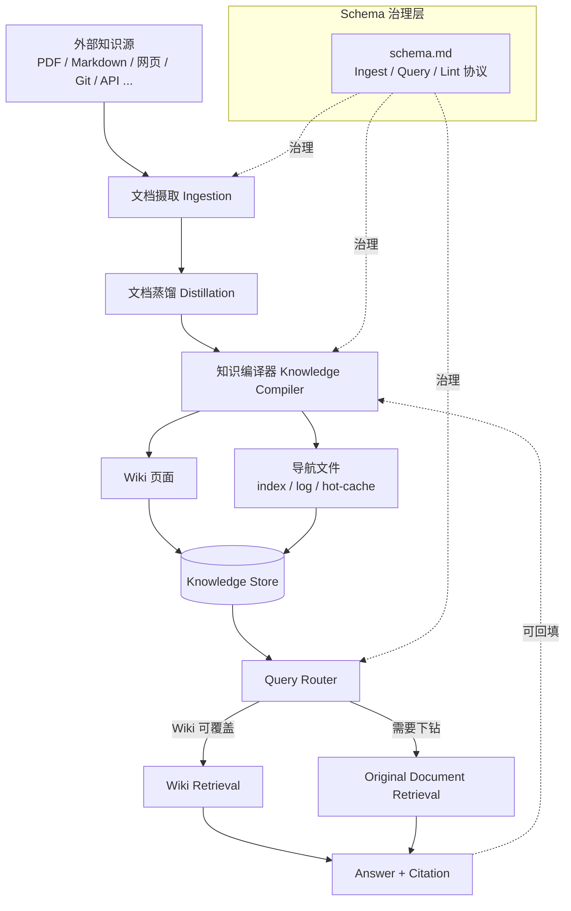
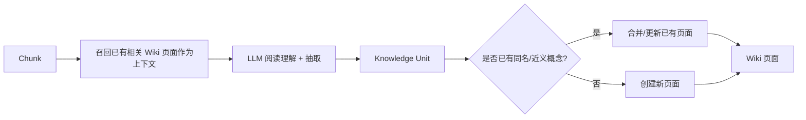
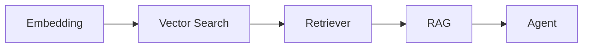
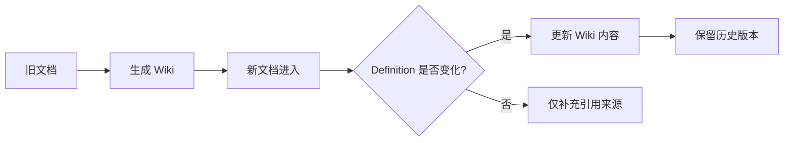
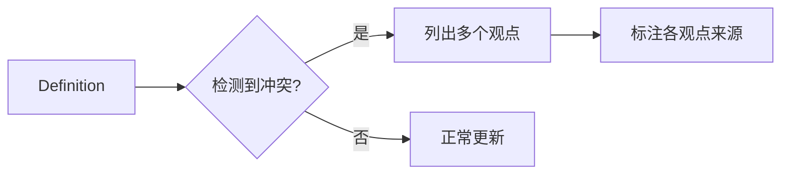
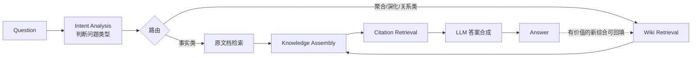
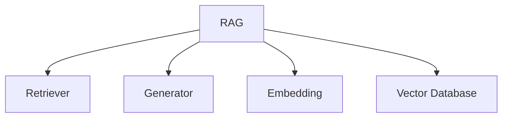

# LLM Wiki 系统设计文档

> **Version**: 0.3
> **状态**: 设计草案
> **目标**：构建一个能够持续吸收知识、自动组织知识、自动维护知识，并基于知识进行问答的 LLM Wiki 系统——而不是一个"一次性"的 RAG 问答工具。

## 目录

- [一、背景与设计目标](#一背景与设计目标)
- [二、理论基础与相关工作](#二理论基础与相关工作)
- [三、整体架构](#三整体架构)
- [四、核心理念：从"检索"到"知识编译"](#四核心理念从检索到知识编译)
- [五、数据模型](#五数据模型)
- [六、系统流程详解](#六系统流程详解)
- [七、Schema 层：知识库的治理协议](#七schema-层知识库的治理协议)
- [八、知识组织与自动链接](#八知识组织与自动链接)
- [九、知识维护：更新、冲突与溯源](#九知识维护更新冲突与溯源)
- [十、Lint：知识库健康检查](#十lint知识库健康检查)
- [十一、检索与问答流程](#十一检索与问答流程)
- [十二、知识图谱视角](#十二知识图谱视角)
- [十三、设计原则](#十三设计原则)
- [十四、风险与挑战](#十四风险与挑战)
- [十五、未来规划](#十五未来规划)
- [十六、总结](#十六总结)
- [参考资料](#参考资料)

---

## 一、背景与设计目标

传统 RAG（Retrieval-Augmented Generation）的核心思路很简单：

> 用户提问 → 检索原始文档片段 → LLM 基于片段生成回答

这种模式的根本问题是**无状态（stateless）**：每次提问，系统都要重新从碎片中"拼接"知识，本次问答产生的综合、关联、结论都不会被保留下来，下一次提问要重新推理一遍。一年的持续提问，得到的知识组织程度并不比第一天更高。

LLM Wiki 的核心思路是：

> 文档进入系统 → 编译为结构化知识 → 持续维护知识库 → 基于知识回答问题

也就是说，系统不是"每次问答都读一次文档"，而是**先把文档"编译"成结构化的 Wiki 知识，长期维护它，再基于 Wiki 回答问题**。这个知识库是一个持续增值的"复合资产"（compounding artifact）：交叉引用已经建好，矛盾已经被标注，综合结论已经反映了所有读过的材料——每加入一个新来源，Wiki 都变得更丰富，而不是简单地变得更大。

设计目标：

| 目标             | 说明                                                   |
| ---------------- | ------------------------------------------------------ |
| **持续吸收知识** | 支持多种来源、多种格式的文档持续接入                   |
| **自动组织知识** | 自动抽取概念、实体、定义、关系，并组织成 Wiki 页面网络 |
| **自动维护知识** | 新文档进入后自动更新已有知识，而非简单堆叠             |
| **可追溯问答**   | 任何回答都能追溯到原始来源，杜绝无依据的幻觉           |
| **长期知识资产** | 系统的价值随时间和文档量增长，而非用完即弃             |

简言之：本系统不是一个"聊天机器人"，而是一个**能够持续演化的知识系统**。

---

## 二、理论基础与相关工作

在正式设计之前，有必要说明这套方案并非凭空构造，而是建立在一个已经被社区广泛验证、也已经被学术界实证评估过的模式之上。这一节的目的是让设计决策"有据可查"，而不是"听起来合理"。

### 2.1 概念起源：Karpathy 的 "LLM Wiki" 模式

"LLM Wiki" 这一说法直接来自 Andrej Karpathy 2026 年 4 月发布的一份构想文档。其核心主张与本方案一致：

> "The knowledge is compiled once and then kept current, not re-derived on every query."（知识只编译一次，然后持续维护，而不是每次提问都重新推导。）

该构想把系统抽象为三层：

- **Raw Sources（原始来源）**：不可变的原始文档，LLM 只读不改；
- **Wiki**：LLM 生成并维护的一组互相链接的 Markdown 页面（摘要、实体页、概念页、综合页）；
- **Schema**：一份告诉 LLM"如何维护这个 Wiki"的规范文档（如 `AGENTS.md`），规定摄取、问答、体检（lint）的具体工作流。

以及三个核心操作：**Ingest（摄取）、Query（问答）、Lint（体检）**。

这与本文档此前版本的设计高度吻合，但本文档此前的版本缺少一个关键角色——**Schema 层**。这是本次修订重点补齐的部分（见第七节）。

### 2.2 实证研究：Wiki 并不总是比 RAG 好

一篇针对该模式的实证论文《The Living Wiki: Schema-Driven LLM Knowledge Bases as Persistent Agent Memory》（AgentSkills '26）在 56 篇真实文档上做了严格对照实验，给出了几个对本方案设计有直接指导意义的发现：

1. **"检索到来源"≠"能回答问题"**：在深度 k=10 时，Wiki 命中至少一个正确来源的比例（90.0%）略高于强 RAG 基线（87.5%），但最终答案质量得分反而更低（0.95 vs 1.32）。瓶颈不在检索，而在**长上下文下的答案合成**。
2. **Wiki 的优势场景是"实体聚合类"问题**（需要跨多篇文档汇总同一实体信息），在这类问题上 Wiki 明显领先 RAG（1.70 vs 1.30）；但在"单文档事实类"问题上，直接检索反而更快更准（RAG 2.40 vs Wiki 0.80）。
3. **悬空链接会随规模累积**：从 V1 到 V3，Wiki 页面数从 21 增长到 102，但未解析的 wikilink 从 0 增长到 199——说明"鼓励自动建链接"如果没有配套的"链接体检"机制，图的质量会随规模退化。
4. **Schema 的措辞方式是可测量的可靠性杠杆**：把提示语从"提醒式"（"remember to update the index"）改为"后果式"（"if you skip this, the vault rots"），实验中的维护遗漏率从 4/5 降到 0/3。这是一个几乎零成本、但影响巨大的设计选择。

这些发现直接指导了本文档第七节（Schema 治理）、第十节（Lint）、第十一节（检索路由）、第十四节（风险）的设计。

### 2.3 与相邻技术的定位区分

| 技术                  | 核心思路                                     | 与 LLM Wiki 的关系                                                                                                             |
| --------------------- | -------------------------------------------- | ------------------------------------------------------------------------------------------------------------------------------ |
| **传统 RAG**          | 查询时从原始文档检索片段                     | LLM Wiki 的"下钻兜底层"，而非主检索路径                                                                                        |
| **GraphRAG**          | 构建实体关系图，用图遍历辅助检索             | 关系型查询占比高（>15%）时可作为 Wiki 链接图的补充，而非从零另建一套图数据库                                                   |
| **STORM（Stanford）** | 用多角度提问+检索自动生成 Wikipedia 风格长文 | 解决的是"一次性生成一篇文章"，而 LLM Wiki 解决的是"持续维护一整个知识库"，二者可以互补（STORM 可作为 Wiki 首次生成骨架的工具） |

结论：LLM Wiki 不是要取代 RAG 或 GraphRAG，而是在它们之上增加一层**持久化、可维护的知识合成层**，并按问题类型把查询路由到最合适的机制（详见第十一节）。

---

## 三、整体架构

延续第二节的三层抽象，系统整体分为四个层次：**Schema 治理层 → 摄取/编译层 → 知识层 → 服务层**。



各层职责：

1. **Schema 治理层**：不是被动文档，而是主动约束——规定摄取的写入顺序、问答的读取顺序、体检的检查项，是保证系统"可靠"而非"随缘"的关键（见第七节）。
2. **摄取/编译层**：接入异构来源，蒸馏为标准化结构，再编译为结构化知识，写入/更新 Wiki 页面与导航文件。
3. **知识层**（Knowledge Store）：Wiki 页面 + 轻量导航文件（`index.md` / `log.md` / `hot-cache.md`），中小规模下无需额外的向量库或图数据库。
4. **服务层**：按问题类型路由到 Wiki 优先检索或原始文档下钻检索，回答可回填为新的 Wiki 页面，形成闭环。

---

## 四、核心理念：从"检索"到"知识编译"

LLM Wiki 的核心不是"检索"，而是**知识编译（Knowledge Compilation）**。

系统认为：**文档只是知识的原始来源，而不是知识本身**。真正需要长期维护的是从文档中提炼出来的：

- **概念（Concept）**
- **实体（Entity）**
- **定义（Definition）**
- **方法（Method / Algorithm）**
- **关系（Relationship）**
- **引用（Citation）**

用一个等式来表达这个核心假设：

> **Document ≠ Knowledge**

系统需要一个持续运行的过程，不断把 `Document` 编译成 `Knowledge`，就像编译器把源代码编译成可执行程序——源代码（文档）依然保留，但真正被执行（被查询、被推理）的是编译产物（Wiki）。

需要特别强调一个容易被忽视的原则（来自社区实践反馈）：**编译的目标是收敛，不是累积**。100 篇输入文档理想情况下应该收敛成几十个高质量、互相合并的 Wiki 页面，而不是线性增长出 100 份摘要。重复出现的主题应该合并强化，而不是重复罗列。如果 Wiki 页面数量与输入文档数量呈线性增长，说明 Compiler 的去重合并机制没有生效，这是需要在评估阶段重点监控的信号。

---

## 五、数据模型

在描述流程之前，先明确系统中流转的核心数据结构。

### 5.1 Document（原始文档）

```yaml
Document:
  id: string
  title: string
  author: string
  source: string # 来源类型：pdf / web / git / api / db ...
  uri: string # 原始位置（文件路径 / URL / commit hash）
  content: string
  created_at: datetime
  updated_at: datetime
  version: int
```

此阶段**不关心问答质量**，只负责忠实保存原始事实，作为后续一切知识的"证据链"起点，**创建后永不修改（append-only）**。

### 5.2 Chunk（标准化片段）

```yaml
Chunk:
  id: string
  document_id: string
  section_path: string[] # 标题层级
  page: int | null
  order: int
  text: string
  prev_chunk_id: string | null
  next_chunk_id: string | null
```

### 5.3 Knowledge Unit（知识单元）

```yaml
KnowledgeUnit:
  id: string
  type: concept | entity | definition | relationship | algorithm | formula | example
  name: string
  summary: string
  detail: string
  sources:
    - document_id: string
      chunk_id: string
      confidence: float
  related: string[]
```

### 5.4 Wiki Page

```yaml
WikiPage:
  slug: string
  title: string
  aliases: string[]
  sections:
    - heading: string
      content: string
      sources: SourceRef[]
  links:
    parent: string | null
    children: string[]
    related: string[]
  status: draft | stub | reviewed # 生命周期状态
  confidence: strong | moderate | weak # 证据强度（供问答降级提示使用）
  updated_at: datetime
  history: WikiPageVersion[]
```

`status` 和 `confidence` 两个字段并非装饰性元数据：当新来源进入时，系统据此判断哪些页面需要重新审视，而不必重建整个 Wiki；当问答时证据不足，系统据此诚实告知用户"这个结论证据较弱"，而不是假装确信。

### 5.5 Relationship（知识关系）

```yaml
Relationship:
  from: string
  to: string
  type: depends_on | part_of | alternative_to | extends | conflicts_with
  evidence: SourceRef[]
```

### 5.6 导航文件（新增）

除了结构化的 Wiki Page，系统维护三个轻量级导航文件，用于在不读全部页面的情况下定位相关知识：

| 文件           | 定位                                                                                   | 更新时机                         |
| -------------- | -------------------------------------------------------------------------------------- | -------------------------------- |
| `index.md`     | 全量目录：每个页面一行（链接 + 一句话摘要 + 类型），按 Entity/Concept/Synthesis 等分类 | 每次新建/重命名/重大修改页面时   |
| `log.md`       | 追加式操作日志：每次 ingest/query/lint 的时间戳与摘要                                  | 每次操作后追加，永不修改历史条目 |
| `hot-cache.md` | 最近一次摄取会话的摘要，用于"热启动"                                                   | 每次 ingest/lint 后刷新          |

这三个文件在中小规模（几百篇 Wiki 页面以内）时，配合简单的关键词/BM25 搜索即可满足绝大部分导航需求，**不必一开始就引入向量数据库**。当 Wiki 规模继续增长、关键词检索的召回率明显下降时，再按需引入向量索引或图数据库作为增强，而不是默认标配。

---

## 六、系统流程详解

### 6.1 文档摄取（Ingestion）

负责接收所有知识来源，统一转换为内部 `Document`：PDF / Word / PPT、Markdown / HTML、网页、Git Repository、API / 数据库。不同格式的解析器各自负责把原始格式转换为统一的纯文本 + 元信息。

### 6.2 文档蒸馏（Distillation）

这一步比"标准化"更进一步：不仅要统一结构（`Document → Section → Paragraph → Chunk`），还要**确定性地剥离原始格式中对 Compiler 无意义的噪声**（例如 PDF 的排版坐标、HTML 的样式标签），只保留语义相关的内容和上下文。

三个约束条件（借鉴生产实践）：

1. **蒸馏输出必须是确定性的**——同一输入多次蒸馏应得到字节级一致的输出，否则后续的"增量摄取"（只处理变化部分）无法可靠工作；
2. **蒸馏产物必须携带溯源头信息**（来源路径、内容哈希、蒸馏器版本），保证可追溯到具体是哪个版本的蒸馏逻辑处理了这份来源；
3. **修改蒸馏规则是一等大事**——蒸馏器决定了 Compiler "能看到什么"，因此也决定了"能产生什么知识"，不能当作无关紧要的格式转换随意调整。

### 6.3 Knowledge Compiler（知识编译器）

这是整个系统**最重要的一层**，负责完成 `Chunk → Knowledge Unit`，而不是简单的 `Chunk → Embedding`。



关键在于 `Dedup` 这一步：Compiler 必须先检索已有 Wiki（而不是无条件创建新页面），判断这是"对已有概念的补充"还是"一个全新概念"。经验法则：如果是一个独立的、会被其它页面链接引用的实体/概念，创建新页面；如果只是已有概念的一个属性更新，就地编辑。这个判断的准确率直接决定 Wiki 是否会退化成"文档摘要的堆叠"。

### 6.4 Wiki Page 生成

```markdown
# RAG

## Definition

检索增强生成（Retrieval-Augmented Generation）是一种...

## Motivation

为了解决 LLM 知识过时、幻觉等问题...

## Related

- [[Embedding]]
- [[Retriever]]
- [[Vector Search]]

## References

- Paper A（2023）
- Paper B（2024）
```

**Wiki Page 是知识的最小维护单位，不是 Chunk，也不是 PDF。**

---

## 七、Schema 层：知识库的治理协议

这是本次修订新增的核心章节。此前版本的设计只描述了 Wiki **是什么**，没有回答"如何保证 Compiler 每次都规范地维护它"——这恰恰是让系统从"能跑的 Demo"变成"可靠系统"的关键。

### 7.1 Schema 文件的作用

Schema 是一份配置文档（类似 `AGENTS.md`），不是训练进模型权重里的能力，而是**外部配置、会话开始时读取、纳入版本控制、可独立迭代**的规范。它规定：

- **写入顺序协议**：摄取一份新来源时，必须按固定顺序完成哪些动作；
- **读取顺序协议**：回答问题时，应该先读什么、再读什么；
- **页面格式规范**：每类页面必须包含哪些字段/小节；
- **去重规则**：什么情况下新建页面，什么情况下编辑已有页面。

### 7.2 写入顺序协议（示例）

```
1. 原始来源写入 sources/（不可变）
2. 更新/创建相关 Entity、Concept 页面
3. 若需要，写入综合分析（Synthesis）页面
4. 更新 index.md
5. 追加一条记录到 log.md
6. 刷新 hot-cache.md
```

### 7.3 后果式语言（Consequence Language）—— 关键的低成本高收益设计

实证研究发现：把 Schema 中的步骤描述从"提醒式"改写为"后果式"，能显著提高执行遵从率。

| 措辞方式         | 示例                                                                                                 | 实测遗漏率 |
| ---------------- | ---------------------------------------------------------------------------------------------------- | ---------- |
| 提醒式（不推荐） | "Remember to update the index."                                                                      | 4/5 次遗漏 |
| 后果式（推荐）   | "If you skip updating the index, the wiki rots — future queries will not be able to find this page." | 0/3 次遗漏 |

**结论**：Schema 中的每一条维护步骤，都应该显式说明"如果跳过这一步会造成什么后果"，而不是仅仅列出步骤清单。这是一个几乎零成本、但对系统长期健康度影响很大的写作细节，应作为团队编写/评审 Schema 文件的强制要求。

### 7.4 读取顺序协议

回答问题时的读取顺序应为：`hot-cache.md → index.md → 定位到的具体页面`。需要特别注意（同样来自实测教训）：**`hot-cache.md` 只能作为"缩小搜索范围"的诊断性上下文，不能作为终止检索的依据**——早期实现中如果让 hot-cache 直接终止检索，会导致复杂的综合性问题遗漏掉 index 里其实存在的相关页面。

---

## 八、知识组织与自动链接

### 8.1 知识网络

Wiki 页面之间天然形成一张网络：



每个页面维护：`Related`（相关但非层级）、`Parent`/`Children`（上下位关系）、`References`（原始文献）、`Aliases`（同义词）。

### 8.2 自动链接机制

Compiler 在生成 Wiki 内容时，自动识别文本中提到的概念：若已存在对应页面，自动生成双向链接 `[[Retriever]]`；若不存在，自动创建一个**空白占位页面（stub）**，等待后续文档补充完整。

需要注意：自动建链接如果没有配套体检机制，**悬空链接会随规模累积**（真实测量数据：从 0 增长到 199 个未解析链接，参见第二节）。因此"自动创建链接"和"自动体检链接"必须成对出现，不能只做前者——这也是第十节 Lint 被独立成一级操作的原因。

---

## 九、知识维护：更新、冲突与溯源

### 9.1 知识更新



原则：**Wiki 始终反映最新、最准确的知识状态；原始 Document 永久保留，作为可追溯的历史证据。**

### 9.2 知识冲突处理



系统**不会**用后来的文档直接覆盖已有结论，而是在 Wiki 页面中保留"多观点 + 各自来源"的呈现方式（例如一个 `Debates / Conflicting Views` 小节），保证知识可追溯、不武断取舍。

### 9.3 引用管理

追溯链路：`Definition → Source → Document → Page/Chunk → Paragraph`。回答问题时直接引用具体来源（文档 + 页码/段落），有效降低幻觉风险。

---

## 十、Lint：知识库健康检查

此前版本把"体检"能力隐含在"知识演化"一节里，一带而过。考虑到实证研究把 Lint 列为与 Ingest、Query 并列的一级操作，本次修订将其独立成章。

### 10.1 检查项清单

| 检查项                      | 说明                                         | 真实观测到的问题                            |
| --------------------------- | -------------------------------------------- | ------------------------------------------- |
| **悬空链接**                | 页面引用了不存在的页面                       | V3 时累积 199 个未解析链接                  |
| **孤儿页面**                | 没有任何入链的页面                           | 说明该页面未被有效整合进知识网络            |
| **矛盾检测**                | 多个页面/来源对同一事实的表述互相冲突        | 需人工或二次模型复核                        |
| **过时声明**                | 新来源已经推翻了旧页面的结论，但旧页面未更新 | 结合 `updated_at` 与新增来源的时间戳判断    |
| **索引漂移（Index Drift）** | `index.md` 与实际页面集合不一致              | 未强制执行时，两个会话内就会失同步          |
| **热缓存过期**              | `hot-cache.md` 未反映最近一次操作            | 仅在 ingest 后刷新、lint 后未刷新会导致过期 |
| **缺失页面**                | 文本中被反复提及但从未生成独立页面的概念     | 提示应该新建页面而不是永远停留在 stub 状态  |

### 10.2 执行方式

Lint 应当是**强制的一等操作**，不是可选的清理任务：

- 每次 Ingest 完成后，自动触发一次轻量 Lint（检查本次改动涉及的页面）；
- 每日/每周定期触发一次全量 Lint；
- Lint 结果写入 `log.md`，形成可审计的健康度趋势。

---

## 十一、检索与问答流程

### 11.1 按问题类型路由，而非简单分级

此前版本采用"先查 Wiki，不够再查原文档"的简单二级检索策略。结合实证数据（见第二节），这一策略需要细化为**按问题类型路由**，因为 Wiki 并非在所有问题类型上都优于直接检索：

| 问题类型     | 示例                                     | 推荐路径                                         | 依据                                                             |
| ------------ | ---------------------------------------- | ------------------------------------------------ | ---------------------------------------------------------------- |
| 单文档事实类 | "论文 A 里 Chunk Size 设为多少？"        | 直接检索原文档                                   | Wiki 综合会引入额外的合成开销，直接检索更快更准                  |
| 实体聚合类   | "某个作者在这些论文里分别做了什么贡献？" | Wiki 优先（实体页）                              | 这是 Wiki 持久化综合的最大优势场景                               |
| 时序演化类   | "这个方法是怎么一步步演化过来的？"       | Wiki 优先（综合/分析页），必要时回补原文档时间戳 | Wiki 的综合页天然按时间组织                                      |
| 隐式关系类   | "哪些工作同时涉及 A 和 B？"              | Wiki 链接图遍历 + 原文档验证                     | 图遍历能找到候选，但"找到"不等于"能回答"，仍需回读原文档确认细节 |

### 11.2 两级下钻（作为兜底，而非默认路径）

对于 Wiki 覆盖不足的情况，仍保留下钻能力：

```
Wiki 检索不足 → Original Document → Chunk 检索 → 补充回答
```

### 11.3 问答流程



需要特别注意"Knowledge Assembly"这一步：实证数据显示，即便检索命中了所有正确来源，答案质量仍可能不足——**瓶颈往往在于把多个分散的证据组装成一个紧凑、可回答的上下文，而不是检索本身**。因此这一步应该被当作独立的工程重点，而不是想当然地认为"检索对了，答案就会对"。

---

## 十二、知识图谱视角

Wiki 本身天然形成一张图，Wiki Link 即图的边：



**是否需要引入专用图数据库（如 Neo4j）是一个需要用数据驱动的决策，不是默认选项**：业界经验表明，当关系型/多跳查询占查询总量的比例低于 15% 时，维护一套独立图基础设施的成本通常不划算，Wiki 链接结构本身遍历即可满足需求；只有当这个比例明显上升、且需要复杂的多跳路径查询时，才值得评估引入专用图存储和检索层（并与向量检索、Wiki 检索一起做混合路由，而不是替代它们）。

---

## 十三、设计原则

延续第一版的价值观，并补充实证研究验证过的工程原则：

### 13.1 价值观原则

| 原则                    | 说明                                                           |
| ----------------------- | -------------------------------------------------------------- |
| **文档不是知识**        | 文档只是知识的来源，知识必须经过整理、抽取、结构化后才能被复用 |
| **Wiki 是唯一事实来源** | 回答应优先依据 Wiki；原始文档仅作为补充证据                    |
| **所有知识必须可追溯**  | 任何一句总结、任何一个结论都必须能找到对应来源                 |
| **面向长期积累**        | 系统的目标不是回答一次问题，而是建立可持续增长的知识资产       |

### 13.2 工程原则（源自实证研究，P1–P6）

| 原则                          | 说明                                                                                                                                     |
| ----------------------------- | ---------------------------------------------------------------------------------------------------------------------------------------- |
| **P1 Schema 先行**            | 在没有 Schema 约束的试点中，Wiki 在两次摄取会话内就退化成了扁平的文件堆放。必须先定义 Schema，再开始摄取；事后补救需要一次完整的重新编译 |
| **P2 使用后果式语言**         | 把"记得更新索引"改成"跳过索引更新会导致知识库腐化"，遗漏率从 4/5 降到 0/3（见 7.3 节）                                                   |
| **P3 来源永久不可变**         | 原始文档只读不改，所有综合都作为 Wiki 页面引用来源，保证可追溯、可重新编译                                                               |
| **P4 热缓存是向导，不是关卡** | 让 `hot-cache.md` 直接终止检索会漏掉复杂问题所需的相关页面；应作为非终止性的诊断上下文                                                   |
| **P5 日志追加式且结构化**     | `log.md` 同时是审计记录、健康度监测数据源和调试工具；一旦可以被随意改写，这些价值都会丧失                                                |
| **P6 链接体检是一等操作**     | 高链接密度只在链接可解析时才有价值；Lint 必须是写入流程的强制步骤，不是可选的事后清理                                                    |

---

## 十四、风险与挑战

结合真实失败模式数据，重新评估风险清单：

| 风险                   | 描述                                             | 真实观测/数据                                                          | 缓解方向                                                       |
| ---------------------- | ------------------------------------------------ | ---------------------------------------------------------------------- | -------------------------------------------------------------- |
| **答案合成能力不足**   | 检索命中正确来源，但最终答案质量仍不足           | 深度 k=10 时 Wiki 来源命中率 90%，但答案得分仍低于 RAG（0.95 vs 1.32） | 把"证据组装"作为独立工程环节优化，而不是假设检索对了答案就会对 |
| **悬空链接累积**       | 自动建链接但缺乏体检，链接逐渐失效               | 观测数据从 0 增长到 199                                                | 将 Lint 设为强制的一等操作（见第十节）                         |
| **索引/缓存漂移**      | `index.md`/`hot-cache.md` 与实际状态不一致       | 无强制机制时两个会话内即失同步                                         | 纳入写入顺序协议 + 定期 Lint                                   |
| **知识合并错误**       | 新知识与旧知识合并时，误判为同一概念或误判为冲突 | ——                                                                     | 引入实体消歧（Entity Resolution）与相似度阈值机制              |
| **Wiki 腐化/维护遗漏** | 大量步骤在长期运行中被静默跳过                   | 提醒式措辞下遗漏率 4/5                                                 | 采用后果式 Schema 语言（P2）                                   |
| **成本与延迟**         | Compiler 依赖 LLM 调用，文档量大时编译成本高     | ——                                                                     | 分层编译（重要文档优先）、缓存复用、增量编译                   |
| **版本膨胀**           | 历史版本持续保留可能导致存储膨胀                 | ——                                                                     | 定期归档/压缩历史版本，保留关键变更节点                        |

---

## 十五、未来规划

系统未来可进一步支持：

- 自动知识审核（人工 Review 流程接入，团队场景下建议采用 PR 式审核门禁，避免多个 Agent 同时写同一页面产生冲突）
- 单一写入者角色约束（不同类型页面由不同角色/流程独占写权限，减少并发冲突）
- 多版本 Wiki（面向不同受众/不同时间点）
- 多语言 Wiki
- 知识可信度评分（结合 `confidence` 字段做检索时的降级提示）
- 专家修订与批注
- 可选开启的语义召回（在关键词/BM25 基础之上，按需叠加本地轻量向量模型，而非默认标配向量数据库）
- 自动生成学习路径 / 课程大纲
- 自动生成思维导图
- 自动发现知识缺口（Knowledge Gap Detection）
- 自动推荐延伸阅读资料

---

## 十六、总结

LLM Wiki 的最终目标不是构建一个"更强的 RAG 系统"，而是构建一个能够**持续学习、持续整理、持续演化**的知识生态：文档只是燃料，Wiki 才是被真正维护、被信任、被复用的知识资产。而支撑这个知识资产长期可靠运转的，不只是巧妙的检索算法，更是一份被认真设计、用"后果式语言"书写、把 Lint 当作一等公民的 **Schema 治理协议**——正如实证研究的结论所说："持久化的 Wiki 不是模型的能力，而是 Schema 的能力"（"The persistent wiki is not a feature of the LLM; it is a feature of the schema."）。

---

## 参考资料

- Andrej Karpathy, _LLM Wiki: A Pattern for Building Personal Knowledge Bases Using LLMs_, GitHub Gist, 2026. https://gist.github.com/karpathy/442a6bf555914893e9891c11519de94f
- Anonymous Authors, _The Living Wiki: Schema-Driven LLM Knowledge Bases as Persistent Agent Memory_, AgentSkills '26 (co-located workshop), 2026.
- Shao et al., _Assisting in Writing Wikipedia-like Articles From Scratch with Large Language Models_（STORM）, arXiv:2402.14207, 2024. https://arxiv.org/abs/2402.14207
- Lewis et al., _Retrieval-Augmented Generation for Knowledge-Intensive NLP Tasks_, NeurIPS, 2020. https://arxiv.org/abs/2005.11401
- Packer et al., _MemGPT: Towards LLMs as Operating Systems_, arXiv:2310.08560, 2023.
- Park et al., _Generative Agents: Interactive Simulacra of Human Behavior_, UIST, 2023. https://arxiv.org/abs/2304.03442
- 社区实现参考：`stanford-oval/storm`、`cobusgreyling/llm-wiki`、`gowtham0992/link`、`microsoft/llmwiki`（均为公开 GitHub 项目，可作为工程实现参考，具体接口以各项目最新文档为准）
