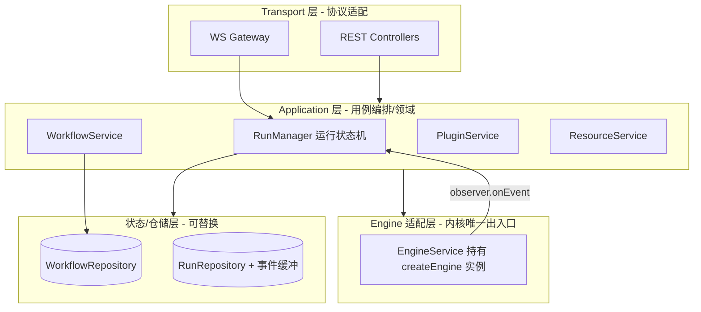
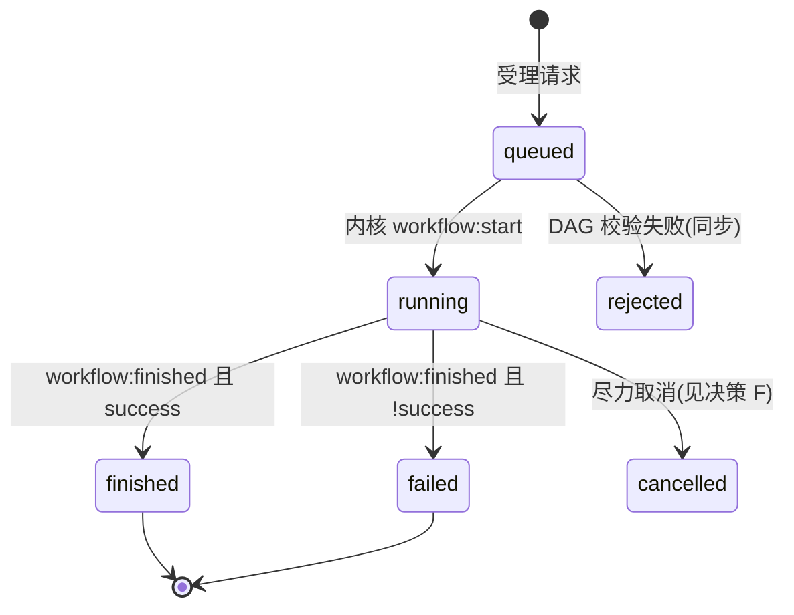

# apps/server 服务设计方案 · MONAI DevOps API

> 从后端服务自身的工程视角设计 `apps/server`，把它定位为「将 `core-engine` 编排内核
> 安全、可观测、可扩展地网络化暴露」的服务。
>
> 核心是服务的职责分层、Run 领域模型与状态机、Engine 生命周期 / 并发 / 事件流等关键工程决策；
> **API 仅作为领域模型的投影**。前端 [web-ui.md](./web-ui.md) §10 清单仅作覆盖度对照（见附录 A）。

---

## 1. 现状盘点

### 1.1 当前实现（起点）

`apps/server` 基于 **NestJS 11 + Express + ws**，当前仅有 3 个端点：

| 类型 | 路径 | 说明 |
| --- | --- | --- |
| HTTP `GET` | `/{prefix}` | 返回 `"Hello World!"` |
| HTTP `GET` | `/{prefix}/test-devops` | 硬编码运行一个 workflow，一次性返回结果 |
| WebSocket | `/{prefix}/test-devops/ws` | 发 `{ type:'run', workflow }`，收 `event` / `done` / `error` |

关键实现特征（决定为何需要架构升级）：

- **每次 run 临时 `createEngine` 后 `destroy`**：资源池 per-run 独享，永远不会产生真实排队。
- **observer 仅向单个 WS 连接回推**：无历史、无回放、刷新即断观测。
- **单连接单任务**：`session.running` 限制同一连接不可并发提交。
- **无持久化、无鉴权、无全局 ValidationPipe**；HTTP 与 WS 前缀来源分裂（`setGlobalPrefix` vs 手动读 env）。

### 1.2 内核能力面（服务需完整覆盖）

`@monai-devops/core-engine` 通过 `createEngine()` 暴露：

- `runWorkflow` / `scheduleWorkflow`
- 插件注册表：`getPlugins` / `registerPlugin` / …
- 资源：`getResourceManager` / `getResourceWaitQueue().getQueueStatus()`
- 单步：`getExecutor().executeStep`
- 观测：`observer.onEvent` → 6 种 `WorkflowLifecycleEvent`
- 生命周期：`destroy`

服务**只调用、不复制**上述能力；编排、调度、插件执行逻辑全部留在内核。

---

## 2. 服务定位与设计边界

`core-engine` 已经是**完整的进程内编排内核**（DAG 校验、并行调度、资源池、插件注册表、生命周期事件、错误分层）。`apps/server` 不应重新实现任何编排逻辑，职责是把内核**网络化、长生命周期化、可观测化**。

| 维度 | 边界 |
| --- | --- |
| **服务负责** | 协议适配（HTTP/WS）、Engine 实例生命周期、Run 状态机与历史、事件流缓冲/回放/扇出、入参校验与错误契约、配置与可观测性、状态持久化抽象 |
| **服务不负责** | DAG 校验算法、调度/资源分配、插件执行、条件求值 —— 全部委托内核 |

**一句话**：`server = core-engine 的「网络运行时」`。设计质量由「是否干净地包住内核能力面」决定，而非由前端字段诉求决定。

---

## 3. 分层架构与模块边界

服务内部分四层，依赖单向向下，禁止跨层耦合（Transport 不直接碰 Engine）：



- **Engine 适配层是内核的唯一出入口**：全服务只有 `EngineService` 直接 `import` core-engine，内核类型经此转译为服务 DTO，避免内核细节渗透到 Transport/前端。
- **状态层用接口隔离**：`WorkflowRepository` / `RunRepository` 是接口，本期 `InMemory*` 实现，未来换 SQLite/Postgres 只替换 provider（NestJS `useClass`），上层零改动。

---

## 4. 核心领域模型：Run 作为一等资源

内核里「一次运行」是 `runWorkflow()` 的 Promise + 一串 observer 事件，**没有可寻址的运行实例**。服务设计的核心增量，是把它提升为一等领域对象 **Run**：

- **Run 标识**：服务生成 `runId`（内核 `meta.runId` 的承载者），使运行可被 GET、订阅、取消、入历史。
- **Run 状态机**（服务维护，非内核概念）：



- **RunRecord**（仓储聚合根）：`runId / workflowSnapshot / status / counts / startedAt / finishedAt / result / events[]`。`workflowSnapshot` 冻结提交时的定义，保证历史可复现。
- **事件缓冲**：每个 Run 持有有序 `events[]`（已序列化），既是 WS 订阅者的回放源，也是 REST 历史查询的数据源 —— **一份缓冲、两个读出口**。

---

## 5. 关键工程决策

### 5.1 决策 A · Engine 生命周期：共享单例（推荐）

这是全服务最重要的决策，直接决定并发模型与资源语义。

- **现状问题**：per-run `createEngine` → 资源池每 run 独享 → **永远不会排队**，`getQueueStatus` 失去意义。
- **推荐：共享单例 Engine**。进程启动建一个 engine（注册全部插件、固定容量资源池、挂全局 observer），所有 Run 共用。
  - 多 Run 并发时产生**真实排队** → `getResourceWaitQueue().getQueueStatus()` 成为有意义的可观测数据。
  - 插件/资源元数据查询有稳定数据源。
- **代价与应对**：
  1. 事件按 `meta.runId` 分流（observer 回调天然带 meta）。
  2. 长生命周期防内存增长 → Run 事件缓冲设上限/TTL + 终态 Run 归档。
  3. 进程退出时 `engine.destroy()`（Nest `OnModuleDestroy`）。
- **备选**：`scheduleWorkflow`（task 级并发上限）可作为「整 workflow 入队」模式，本期主路径用 `runWorkflow` + 共享资源池。

### 5.2 决策 B · 并发与背压

- 服务**不自己排队**，并发控制下沉给内核：步骤级 `maxParallelSteps` + 资源池容量。
- 背压与调度观测：步骤进入资源调度流程会产生 `step:queued` 事件（通常发生在资源紧张场景）；该事件用于解释调度路径，不保证已发生物理等待。
- 可选：Application 层「最大活跃 Run 数」软上限（超限 429），作为可配置项保护进程。

### 5.3 决策 C · 事件流通道：缓冲 + 回放 + 扇出

内核 observer 是「即时推送、无历史、单消费」。服务补三件事：

| 能力 | 说明 |
| --- | --- |
| **缓冲** | 事件先落 `RunRecord.events[]`，再分发 |
| **回放** | 新订阅者先按序回放已有事件，再接实时流（刷新/断线重连） |
| **扇出** | 同一 Run 可被多个 WS 连接订阅 |

主通道 **WebSocket**（沿用现有 `ws` 依赖与 `event/done/error` 协议）；协议从「连上即跑」升级为「订阅 runId」。

### 5.4 决策 D · 状态与持久化抽象

- 一切状态经 `WorkflowRepository` / `RunRepository` 接口存取，本期 **InMemory** 实现。
- 接口面向领域（`save / findById / list(filter,page) / appendEvent`），非面向 SQL。
- 内存期设容量上限 + LRU 淘汰；未来终态 Run 可序列化落盘。

### 5.5 决策 E · 错误契约与序列化边界

- **校验前置**：DAG 校验失败 → 同步 400 + 结构化明细（`WorkflowValidationError`），运行不进状态机。
- **运行内失败不是 HTTP 错误**：步骤失败 / `PLUGIN_NOT_FOUND` 体现在 `ExecutionResult`，HTTP/WS 链路本身成功。
- **序列化边界唯一**：`Error → { name, message }` 只在 Engine 适配层做一次（提升现有 `serialize-workflow-event.ts`）。
- 全局 `AllExceptionsFilter`：`{ statusCode, message, error, code? }`。

### 5.6 决策 F · 取消语义（诚实暴露内核能力）

内核支持两档取消，由请求体 `mode` 选择（默认 `best-effort`）：

| `mode` | 行为 |
| --- | --- |
| `best-effort` | 停止调度未开始步骤；资源队列中步骤取消；**in-flight 跑完**；响应 `cancelled: 'best-effort'` |
| `hard` | 向 in-flight 步骤注入 `AbortSignal`（`getAbortSignal`）；插件应协作退出；`inFlightTimeoutMs` 超时后步骤 `SKIPPED / user_cancelled`；响应 `cancelled: 'hard'` |

`POST /runs/:runId/cancel` 请求体：`{ "mode"?: "best-effort" | "hard" }`。

`POST /runs/:runId/pause` 请求体：`{ "waitInFlight"?: boolean, "abortInFlight"?: boolean }`（默认 `waitInFlight: true`）。

未协作插件的子进程强制回收仍属后续运维增强，见 [core-engine.md](./core-engine.md)。

### 5.7 决策 G · 配置与可观测性

| 配置项 | 用途 |
| --- | --- |
| `GLOBAL_API_PREFIX` | HTTP 全局前缀 + WS path（统一来源） |
| `PORT` | 监听端口 |
| `MAX_PARALLEL_STEPS` | 步骤并行上限 |
| `RESOURCE_POOL_SIZE` | 资源池容量 |
| `MAX_ACTIVE_RUNS` | 活跃 Run 软上限 |
| `RUN_HISTORY_LIMIT` | 历史保留上限 |

可观测性：`GET /healthz`、`GET /stats/overview`、Run 级 `traceId` 结构化日志。

---

## 6. 模块结构（NestJS）

```
apps/server/src/
├─ main.ts                         # 统一前缀/WS path、ValidationPipe、CORS、异常过滤器、优雅退出
├─ app.module.ts
├─ common/
│  ├─ filters/all-exceptions.filter.ts
│  ├─ serialization/                # Engine→DTO 转译 + 事件序列化（唯一边界）
│  └─ dto/pagination.dto.ts
├─ engine/
│  └─ engine.service.ts             # 内核唯一出入口：共享 engine + 全局 observer 分发器
├─ runs/                            # 服务核心领域
│  ├─ run-manager.service.ts        # Run 状态机 + 事件缓冲 + 扇出
│  ├─ runs.repository.ts            # 接口 + InMemoryRunRepository
│  ├─ runs.controller.ts            # REST：历史/详情/事件回放/取消
│  └─ runs.gateway.ts               # WS：订阅型事件流
├─ workflows/
│  ├─ workflows.service.ts / controller.ts / dto/
│  └─ workflows.repository.ts       # 接口 + InMemoryWorkflowRepository
├─ plugins/  (controller + service) # 读内核 registry
├─ resources/ (controller + service)# 读资源池 + 队列状态
└─ test-devops/                     # 现有验证模块，迁移后保留为兼容层或下线
```

---

## 7. API 投影（按服务资源模型组织）

API 是领域模型的 HTTP/WS 投影，按服务资源边界归组。

### 7.1 Engine / Plugins（内核能力的只读暴露）

| 方法 | 路径 | 说明 |
| --- | --- | --- |
| `GET` | `/healthz` | 存活与 engine 就绪 |
| `GET` | `/plugins` | 插件注册表（`name / version / description / hasConfigSchema`） |
| `GET` | `/plugins/:name` | 单插件详情（含 `hasConfigSchema`） |
| `GET` | `/plugins/:name/config-schema` | 插件 config 的 JSON Schema，响应 `{ name, configJsonSchema }` |
| `POST` | `/plugins/:name/dry-run` | 单步试运行，body `{ config }` → `ExecutionResult` |

### 7.2 Workflows（定义 CRUD + 校验 + 触发）

| 方法 | 路径 | 说明 |
| --- | --- | --- |
| `GET` | `/workflows` | 列表（`search / page / pageSize`） |
| `POST` | `/workflows` | 创建，body = `WorkflowDefinition` |
| `GET` | `/workflows/:id` | 详情 |
| `PUT` | `/workflows/:id` | 更新 |
| `DELETE` | `/workflows/:id` | 删除 |
| `POST` | `/workflows/validate` | 不持久化的 DAG 校验 |
| `POST` | `/workflows/:id/run` | 触发运行，返回 `{ runId, status:'queued' }` |
| `POST` | `/runs` | 内联 workflow 触发（未保存即运行） |

Run 级 context 可选：`priority / traceId / maxParallelSteps / failFast`。

### 7.3 Runs（服务核心一等资源）

| 方法 | 路径 | 说明 |
| --- | --- | --- |
| `GET` | `/runs` | 历史列表（`status / workflowId / search / page / pageSize`，活跃置顶） |
| `GET` | `/runs/:runId` | Run 聚合（状态、counts、时间、result、workflow 快照） |
| `GET` | `/runs/:runId/events` | 事件缓冲回放（6 类序列化事件） |
| `POST` | `/runs/:runId/cancel` | 取消（body：`mode?: best-effort \| hard`） |
| `POST` | `/runs/:runId/pause` | 暂停（body：`waitInFlight?, abortInFlight?`） |
| `POST` | `/runs/:runId/resume` | 继续 |
| `DELETE` | `/runs/:runId` | 删除历史（可选） |

### 7.4 Resources（调度可观测性）

| 方法 | 路径 | 说明 |
| --- | --- | --- |
| `GET` | `/resources` | 资源池快照（`id / type / name / status`） |
| `GET` | `/resources/queue` | `getResourceWaitQueue().getQueueStatus()`（`byType`） |

### 7.5 Stats

| 方法 | 路径 | 说明 |
| --- | --- | --- |
| `GET` | `/stats/overview` | 活跃/成功率/排队/插件数实时聚合 |

---

## 8. WebSocket / 事件流通道

**入站消息**：

```ts
type WsInboundMessage =
  | { type: 'subscribe'; runId: string }   // 主路径
  | { type: 'unsubscribe'; runId: string }
  | { type: 'run'; workflow: WorkflowDefinition };  // 兼容即时模式
```

**出站消息**（沿用现有协议）：

```ts
type WsOutboundMessage =
  | { type: 'event'; event: SerializedWorkflowLifecycleEvent }
  | { type: 'done'; result: WorkflowRunResultSerialized }
  | { type: 'error'; message: string };
```

**行为**：

- 订阅即回放缓冲 + 续接实时；多订阅者扇出。
- 连接断开仅退订，Run 继续执行（生命周期归 `RunManager`，不绑定单个连接）。
- `{ type:'run' }` 内部 = 受理 Run + 自动订阅（向后兼容 `test-devops/ws`）。

---

## 9. 横切关注（后续迭代）

本期不实现，接口形态已预留位置：

- 鉴权（JWT / API Key）+ 守卫
- 限流、OpenAPI/Swagger
- 插件动态注册 API
- `scheduleWorkflow` task 队列暴露
- 数据库持久化（替换 `InMemory*` repo）
- 插件孤立任务强制回收（hard cancel 超时后）

---

## 10. 分阶段实施

```
阶段1 服务地基
  EngineService 共享单例 + observer 分发器
  common（序列化/异常过滤/分页）
  统一前缀与 WS path、ValidationPipe、优雅退出

阶段2 Run 领域闭环 ★
  RunManager 状态机 + 事件缓冲 + InMemoryRunRepository
  订阅型 WS Gateway
  POST /runs + GET /runs/:runId(/events)
  验收：提交 → 订阅 → 回放 → 历史

阶段3 资源模型补全
  Workflows CRUD + validate
  Plugins 只读 + dry-run
  Resources 队列可观测
  Stats overview

阶段4 打磨
  healthz、traceId 日志
  历史容量上限/TTL
  test-devops 兼容层收敛
```

---

## 附录 A · 与 web-ui.md §10 的对照（验证覆盖，非设计驱动）

| web-ui §10 | 本方案 |
| --- | --- |
| `GET /plugins` | §7.1 Engine/Plugins |
| workflows CRUD | §7.2 Workflows |
| `GET /runs`、`GET /runs/:runId` | §7.3 Runs（+ 事件回放） |
| `GET /resources/queue` | §7.4 Resources |
| 运行取消 | §5.6 决策 F 尽力取消 |
| 按 runId 订阅 / 多任务 | §5.3 决策 C + §8 WS 通道 |
