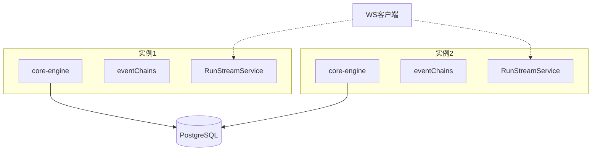
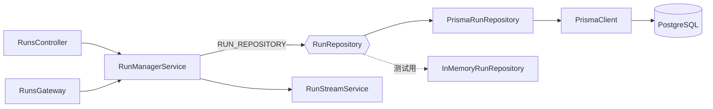
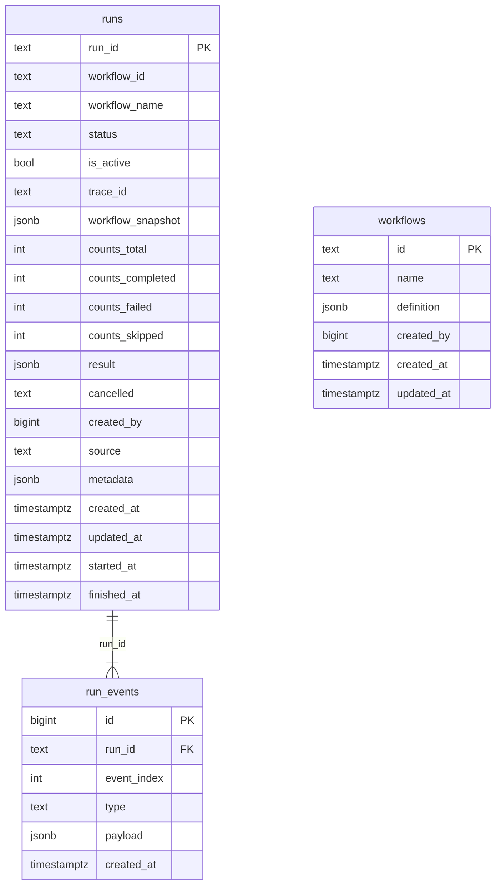

# apps/server 数据持久化方案

将 `apps/server` 中 Runs 与 Workflows 的存储从进程内存（`Map` + LRU）迁移至 **PostgreSQL + Prisma**。业务层（`RunManagerService`、`RunsController`、`RunsGateway`）通过既有 `RunRepository` / `WorkflowRepository` 接口访问数据，**仅替换 Repository 实现与 DI 绑定，不改业务逻辑**。

| 项       | 决策                                                                                       |
| -------- | ------------------------------------------------------------------------------------------ |
| 数据库   | PostgreSQL（团队共享常驻服务）                                                             |
| ORM      | Prisma                                                                                     |
| 迁移范围 | Runs、Workflows、Stats 聚合查询                                                            |
| 历史数据 | 无；当前数据易失，直接切换实现                                                             |
| 身份字段 | `workflows.created_by`、`runs.created_by` 均为 `BigInt`，存储后续统一认证服务下发的用户 ID |
| 权限     | 本次不实现，仅预留身份字段与扩展点（见 4.5）                                               |

---

## 1. 背景与起点

### 1.1 当前存储现状

- **Runs**：`InMemoryRunRepository`（`apps/server/src/runs/in-memory-run.repository.ts`），`Map<string, RunRecord>` + LRU 淘汰，`RUN_HISTORY_LIMIT` 同时限制 run 总数与单 run 事件数。
- **Workflows**：`InMemoryWorkflowRepository`（`apps/server/src/workflows/in-memory-workflow.repository.ts`），同为内存 `Map`。
- **接口已抽象**：`RunRepository`（`runs.repository.ts`）、`WorkflowRepository`（`workflows.repository.ts`），通过 `RUN_REPOSITORY` / `WORKFLOW_REPOSITORY` token 注入。
- **上层无感知**：`RunManagerService`、`RunsController`、`RunsGateway`、`StatsService` 均只依赖接口。
- **基础设施**：项目当前无数据库/ORM 依赖，无 Docker/K8s 配置，需从零引入。
- **与内核边界**：`docs/plans/core-engine.md` CE-011 约定持久化由 server 层承担；`core-engine` 执行态仍在进程内，不在本次范围。

### 1.2 前端消费模式（决定查询设计）

| 场景     | 行为                                                  | 存储层要求                                   |
| -------- | ----------------------------------------------------- | -------------------------------------------- |
| 列表页   | `GET /runs?status&search&page&pageSize`，5s 轮询      | 分页、筛选、活跃优先排序                     |
| 详情页   | `GET /runs/:id` 整包（含 events + snapshot + result） | 按 runId 关联查询                            |
| 实时日志 | WS `subscribe`，`fromEventIndex` 只拉增量             | `event_index` 单调递增、支持 `>= index` 切片 |
| 统计     | `StatsService.overview()`                             | `COUNT` 按 status 聚合                       |

---

## 2. 范围与边界

### 2.1 本次交付

- PostgreSQL 表结构、`PrismaModule`、首个 migration
- `PrismaRunRepository`、`PrismaWorkflowRepository`
- 事件合并/裁剪逻辑抽取为共享纯函数
- DI 切换（`RUN_STORAGE_DRIVER`），生产环境 fail-fast
- 本地使用**团队公共 PostgreSQL**（`monai_devops` / `monai_devops_test`；见 `docs/ops/postgres-shared.md`）
- 单元测试 + Prisma 集成测试

### 2.2 不在本次范围

| 能力                  | 原因                                     | 后续方向                                                |
| --------------------- | ---------------------------------------- | ------------------------------------------------------- |
| 多实例执行归属        | `core-engine` 绑定提交时的进程           | BullMQ 等任务队列                                       |
| WS 跨实例广播         | `RunStreamService` 订阅表在进程内存      | Redis Pub/Sub 或 Postgres `LISTEN/NOTIFY`               |
| 跨实例事件串行        | `eventChains` 仅单进程有效               | 执行层独立方案                                          |
| `run_steps` 分析表    | 报表需求未明确                           | 按 `step:finished` 同步写入摘要表                       |
| 数据保留/分区归档     | 可先上线再观测量级                       | `RUN_RETENTION_DAYS` + 按 `created_at` 分区             |
| 软删除                | 审计需求待确认                           | `deleted_at` 列                                         |
| 权限（RBAC/归属校验） | 认证服务仅提供用户身份，权限模型尚未定义 | 基于本次预留的身份字段（4.5）做 Guard/ACL，后续独立设计 |

多实例部署时需注意：持久化后任意实例**可读** run 状态，但**正在执行的 run** 仍只能由提交时命中的实例处理与推送；连到其他实例的 WS 客户端可能缺失实时事件，需轮询或刷新。



---

## 3. 总体架构



**原则**：Repository 是唯一存储边界；`RunStreamService` / `RunsGateway` 管理连接态，不持久化；`RunManagerService` 状态机与 `eventChains` 不改。

**DI 规则**：

- `RUN_STORAGE_DRIVER=postgres`（默认）：使用 `PrismaRunRepository`
- `RUN_STORAGE_DRIVER=memory`：仅用于测试或本地无库场景，须显式指定
- 非 `test` 环境且 driver 为 `postgres` 但缺少 `DATABASE_URL` → **启动失败**（禁止静默降级为内存）

---

## 4. 数据模型

### 4.1 拆表策略

内存实现将 `events[]` 嵌在 `RunRecord` 内，每次 `appendEvent` 整包 `structuredClone`。持久化采用：

- **`runs`**：头信息，低频更新（status、counts、result）
- **`run_events`**：事件明细，高频 append（`plugin:log` 合并时可能 update 最后一条）
- **`workflows`**：工作流定义，文档型整存

不采用单行 JSONB 存全部 events——会导致每次追加重写大字段，锁竞争严重。



### 4.2 字段设计说明

| 字段/表                                    | 用途                                                                                                                                                                                                                                                                              |
| ------------------------------------------ | --------------------------------------------------------------------------------------------------------------------------------------------------------------------------------------------------------------------------------------------------------------------------------- |
| `workflow_name`                            | 冗余列，支撑 `list()` 的 `search`（runId / workflowId / name），避免 JSON 内模糊查询                                                                                                                                                                                              |
| `is_active`                                | 冗余列，`queued/running/pausing/paused` → `true`；支撑「活跃优先 + createdAt 降序」排序                                                                                                                                                                                           |
| `event_index`                              | `(run_id, event_index)` 唯一；对应 WS `fromEventIndex` 回放                                                                                                                                                                                                                       |
| `updated_at`                               | 行级更新时间，`@updatedAt` 自动维护                                                                                                                                                                                                                                               |
| `runs.created_by`                          | `BigInt?`，提交/触发该次运行的用户 ID（来自认证服务），API 调用时若未带身份可为空。Run 本身就是一次执行事件，不存在「先创建、后执行」的中间态，因此只用一个字段，不再额外拆 `executed_by`——如未来出现「审批后执行」「代人重跑」等使提交人与执行人分离的场景，再新增字段，不预先加 |
| `workflows.created_by`                     | `BigInt?`，创建该 workflow 定义的用户 ID                                                                                                                                                                                                                                          |
| `source`                                   | 可空，默认 `'api'`，预留触发来源（api / cron / webhook）                                                                                                                                                                                                                          |
| `metadata`                                 | `jsonb` 默认 `{}`，配 GIN 索引，预留扩展筛选维度                                                                                                                                                                                                                                  |
| `counts_*`                                 | 拆列存储，避免每次读 counts 解析 JSON                                                                                                                                                                                                                                             |
| `workflow_snapshot` / `result` / `payload` | `jsonb`，结构与现有 TS 类型一致                                                                                                                                                                                                                                                   |

### 4.3 事件合并与裁剪

从 `InMemoryRunRepository` 抽取至 `apps/server/src/runs/run-event-merge.ts`：

- **合并**：同 step + 同 stream 的连续 `plugin:log` 合并 message（DB 版：update 最后一条 payload 或 insert 新行）
- **裁剪**：单 run 事件超 `RUN_HISTORY_LIMIT` 时，优先删 log，再删非生命周期事件，最后 FIFO

两个 Repository 实现共用此逻辑，保证行为一致。

### 4.4 接口扩展

`RunListFilter` 增加可选字段：

```typescript
metadata?: Record<string, unknown>;  // 对应 runs.metadata jsonb
```

分页暂用 offset（`page` / `pageSize`）；接口注释标注后续可切换 cursor（`created_at + runId`）。

### 4.5 身份与权限预留设计

后续会接入统一认证服务，该服务**只提供用户身份信息（用户 ID 等），不提供权限模型**——权限判断需要本系统自行设计和实现。本次不实现权限，但按以下原则预留扩展点，避免后续接入时再动 schema：

1. **身份字段只存 ID，不建本地用户表外键**：`created_by` 均为裸 `BigInt`，不设 `@relation` 外键约束。用户主数据归属认证服务，本系统不做用户数据的强一致复制；如后续需要展示用户名等信息，走应用层调用认证服务或维护一张不带约束的只读缓存表（`users_cache`），本次不建。
2. **身份获取与写入位置**：身份来自请求上下文（如 JWT 解析后的 `request.user.id`），在 `RunsController` / `RunManagerService.submitRun` 写入 `created_by`；`RunRepository` / `WorkflowRepository` 接口方法签名不感知「谁在调用」，只负责存取已经确定好的字段值——鉴权逻辑不下沉到 Repository 层。
3. **权限校验预留在 Guard/Interceptor 层**：待权限模型确定后，以 NestJS `Guard` 的形式在 Controller 路由上追加校验（如「只能操作自己创建的 run」「按角色限制可见的 workflow」），依赖的正是本次落地的 `created_by` 字段，不需要再改表结构。
4. **本次不实现的内容**：角色/权限表、资源级 ACL、`Guard` 具体实现——均等权限方案明确后单独设计，仅在本方案中确保数据层已具备支撑这些能力的字段。

---

## 5. Prisma Schema

文件：`apps/server/prisma/schema.prisma`

```prisma
model Run {
  runId            String    @id @map("run_id")
  workflowId       String    @map("workflow_id")
  workflowName     String    @map("workflow_name")
  status           String
  isActive         Boolean   @default(true) @map("is_active")
  traceId          String?   @map("trace_id")
  workflowSnapshot Json      @map("workflow_snapshot")
  countsTotal      Int       @default(0) @map("counts_total")
  countsCompleted  Int       @default(0) @map("counts_completed")
  countsFailed     Int       @default(0) @map("counts_failed")
  countsSkipped    Int       @default(0) @map("counts_skipped")
  result           Json?
  cancelled        String?
  createdBy        BigInt?   @map("created_by")
  source           String?   @default("api")
  metadata         Json      @default("{}")
  createdAt        DateTime  @default(now()) @map("created_at")
  updatedAt        DateTime  @updatedAt @map("updated_at")
  startedAt        DateTime? @map("started_at")
  finishedAt       DateTime? @map("finished_at")
  events           RunEvent[]

  @@index([isActive, createdAt])
  @@index([workflowId])
  @@index([workflowName])
  @@map("runs")
}

model RunEvent {
  id         BigInt   @id @default(autoincrement())
  runId      String   @map("run_id")
  eventIndex Int      @map("event_index")
  type       String
  payload    Json
  createdAt  DateTime @default(now()) @map("created_at")
  run        Run      @relation(fields: [runId], references: [runId], onDelete: Cascade)

  @@unique([runId, eventIndex])
  @@map("run_events")
}

model Workflow {
  id         String   @id
  name       String   @unique
  definition Json
  createdBy  BigInt?  @map("created_by")
  createdAt  DateTime @default(now()) @map("created_at")
  updatedAt  DateTime @updatedAt @map("updated_at")

  @@map("workflows")
}
```

首个 migration 中手动追加 GIN 索引（Prisma schema 不直接表达时）：

```sql
CREATE INDEX runs_metadata_gin ON runs USING GIN (metadata);
CREATE INDEX run_events_payload_gin ON run_events USING GIN (payload);
```

---

## 6. 实现任务

### 6.1 基础设施

| 文件/配置                                  | 内容                                                                                    |
| ------------------------------------------ | --------------------------------------------------------------------------------------- |
| `apps/server/prisma/schema.prisma`         | 上节 schema                                                                             |
| `apps/server/prisma/migrations/`           | `prisma migrate dev` 生成                                                               |
| `apps/server/src/prisma/prisma.service.ts` | `OnModuleInit` 连接 / `OnModuleDestroy` 断开                                            |
| `apps/server/src/prisma/prisma.module.ts`  | `@Global()` 导出 `PrismaService`                                                        |
| `docker/postgres/init-databases.sql`       | 公共 Postgres 建 dev/test 库                                                          |
| `docs/ops/postgres-shared.md`              | 建库、从旧 compose 迁数据、共享协作说明                                               |
| `apps/server/.env.example`                 | `DATABASE_URL=postgresql://...`                                                         |
| `apps/server/package.json`                 | 依赖 `@prisma/client`；dev 依赖 `prisma`；脚本 `db:generate`、`db:migrate`、`db:studio` |

### 6.2 域类型扩展

`apps/server/src/runs/runs.repository.ts` 的 `RunRecord` 增加：

```typescript
createdBy?: bigint;
```

`apps/server/src/workflows/workflows.repository.ts` 的 `WorkflowRecord` 增加：

```typescript
createdBy?: bigint;
```

两接口的方法签名不变（不新增「actor」参数），字段由调用方（Controller/Service）在构造 `RunRecord` / `WorkflowRecord` 时一并填入，Repository 只负责存取，不做身份感知或校验（见 4.5）。

### 6.3 PrismaRunRepository

文件：`apps/server/src/runs/prisma-run.repository.ts`

| 方法            | 实现要点                                                                                                                            |
| --------------- | ----------------------------------------------------------------------------------------------------------------------------------- |
| `save`          | insert `runs`；`workflowName` ← `workflowSnapshot.name`；`isActive` ← `status`；`createdBy` 直接写入（可为空）                      |
| `update`        | 局部 update；status 变化时同步 `isActive`                                                                                           |
| `appendEvent`   | 查最后一条 → 合并或 insert；超限时裁剪                                                                                              |
| `findById`      | `runs` + `events` orderBy `eventIndex` asc                                                                                          |
| `list`          | filter: status / workflowId / search（runId、workflowId、workflowName contains）；orderBy: isActive desc, createdAt desc；skip/take |
| `delete`        | 级联删 events（`onDelete: Cascade`）                                                                                                |
| `countActive`   | `status IN (queued, running, pausing, paused)`                                                                                      |
| `countByStatus` | 精确匹配                                                                                                                            |

### 6.4 PrismaWorkflowRepository

文件：`apps/server/src/workflows/prisma-workflow.repository.ts`

直接映射 `workflows` 表，实现 `WorkflowRepository` 全部方法（save / findById / findByName / list / update / delete），`createdBy` 随 `save` 写入。

### 6.5 模块接入

- `apps/server/src/runs/runs.module.ts`：按 `RUN_STORAGE_DRIVER` 选择 `PrismaRunRepository` 或 `InMemoryRunRepository`
- `apps/server/src/workflows/workflows.module.ts`：同上模式
- `apps/server/src/app.module.ts`：import `PrismaModule`

### 6.6 Stats

`apps/server/src/stats/stats.service.ts`：`countActive` / `countByStatus` 底层改为 SQL `COUNT`，`StatsService` 代码不变。

### 6.7 测试

| 测试                               | 范围                                   |
| ---------------------------------- | -------------------------------------- |
| `run-event-merge.spec.ts`          | 合并/裁剪纯函数                        |
| `in-memory-run.repository.spec.ts` | 保留，验证接口行为基准                 |
| `prisma-run.repository.spec.ts`    | 集成测试，依赖公共 Postgres（`.env.test` → `monai_devops_test`） |

---

## 7. 上线与运维

1. **切换方式**：部署时配置 `DATABASE_URL` + `RUN_STORAGE_DRIVER=postgres`，重启服务；无数据搬迁。
2. **写入热点**：`appendEvent` 高频，日志合并必须启用；`eventChains` 保证单 run 串行，Repository 无需额外锁。
3. **连接池**：多实例时评估 `connection_limit` 或 PgBouncer，避免超过 Postgres `max_connections`。
4. **数据增长**：初期不做淘汰；观测后按 `RUN_RETENTION_DAYS` 清理终态 run；`run_events` 达千万级时评估按 `created_at` 分区。
5. **软删除**：当前硬删除；有审计需求时再引入 `deleted_at`。

---

## 8. 任务清单

| ID                    | 任务                                                                                         | 状态 |
| --------------------- | -------------------------------------------------------------------------------------------- | ---- |
| infra                 | Prisma + PostgreSQL 基础设施（schema、PrismaModule、建库脚本、postgres-shared 文档、env） | done |
| shared-merge-fn       | 抽取 `run-event-merge.ts`，内存与 Prisma 实现共用                                            | done |
| domain-types          | `RunRecord`/`WorkflowRecord` 增加 `createdBy` 字段，调用方写入身份 ID                        | done |
| runs-schema           | 生成 `runs` / `run_events` migration（含 GIN 索引）                                          | done |
| runs-repo             | 实现 `PrismaRunRepository`                                                                   | done |
| runs-wiring           | `runs.module.ts` DI 切换 + fail-fast                                                         | done |
| workflows-schema-repo | `workflows` 表 + `PrismaWorkflowRepository` + module 接入                                    | done |
| stats-verify          | 验证 `StatsService` 聚合结果与内存实现一致                                                   | done |
| tests                 | 纯函数单测 + Prisma 集成测试                                                                 | done |
