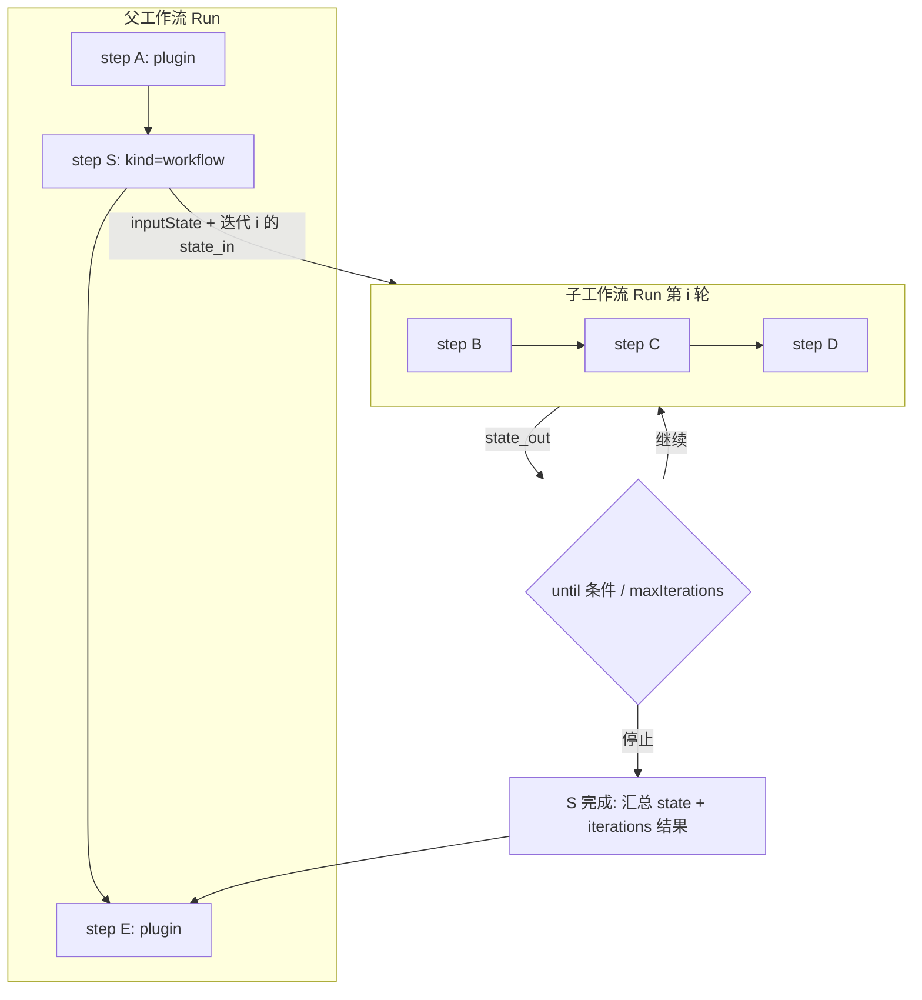

# 工作流可组合化与循环执行（Workflow-as-Composable-Unit）· 设计与实施计划

> 目标：把 `core-engine` 的编排语义从「插件执行 DAG」扩展为「可组合、可循环的流程定义」——
> 工作流既可以独立运行，也可以作为一个步骤被父工作流引用执行；引用执行时可传入/产出 `state`，并可基于 `state` 循环执行整个引用的工作流。
>
> **状态（2026-07-24）**：阶段 1–5 与「子 run 并入父」修订均已落地；本文档保留为设计真源与验收对照。实现进度见 [handoff.md](./handoff.md)。§0「已确认」指讨论中的方向性共识，实现中若有分歧仍按同样方式在 §0 追加、在正文回填。

**关联文档**

- 内核说明：[packages/core-engine/README.md](../../../packages/core-engine/README.md)
- 已知问题归档：[core-engine.md](../core-engine/core-engine.md)
- 已落地的相邻设计（`$ref` 上下文引用，本方案在此基础上扩展）：[context-injection.md](../core-engine/context-injection.md)
- 服务侧设计：[server/server.md](../server/server.md) · [server-api.md](../server/server-api.md) · [server-persistence.md](../server/server-persistence.md)
- 前端设计：[web/web-ui.md](../web/web-ui.md)

---

## 0. 本次讨论确认的方向（对话记录）

| #    | 讨论点                                                       | 结论                                                         | 状态               |
| ---- | ------------------------------------------------------------ | ------------------------------------------------------------ | ------------------ |
| 1    | `dependsOn` 依赖图是否允许成环                               | **不允许**。外层步骤依赖图继续是 DAG，Kahn 校验保留          | 已达成共识         |
| 2    | 「循环」如何表达                                             | 不放开依赖图的环，而是引入**可循环的子图（工作流引用）步骤**：整张子工作流按条件重复执行，而不是依赖边回指 | 已达成共识         |
| 3    | 子工作流与父工作流的关系                                     | **同一种 `WorkflowDefinition`**，没有独立的"子图"类型：任意工作流既可独立运行，也可被其他工作流引用执行 | 已达成共识         |
| 4    | 循环终止依据                                                 | 引入工作流级 `state`（按需声明，见决策 9）：声明了 `stateSchema` 时可选传入（输入）、产出（输出）；引用步骤的循环条件基于每轮产出的 `state` 判定，而非某个内部步骤的 `$ref` | 已达成共识         |
| 5    | 循环上限                                                     | 必须有 `maxIterations` 硬上限，防止死循环；条件与上限同时存在，任一触发即停 | 已达成共识         |
| 6    | 控制流是否可以用"伪插件"实现（如 `break-plugin`、`set-state-plugin`） | **不行**。引用工作流、写 state、（未来）分支/跳出必须是引擎原生理解的步骤形态，插件只负责业务副作用，无法反向影响调度 | 已达成共识         |
| 7    | 新增步骤形态的范围（本次）                                   | 明确落地 **`plugin`**（现有）与 **`workflow`**（工作流引用，含循环）、**`set_state`**（写 state）三种；`branch`（图级分支）、`break`（提前跳出）列为后续（P2+），本次只预留扩展位 | 已达成共识         |
| 8    | 现有 `StepCondition`（单步跳过）是否废弃                     | 不废弃，保留作为「本步是否执行」的轻量门闩，与「引用步骤的循环条件」是两个不同层级的概念，不合并 | 已达成共识         |
| 9    | `state` 是否所有工作流都必须具备                             | **不是**。按需声明：工作流是否声明 `stateSchema` 决定它是否具备"输入/输出 state"的能力；纯副作用工作流可以完全不声明、不产出 `state` | 已达成共识         |
| 10   | 同一个被引用工作流是否固定循环/不循环                        | **不固定在被引用工作流定义上**；是否循环、循环参数（`maxIterations`/`until`）由**发起引用的那个步骤**配置——同一个工作流可以在一处被循环调用、在另一处被单次调用 | 已达成共识         |
| 11   | 新增步骤形态是否需要对前端可见                               | **需要**。`workflow`/`set_state`（及未来 `branch`/`break`）要作为可导出的「内置步骤清单」，供前端节点面板与插件列表并列渲染 | 已达成共识         |
| 12   | `stateSchema` 由谁定义                                       | 不是开发者写死的 Zod 代码，而是**前端表单**产出的 schema（编辑工作流时可视化搭建字段），随 `WorkflowDefinition` 一起持久化为 JSON | 已达成共识         |
| 13   | 子工作流的接入方式                                           | 需要显式**「导入」**操作（而非在步骤里直接填一个 `workflowId` 就算引用）；导入分两种模式：**引用（reference）**与**拷贝（copy）**，且需要记录导入关系，供前端以「二级表格」展示当前工作流用了哪些子工作流；引用态在二级表格中不可编辑，拷贝态可编辑（本次一并实现编辑入口，见决策 23） | 机制方向已达成共识 |
| 14   | 子 run 标识格式                                              | **前缀（可读性）+ 哈希（唯一性）**（见 §5.2，取代早期"纯前缀截断"方案）：对 `parentRunId` / `stepId` 各取固定长度前缀用于人眼可读，唯一性来自对**完整** `${parentRunId}:${stepId}` 计算的短哈希；`` `${parentPrefix}__${stepPrefix}__${token}__iter${iteration}` ``，保证嵌套后仍满足 `WORKFLOW_RUN_ID_PATTERN` 与长度 ≤ 128，且截断不再影响唯一性 | 已确定             |
| 15   | "引用"模式的运行时定义解析时机                               | **实时解析**：每次运行（含循环的每一轮）都按 `importId` 现查源工作流当前最新定义，不落导入时快照；源工作流一改，所有引用处下次运行立即生效，无需"更新引用"操作 | 已确定             |
| 16   | `WorkflowImport` 持久化位置                                  | **新增独立 Prisma 表**，不内嵌进 `Workflow.definition` JSON  | 已确定             |
| 17   | 未声明 `stateSchema` 时 `set_state`/`initialState` 的处理    | **严格拒绝**：校验阶段直接判定为非法配置（`set_state` 步骤）/ 请求校验失败（`initialState`），不做静默忽略 | 已确定             |
| 18   | "拷贝"导入模式本次范围                                       | **本次一并实现**：数据模型改为私有 `Workflow` 记录（见决策 23），可执行、可编辑，二级表格编辑 UI **本次一并做** | 已确定             |
| 19   | 内置步骤如何接入 `$ref` / `previousResultsData`              | **双轨**：`set_state` / `workflow` 执行结果统一写入合成 `pluginResult: { success: true, data }`，使现有 `toPreviousResultsData` 无需为插件路径特判；同时扩展 `validateWorkflowContextReferences`——内置 `kind` 走引擎固定 `resultSchema`，**不再** `resolvePlugin(sourceStep.plugin)` | 已确定             |
| 20   | 谁负责查最新定义、`reference`/`copy` 运行时是否分支          | **不分支**：`EngineOptions` / `executeWorkflow` options 注入统一入口 `resolveWorkflow(importId) => Promise<WorkflowDefinition>`（参数从 `workflowId` 改为 `importId`，内部经 `WorkflowImport → Workflow` 两跳查询）；`reference`/`copy` 运行时都调用它，**不再有 `copiedDefinition` 特判分支**；`apps/server` 实现实时查库；单测用内存 `Map<importId, WorkflowDefinition>` | 已确定             |
| 21   | 子 run 是否落 `runs` 表、如何解决审计空洞                    | **不落独立行**（2026-07-24 修订，推翻早前「落表」方案）：子执行仍派生 `childRunId`（pause/cancel 级联与事件关联），但 **不** 插入 `runs` 行；`EmbeddedRunHooks.onChildRunStart` 仅维护 `childRunId → 顶层 API runId` 内存映射；子事件（含 `parent`）写入并推流到顶层父 run；`GET /runs/:runId/children` 保留兼容但恒返回空列表。审计靠父 run 事件流中的 `parent` / `workflow:iteration:*` | 已修订             |
| 22   | `WorkflowRefStep.workflowRef` 冗余字段治理                   | **单一数据源**：`workflowRef` 只存 `importId`，去掉冗余的 `workflowId`/`mode`/`copiedDefinition`；执行时通过 `resolveWorkflow(importId)` 解析，前端渲染通过 `GET /workflows/:id/imports` 拿到的 `importId → {workflowId, mode}` 映射，不在 step JSON 里重复存 | 已确定             |
| 23   | "拷贝"导入模式的实现方式                                     | 不再内嵌 `copiedDefinition` JSON；改为导入时**新建一条私有 `Workflow` 记录**，用 `ownerWorkflowId` 字段标记归属（指向创建它的父工作流），只能被该父工作流通过二级表格管理/编辑，不出现在公开的工作流列表与"导入子工作流"选择器里；父工作流删除时级联删除其名下私有 Workflow | 已确定             |
| 24   | 父 run pause 是否级联到子工作流                              | **级联**：`workflow` 步骤在 `onStepStart` 记录当前活跃 `childRunId`；父 run 收到 pause/resume 请求时同步转发给该 `childRunId`；嵌套时逐层递归转发；需要给 `RunHandle` 新增 `onPauseRequested`/`onResumeRequested` 回调注册能力供 executor 内部订阅（现有 `RunHandle` 无此订阅接口，是本次新增的内核改动点） | 已确定             |
| 25   | DAG 校验三份重复实现如何处理                                 | **收敛为一份**：`core-engine` 导出 `validateDag`；`apps/server`（`validate-workflow.ts`）与 `apps/web`（`dag-utils.ts`）删除各自重复实现，直接复用该导出；实现前需验证该函数无 Node-only 依赖，可安全在浏览器端引入 | 已确定             |
| 26   | `stateSchema` 运行时强校验的技术路线                         | **坚持 Zod 方案**：`stateSchema` 始终以 JSON Schema 形式持久化/传输（表单构建器与 JSON 手填两种编辑入口，产出同一份 JSON Schema；接口入参只传 JSON，不传 Zod 代码）；`packages/core-engine` 引入 `json-schema-to-zod`（或等价库）在运行时把 `stateSchema` 转换为 `ZodType` 并缓存，用于 `initialState`/`set_state` 合并后 state 的强校验；转换失败或含不支持特性时在**保存工作流阶段**直接拒绝，见 §4.5 | 已确定             |
| 27   | §14 遗留问题收尾                                             | 循环内某轮失败**立即终止**；`set_state` **浅合并**；`workflow` 步骤失败**新增** `SUBWORKFLOW_FAILED`；嵌套深度**可配置**（`ExecutorOptions.maxNestingDepth`，默认 3）；工作流删除**需要应用层友好预检**（配合 §23 的删除级联策略调整，`WorkflowImport.childWorkflowId` 由 `Restrict` 改 `Cascade`，保护逻辑上移到应用层）；明细分别见 §5.3/§4.2/§6.4/§5.4/§8.1/§8.3，§14 表格保留问题原文供追溯 | 已确定             |

> 以下均为本文档在上述共识基础上做的**具体化设计**。§14 曾列出的开放问题已全部拍板并回填本节，§14 仅保留问题原文与决策指向，供追溯。

---

## 1. 现状盘点（与本次改动相关的事实）

### 1.1 执行模型：Kahn 拓扑 + 每步至多执行一次

- `packages/core-engine/executor/index.ts`
  - `validateDag`（Kahn 算法）：入度扫描后 `visited !== stepIds.size` → `throw WorkflowValidationError('工作流存在循环依赖')`
  - `executeWorkflow`：`results.has(stepId)` 为真则不再调度该步骤——**同一 stepId 在一次 run 中只会产生一个终态结果**
  - `propagateDependents`：下游入度只减不增，无法表达"回到之前的步骤重跑"
- 这些假设**全部保留**：本方案不改动外层依赖图的拓扑调度，循环被封装在"引用步骤"内部，对外层调度器而言仍是"一步、一个终态结果"。

### 1.2 `WorkflowStep` / `WorkflowDefinition` 现状

`packages/core-engine/executor/types.ts`：

```ts
export interface WorkflowDefinition {
  id: string;
  name: string;
  steps: WorkflowStep[];
}

export interface WorkflowStep {
  id: string;
  name: string;
  plugin: string; // 隐含假设：每一步都是"调某个已注册插件"
  config: PluginConfig;
  condition?: StepCondition;
  dependsOn?: string[];
  priority?: number;
}
```

**关键问题**：`plugin` 是必填字段，且 `executeStep` 直接把 `step.plugin` 交给 `pluginExecutor` 解析——没有"这一步到底是插件调用还是别的语义"的判别位。本方案需要在这里插入判别字段。

### 1.3 `$ref` 上下文引用（已实现，本方案复用其模式）

`packages/core-engine/executor/context-reference.ts`（详见 `context-injection.md`）：

- `ContextRef = { $ref: { fromStepId, path } }`，整字段替换，非字符串插值
- `validateWorkflowContextReferences`：静态校验 `fromStepId` 必须是祖先、且插件声明了 `resultSchema`
- `resolveConfigReferences`：在 `executeStep` 内、调用插件前解析

本方案的 `state` 读写、`workflow` 步骤的 `inputState` 都将**复用同一套 `ContextRef` 机制**，不再发明新的引用语法。

### 1.4 可观测性事件（discriminated union，无 parent/iteration 维度）

`packages/core-engine/observer/types.ts` 的 `WorkflowLifecycleEvent` 六种类型（`WORKFLOW_START/FINISHED/CANCELLED/PAUSED/RESUMED`、`STEP_QUEUED/START/FINISHED`、`PLUGIN_LOG`）均**没有**"属于哪个父 run、第几次迭代"的字段——这是嵌入执行必须新增的维度（见 §5）。

### 1.5 Run 标识与持久化

- `WORKFLOW_RUN_ID_PATTERN = /^[A-Za-z0-9_-]+$/`，另有 `WORKFLOW_RUN_ID_MAX_LENGTH = 128`（`executor/index.ts`）——嵌入执行合成的子 run id 必须同时满足字符集与长度上限（见 §5.2；不可直接拼接完整 `parentRunId` + `stepId`，嵌套后极易超限）
- `apps/server/prisma/schema.prisma`：`Run.countsTotal/Completed/Failed/Skipped` 目前按 `workflow.steps.length` 与 `result.results` 长度计算（`run-manager.service.ts` 的 `initialCounts` / `countsFromResult`）——嵌入执行产生的子步骤**不应**计入父 run 的 counts，否则语义会漂移（见 §7）
- `Workflow` 模型（`id/name/definition/createdBy`）已经是"可被引用"的天然载体：`workflow` 步骤引用的正是 `Workflow.id`

### 1.6 前端 DAG 假设

- `apps/web/src/features/editor/dag-utils.ts`：`validateDag`（DFS 三色法）+ `getAncestorIds`，均只理解 `{ id, dependsOn }`，尚不理解"引用了另一个工作流"这件事
- `apps/web/src/shared/dag/flow-layout.ts`：dagre 分层布局，假设扁平单层图

---

## 2. 总体设计

### 2.1 核心心智模型

```
Workflow 是唯一编排单元：
  - 可以独立运行（POST /workflows/:id/run）
  - 可以被其他 Workflow 的某个步骤引用执行（作为该步骤的"实现"）
  - 每次执行：state 完全按需——声明了 stateSchema 才有可选输入/产出；未声明则没有 state 概念
  - 循环 = 对"引用执行"重复调用，用上一轮产出的 state 判定是否继续（仅当声明了 stateSchema 时可配置 until）
```



外层调度器视角：`S` 从入队到 `step:finished` 是**一次**黑盒执行（无论内部循环了几轮），完全兼容现有 Kahn 调度、资源键、`$ref` 祖先规则。

### 2.2 三种步骤形态（`kind`）

新增判别字段 `kind`，**默认值 `'plugin'`**（现有工作流定义无需迁移，未带 `kind` 字段的历史步骤按 `plugin` 处理）：

| `kind`           | 谁执行                                     | 是否可被普通插件伪装                         | 本次范围                       |
| ---------------- | ------------------------------------------ | -------------------------------------------- | ------------------------------ |
| `plugin`（默认） | 插件注册表（现有 `pluginExecutor`）        | —                                            | 已有，不变                     |
| `workflow`       | 引擎递归调用 `executeWorkflow`             | 不可（需要引擎介入调度、循环、资源命名空间） | **本次新增，P0**               |
| `set_state`      | 引擎内置逻辑（合并 patch 到 run state）    | 不可（改的是 run 级契约）                    | **本次新增，P0**               |
| `branch`（预留） | 引擎内置逻辑（决定下游是否 ready）         | 不可                                         | 仅预留 `kind` 值，不实现（P2） |
| `break`（预留）  | 引擎内置逻辑（提前结束当前 workflow 执行） | 不可                                         | 仅预留 `kind` 值，不实现（P2） |

> 对应 §0 决策 11：`workflow` / `set_state` 不是只在内核里判别就够了，还需要通过 §6.5 描述的「内置步骤清单」导出，供前端节点面板与插件列表并列渲染。

---

## 3. 数据模型 / 类型变更

### 3.1 `WorkflowStep`：判别联合（discriminated union）

`packages/core-engine/executor/types.ts`：

```ts
export const StepKinds = {
  PLUGIN: 'plugin',
  WORKFLOW: 'workflow',
  SET_STATE: 'set_state',
} as const;
export type StepKind = (typeof StepKinds)[keyof typeof StepKinds];

interface BaseStep {
  id: string;
  name: string;
  condition?: StepCondition;
  dependsOn?: string[];
  priority?: number;
}

/** 未带 kind 字段的历史数据按 PLUGIN 处理（见 §3.4 兼容策略） */
export interface PluginStep extends BaseStep {
  kind?: typeof StepKinds.PLUGIN;
  plugin: string;
  config: PluginConfig;
}

export interface SetStateStep extends BaseStep {
  kind: typeof StepKinds.SET_STATE;
  /** 值可以是字面量，也可以是 ContextRef（引用同一 run 内上游步骤结果） */
  patch: Record<string, unknown>;
}

export interface WorkflowRefStep extends BaseStep {
  kind: typeof StepKinds.WORKFLOW;
  /**
   * 显式「导入」产生的引用信息；只存 importId，不冗余 workflowId/mode（§0 决策 22）。
   * workflowId/mode 均以 WorkflowImport 记录为唯一数据源：执行时通过 resolveWorkflow(importId) 解析，
   * 前端渲染通过 GET /workflows/:id/imports 拿到的映射，避免两处状态各自演化导致漂移。
   */
  workflowRef: {
    /** 对应的 WorkflowImport 记录 id（见 §3.3.2） */
    importId: string;
  };
  /** 首轮传入子工作流的初始 state；仅当被引用工作流声明了 stateSchema 时才有意义，见 §3.2 */
  inputState?: unknown;
  /** 可选：不配置则单次执行一次子工作流；配置则循环执行，见 §0 决策 10 —— 是否循环是引用步骤的属性，不是被引用工作流定义的属性 */
  loop?: {
    /** 硬上限，必填，防止死循环 */
    maxIterations: number;
    /** 基于上一轮 state_out 求值；仅当被引用工作流声明了 stateSchema 时可配置，否则只能靠 maxIterations 停止 */
    until?: StateCondition;
  };
}

export type WorkflowStep = PluginStep | SetStateStep | WorkflowRefStep;
```

`StateCondition` 复用 `StepCondition` 的结构（`when: string`（state 内的路径）、`equals?`、`exists?`），但求值对象是 `state`，语义单列一个类型避免与"针对 `previousResults` 的 `StepCondition`"混淆。

### 3.2 `WorkflowDefinition`：`state` 契约按需声明

```ts
export interface WorkflowDefinition {
  id: string;
  name: string;
  steps: WorkflowStep[];
  /**
   * 可选：声明 state 的结构。按需提供——纯执行副作用、不需要向外暴露/传递结果的工作流可以完全不声明。
   * 由前端「state 表单构建器」产出（详见 §9.1），持久化为 JSON Schema（不是 Zod 代码），
   * 消费方式与 apps/server 现有 `toPluginConfigJsonSchema` 一致（供 json-schema-form 渲染）。
   */
  stateSchema?: JsonSchemaObject;
}
```

`stateSchema` 是这个工作流"是否具备 state 契约"的唯一开关（对应 §0 决策 9）：

- **未声明** `stateSchema` → 该工作流没有 state 概念：校验阶段拦截任何 `set_state` 步骤；调用方若传入 `initialState` 则**严格拒绝**（见下）；`WorkflowRunResult.state` 字段**不出现**（`undefined`，不是 `{}`）——这类工作流可能只是纯副作用（如触发几个插件调用），本来就没有"结果"的概念
- **声明了** `stateSchema` → 允许 `set_state` 步骤、`initialState` 生效、`WorkflowRunResult.state` 始终出现（即使从未执行任何 `set_state`，也返回符合 schema 的初始值）
- 引用步骤的 `loop.until` 只有在**被引用工作流声明了 `stateSchema`** 时才可配置；未声明时 `loop` 只能依赖 `maxIterations` 停止循环

**已确定采用严格拒绝**（§0 决策 17）：未声明 `stateSchema` 时，`set_state` 步骤在校验阶段直接判定为非法配置（`WorkflowValidationError`）；`initialState` 若被传入，`POST /workflows/:id/run` 校验阶段直接拒绝（400），不做静默忽略。

### 3.3 导入机制：显式「引用」与「拷贝」

不再是"步骤里随手填一个 `workflowId` 就算引用"——按讨论要求，接入子工作流必须先经过一次显式的**导入**操作，产生一条可查询、可在前端展示的**导入关系记录**。**执行导入操作时需对子导入的工作流进行一次可行性校验，避免出现循环导入等情况**。

#### 3.3.1 两种导入模式

| 模式                  | 语义                                                         | 是否可在子工作流二级表格中编辑   |
| --------------------- | ------------------------------------------------------------ | -------------------------------- |
| **引用（reference）** | 指向一个**公共** `Workflow`；**实时解析**——每次运行都按 `importId → WorkflowImport → Workflow` 现查当前最新定义，源工作流一改，所有引用处下次运行立即生效（见 §3.3.4） | 不可编辑，只能跳转到源工作流只读预览 |
| **拷贝（copy）**      | 导入时**新建一条私有 `Workflow` 记录**（`ownerWorkflowId` 指向创建它的父工作流，见 §0 决策 23），后续与源工作流脱钩、只能由父工作流独占管理；本次一并实现（真实复制 + 可执行 + 可编辑） | 可编辑（跳转到该私有 Workflow 的正常编辑器） |

#### 3.3.2 导入关系记录（`WorkflowImport`）

用于回答"这个工作流用了哪些子工作流"（正向，供二级表格展示）与"这个工作流被哪些工作流用了"（反向，供删除保护，见 §8.3）：

```ts
interface WorkflowImport {
  id: string; // 即步骤 workflowRef.importId
  parentWorkflowId: string; // 发起导入的工作流
  childWorkflowId: string; // 被导入的工作流（copy 模式下是新建的私有 Workflow）
  stepId: string; // 对应父工作流内哪个 WorkflowRefStep，仅用于展示/回溯，不是执行时的解析路径
  mode: 'reference' | 'copy';
  createdAt: string;
}
```

**持久化位置**：新增独立 Prisma 表（§0 决策 16），不内嵌进 `Workflow.definition` JSON。

**一致性校验**（配合 §0 决策 22 的单一数据源治理）：

- 保存工作流时，对每个 `kind: 'workflow'` 步骤校验其 `workflowRef.importId` 必须存在于 `WorkflowImport.parentWorkflowId = 本工作流 id` 的记录集合中，否则 400 拒绝——防止绕过「导入」API 直接在 JSON 里编一个 id
- 若某条 `WorkflowImport` 记录不再被任何步骤引用（画布上删除了该步骤）：保存时幂等清理该行
- `stepId` 字段随步骤改名同步更新（原地更新，不是删旧建新），仅用于"这条导入对应画布里哪个节点"的展示

#### 3.3.3 二级表格（本次实现前端交互，§0 决策 18）

- 位置：工作流列表 / 详情页，凡是导入了子工作流的工作流行可展开，展开后渲染二级表格
- 数据源：`GET /workflows/:id/imports`
- 列：子工作流名称、mode（引用 / 拷贝，用 Pill 区分）、更新时间、操作
- 操作列：
  - `reference`：仅「查看」——跳转到该工作流的只读预览
  - `copy`：「编辑」——跳转到该私有 Workflow（`ownerWorkflowId` 指向本工作流）的正常编辑器，复用现有整套工作流编辑器，不需要造内嵌 JSON 编辑组件
- 与主列表的关系：私有 copy Workflow（`ownerWorkflowId != null`）**不出现**在顶层工作流列表与"导入子工作流"选择器中，只能通过其父工作流的二级表格入口访问

#### 3.3.4 与执行时定义解析的关系（已确定，本轮简化）

`reference` 与 `copy` 在**运行时不再有分支**：都通过统一入口 `resolveWorkflow(importId)` 解析（§0 决策 20）——内部按 `importId` 查 `WorkflowImport` 得到 `childWorkflowId`，再查 `Workflow.definition` 返回当前最新定义。两种模式的差异**只存在于数据模型层**，不在执行路径里：

- `reference` 指向一个公共 `Workflow`，任何有权限的人都能编辑，编辑会影响所有引用它的父工作流
- `copy` 指向一个私有 `Workflow`（`ownerWorkflowId` 指向创建它的父工作流），只有该父工作流能通过二级表格编辑入口修改它，编辑只影响自己

**这个选择的代价（已知悉、接受）**：无论哪种模式，源定义在两次运行之间被修改，都会导致"同一个 `importId`、不同时间跑出不同行为"。历史上某次父 Run 具体执行的是哪个版本，靠父 run 事件流中的嵌套事件与迭代边界还原（2026-07-24 起子执行不再单独落 `runs` 行存 `workflowSnapshot`）。

循环执行的额外风险：若某个 `workflow` 步骤配置了 `loop`，源定义可能在**同一次循环的中途**被修改，导致第 3 轮和第 1 轮实际跑的定义不一致。MVP 暂不做"循环开始时锁定本次循环使用的定义版本"这类额外机制，接受这个代价；后续方向见 §12 的"工作流版本发布"，只需保证每轮各自的子 Run 快照如实记录当轮实际解析到的定义，问题可追溯即可。

### 3.4 兼容策略

- 现有 `Workflow.definition`（JSON，存量数据）没有 `kind` 字段 → 反序列化/校验时按 `kind ?? 'plugin'` 处理，**零迁移成本**
- `packages/plugin-sdk` 不受影响：`workflow` / `set_state` 步骤不经过插件注册表，插件契约（`configSchema` / `resultSchema`）不变

---

## 4. `state` 契约

### 4.1 定位：与 `$ref`/`previousResultsData` 分工

| 机制                           | 作用域                            | 用途                                                                         |
| ------------------------------ | --------------------------------- | ---------------------------------------------------------------------------- |
| `previousResultsData` + `$ref` | 同一工作流内，**步骤之间**        | 下游步骤的 config 引用上游步骤结果的 `data`（插件步为真实 `PluginResult.data`；内置步为合成 `pluginResult.data`，见 §5.5 / §0 决策 19） |
| `state`                        | **一次工作流执行**的输入/输出边界 | 独立运行时的初始参数与最终产出；被父工作流引用执行时，用于循环判定与跨轮传递 |

`state` **不是** `artifacts`（`ExecutionContext.artifacts`）的替代品：`artifacts` 继续是调用方随意传入的共享袋，无格式约定；`state` 是工作流对外承诺的、有读写时机约定的契约。

### 4.2 读写时机

`state` 完全按需——是否存在取决于 `stateSchema` 是否声明（对应 §3.2）：

```
声明了 stateSchema 的工作流：
  run 开始：state = initialState ?? （schema 默认值 / {}）
    ↓（工作流内任意 set_state 步骤可执行）
    set_state 步骤：state = { ...state, ...resolve(patch) }（浅合并，`Object.assign` 语义，已确定，§0 决策 27）
    ↓
  run 结束：WorkflowRunResult.state = 结束时刻的 state（即使从未执行任何 set_state 步骤，也返回初始值）

未声明 stateSchema 的工作流（纯副作用，例如只是编排几个插件调用、不需要产出结果）：
  不存在 state 读写；WorkflowRunResult.state 字段为 undefined（不出现，不是 {}）
  校验阶段严格拒绝任何 set_state 步骤（WorkflowValidationError）；调用方若传入 initialState，运行前校验直接拒绝（400），不做静默忽略
```

- 一次 run 内可以有 0..N 个 `set_state` 步骤，按拓扑顺序依次合并（`set_state` 也是普通 `WorkflowStep`，参与 `dependsOn` 排序）
- `set_state` 的 `ExecutionResult`：`status: COMPLETED`；同时写入合成 `pluginResult: { success: true, data: <合并后完整 state 快照> }`（与 `result` 同形），以便现有 `toPreviousResultsData` 直接收录、下游 `$ref` 可用；也便于运行详情页展示"这一步后 state 变成了什么"

### 4.3 `WorkflowRunResult` 扩展

```ts
export interface WorkflowRunResult {
  success: boolean;
  status: WorkflowRunStatus;
  workflowId: string;
  results: ExecutionResult[];
  /** 新增：仅当 workflow.stateSchema 已声明时才会出现；纯副作用工作流没有这个字段 */
  state?: unknown;
}
```

`executeWorkflow` 签名新增可选入参（`resolveWorkflow` 亦可挂在 `EngineOptions` 上，由 `createEngine` 注入后透传；优先用本次调用的 options 覆盖引擎默认）：

```ts
/**
 * 按 importId 解析：内部经 WorkflowImport → Workflow 两跳查询，返回当前最新定义。
 * reference / copy 运行时统一走此入口，不再分支（§0 决策 20 / 22）。
 */
export type ResolveWorkflow = (importId: string) => Promise<WorkflowDefinition>;

executeWorkflow(
  workflowRunId: string,
  workflow: WorkflowDefinition,
  context: Partial<ExecutionContext> = {},
  options?: {
    initialState?: unknown;
    resolveWorkflow?: ResolveWorkflow;
  },
): Promise<WorkflowRunResult>
```

- `apps/server`：实现为按 `importId` 查 `WorkflowImport` 得到 `childWorkflowId`，再查 Prisma `Workflow` 表返回 `definition`（实时解析，§0 决策 15 / 20）
- core-engine 单测：传入内存 `Map<importId, WorkflowDefinition>` 上的 `resolveWorkflow`，不引入任何 I/O
- 若某 `workflow` 步骤运行时未提供 `resolveWorkflow` → 该步失败（`INTERNAL` 或明确错误信息），不静默跳过

### 4.4 循环条件如何读 state

`WorkflowRefStep.loop.until`（`StateCondition`）在**每轮子工作流跑完后**，对该轮 `state_out` 求值。**前提是被引用工作流声明了 `stateSchema`**——未声明时 `until` 字段在校验阶段即被拦截，循环只能靠 `maxIterations` 停止：

```
未声明 stateSchema（无 state_out 可读） → loop 只能配置 maxIterations，until 不允许出现
until 未定义        → 跑满 maxIterations 轮后停止
until 求值为 true    → 停止（本轮是最后一轮）
until 求值为 false   → 继续下一轮（state_out 作为下一轮 state_in）
达到 maxIterations   → 强制停止（无论 until 结果如何）
```

### 4.5 `stateSchema` 运行时强校验（已确定 · §0 决策 26）

不再是"仅声明/UI 辅助"（推翻早前排除范围里的这条），本次范围内落地真实的运行时校验：

- **存储/传输层**：`stateSchema` 始终以 **JSON Schema** 形式持久化和传输。前端提供两种编辑入口——可视化表单构建器与直接 JSON 手填——两者产出的都是同一份 JSON Schema；接口入参统一只接受 JSON Schema，**不接受 Zod 代码**。
- **转换层**：`packages/core-engine` 引入 `json-schema-to-zod`（或等价库）作为新依赖，把 `WorkflowDefinition.stateSchema` 转换为运行时 `ZodType`；转换结果按工作流定义内容缓存，避免每次执行重复转换。
- **校验时机**：
  1. `POST /workflows/:id/run` 提交 `initialState` 时，先转换 `stateSchema` 为 Zod，`safeParse(initialState)`，失败则 400 并带字段级错误
  2. 每次 `set_state` 步骤合并 patch 得到新 state 后，执行器用同一 Zod schema `safeParse`，失败则该步 `FAILED`
  3. `executeWorkflow` 收尾时对最终 `WorkflowRunResult.state` 再做一次校验，双重保险
- **转换失败或含不支持特性的兜底**：在**保存工作流阶段**（`validate-workflow.ts`）直接拒绝，不允许发布这样的 `stateSchema`——把"能否转换成合法 Zod"提前到编辑期暴露，而不是留到运行期才炸。

---

## 5. `workflow` 步骤的执行语义

### 5.1 单次引用执行（无 loop）

等价于"内联跑一次子工作流，把结果当作这一步的结果"：

```
childDefinition = await resolveWorkflow(step.workflowRef.importId)  // 统一入口，reference/copy 不再分支；见 §4.3 / §0 决策 20/22
resolvedInputState = resolve(step.inputState, previousResultsData)  // 复用现有 $ref 解析
childRunId = deriveChildRunId(parentRunId, step.id, iteration=0)     // 见 5.2
childResult = await executeWorkflow(childRunId, childDefinition, childContext, {
  initialState: resolvedInputState,
  resolveWorkflow,  // 嵌套引用继续向下透传
})
该步骤的 ExecutionResult:
  status: childResult.success ? COMPLETED : FAILED
  // 合成 pluginResult，使 toPreviousResultsData / 下游 $ref 可走现有路径（§0 决策 19）
  pluginResult: { success: true, data: { state, iterations, iterationCount } }  // 失败时 success: false
  result: 同上 data 形状
```

若 `childDefinition` 未声明 `stateSchema`，`resolvedInputState` 应为 `undefined`（不允许配置 `inputState`，校验阶段拦截），`childResult.state` 同样为 `undefined`。

### 5.2 子 run 标识（已确定 · 前缀可读 + 哈希唯一）

约束回顾：

- `WORKFLOW_RUN_ID_PATTERN = /^[A-Za-z0-9_-]+$/`（不可用 `#`、`:` 等分隔符）
- `WORKFLOW_RUN_ID_MAX_LENGTH = 128`——若直接拼接完整 `parentRunId` + `stepId`，嵌套 3 层后极易超限
- 纯前缀截断（早前方案）存在碰撞风险：不同的长 id 截断后前缀可能相同

已确定（§0 决策 14）：**前缀只负责人眼可读，唯一性来自对完整字符串计算的短哈希**：

```ts
/** 实现常量；须保证最坏情况下整串 ≤ 128 */
const CHILD_RUN_PARENT_PREFIX_LEN = 12;
const CHILD_RUN_STEP_PREFIX_LEN = 12;
const CHILD_RUN_HASH_LEN = 8;

/** 非加密哈希（如 FNV-1a），base36 编码并规整到 CHILD_RUN_HASH_LEN 位；字符集天然满足 [A-Za-z0-9] */
function shortHash(input: string): string { /* ... */ }

function deriveChildRunId(parentRunId: string, stepId: string, iteration: number): string {
  const parentPrefix = parentRunId.slice(0, CHILD_RUN_PARENT_PREFIX_LEN);
  const stepPrefix = stepId.slice(0, CHILD_RUN_STEP_PREFIX_LEN);
  // 对完整（未截断）的 parentRunId:stepId 计算哈希，真正保证唯一性；前缀截断不影响这一步
  const token = shortHash(`${parentRunId}:${stepId}`);
  return `${parentPrefix}__${stepPrefix}__${token}__iter${iteration}`;
}
```

- **唯一性不依赖前缀**：即使两个不同的长 id 截断后前缀相同，对完整字符串计算的哈希大概率不同，碰撞概率降到可忽略；前缀部分只是方便人眼调试时看出"这是哪个父 run 派生出来的"
- 长度预算：`12+2+12+2+8+2+4+digits(iteration) ≈ 45` 字符，远低于 128；嵌套下一层时，上一层的 `parentRunId` 本身可能已经是这个 ~45 字符的派生串，但哈希始终对**该层完整字符串**计算（不再截断输入），所以嵌套 3 层仍在预算内，长度不会随深度线性膨胀
- 极端哈希碰撞的兜底（实现阶段处理，不改变对外契约）：生成后查重，若已存在则退避重算一次
- `RunRegistry` 对子 run 走**与顶层 run 相同的注册/生命周期路径**，不特殊化——`pause/cancel` 等 Run 控制 API 天然可以对子 run 单独生效（用于调试），但**父 run 的 cancel/pause 需要级联到当前活跃子 run**（见 §5.4）

### 5.3 循环执行

```
state_in(0) = resolvedInputState
iterations = []
for i in 0..maxIterations-1:
  // 每轮都重新 resolveWorkflow，允许中途被源工作流的最新修改影响（已知代价，见 §3.3.4）
  childDefinitionForIteration = await resolveWorkflow(step.workflowRef.importId)
  childRunId = deriveChildRunId(parentRunId, step.id, i)
  childResult = await executeWorkflow(childRunId, childDefinitionForIteration, childContext, {
    initialState: state_in(i),
    resolveWorkflow,
  })
  iterations.push({ index: i, state: childResult.state, success: childResult.success })
  if !childResult.success:
    break   // 子工作流失败即终止循环，父步骤标记 FAILED（见下）
  if evalStateCondition(loop.until, childResult.state):
    break   // 本轮是最后一轮
  state_in(i+1) = childResult.state

该步骤的 ExecutionResult:
  status: 最后一轮 success ? COMPLETED : FAILED
  pluginResult.data / result: { state: 最后一轮的 state, iterations, iterationCount: iterations.length }
```

**失败策略已确定为「子工作流失败即终止循环」**（非 `continueOnError`，§0 决策 27）——与现有引擎"步骤失败即该步 FAILED、不静默吞错"的一贯风格一致，不提供 `continueOnError` 选项。

### 5.4 资源、取消、暂停如何级联

| 现有能力                                | 对 `workflow` 步骤的处理                                                                                                                                                                                                |
| --------------------------------------- | ----------------------------------------------------------------------------------------------------------------------------------------------------------------------------------------------------------------------- |
| 资源池 `stepResourceKey(runId, stepId)` | 子 run 内部步骤使用**自己的 `childRunId`**，键天然与父 run 隔离，无需改资源池代码                                                                                                                                       |
| `cancelRun(parentRunId)`                | 需要新增级联：`workflow` 步骤在 `onStepStart` 记录当前活跃 `childRunId`；父 run 取消时，若某步骤为 `workflow` 且正在跑，同步对 `childRunId` 调用 `cancelRun`                                                            |
| `pauseRun(parentRunId)` / `resumeRun`   | **级联**（已确定，§0 决策 24，推翻早前"仅循环边界可暂停"的方案）：`workflow` 步骤在 `onStepStart` 记录当前活跃 `childRunId`；父 run 收到 pause/resume 请求时，若某步骤为 `workflow` 且正在跑，同步对 `childRunId` 转发相同的 pause/resume（选项透传）；嵌套时天然逐层递归转发，无需额外代码。需要给 `RunHandle` 新增 `onPauseRequested`/`onResumeRequested` 回调注册能力供 executor 内部订阅——现有 `RunHandle` 的暂停状态转换是内部命令式处理，没有现成的"请求到达时通知我"接口，这是本次新增的内核改动点 |
| `maxParallelSteps` / 并发调度           | 子工作流内部并发**不占用**父 run 的并发槽位（各自是独立的 `executeWorkflow` 调用栈），但会叠加实际系统负载——嵌套 workflow 步骤较多时需要在文档中提示容量规划（不在本次代码范围）                                        |

嵌套深度：**MVP 限制子工作流内部不允许再包含 `kind: 'workflow'` 且带 `loop` 的步骤**（禁止循环嵌套循环），无 `loop` 的单次引用允许嵌套；深度上限**可配置**（`ExecutorOptions.maxNestingDepth`，默认 3，§0 决策 27），超过时在 `validateWorkflowContextReferences` 同级新增的校验中拦截并抛 `WorkflowValidationError`。

### 5.5 `$ref` 与内置步骤的交互（已确定 · §0 决策 19）

**运行时（写入侧）**

- `set_state` / `workflow` 步骤完成时，除 `ExecutionResult.result` 外，**统一写入合成** `pluginResult: { success: true, data }`（失败则为 `success: false` + 可选 message）
- `data` 形状：
  - `set_state`：合并后的完整 state 快照
  - `workflow`：§5.1/§5.3 的聚合结果 `{ state, iterations, iterationCount }`
- 这样现有 `toPreviousResultsData`（只收录 `COMPLETED ∧ pluginResult.success ∧ data`）**无需为内置 kind 再开分支**即可让下游 `$ref` 解析到内置步结果

**静态校验（读取侧）**

- 扩展 `validateWorkflowContextReferences`：当 `fromStepId` 对应步骤的 `kind` 为 `set_state` / `workflow` 时，**使用引擎内置固定 `resultSchema`**，**不再**调用 `resolvePluginResultSchema(sourceStep.plugin)`（这些步骤没有 `plugin` 字段）
- 外层步骤对 `workflow` 步骤的 `$ref.path` 只能指向聚合结果形状（`state` / `iterations` / `iterationCount`），不能穿透到子工作流内部某一步——子工作流是黑盒
- `set_state` / `workflow` **天然可被下游引用**（内置 schema 始终存在），不像插件步需要显式声明 `resultSchema`
---

## 6. 执行器改动（`packages/core-engine`）

### 6.1 `executeStep` 按 `kind` 分派

`packages/core-engine/executor/index.ts` 的 `executeStep`（现有：条件求值 → 资源 acquire → `pluginExecutor`）改为：

```
条件求值(previousResults) → onStepStart(资源 acquire，仅 plugin/workflow 需要资源池；set_state 跳过资源池)
  → switch(step.kind ?? 'plugin'):
      'plugin'     → 现有逻辑（resolveConfigReferences → pluginExecutor）
      'set_state'  → resolveConfigReferences(patch) → 浅合并进 runState → 构造 COMPLETED + 合成 pluginResult.data
      'workflow'   → §5 的单次/循环子执行逻辑（reference 时调用 options.resolveWorkflow）
  → 结果映射 → emit step:finished
```

`set_state` / `workflow` 步骤**不经过 `pluginExecutor`**，因此不受"插件必须已注册"的校验约束，但需要各自的静态校验（见 6.3）。`engine.getResourceType(step)` 等假定 `step.config` 存在的路径须对非 `plugin` 步骤短路（`set_state` 无 `config`）。

### 6.2 `runState` 的生命周期

- 新增一个与 `results: Map<string, ExecutionResult>` 平级的可变引用 `runState: { current: unknown }`，`executeWorkflow` 入口用 `options.initialState ?? {}` 初始化（仅当声明了 `stateSchema` 时）
- `set_state` 步骤执行时读写 `runState.current`
- `executeWorkflow` 收尾时把 `runState.current` 写入 `WorkflowRunResult.state`

### 6.3 静态校验扩展

在 `validateDag` 之后、`validateWorkflowContextReferences` 同级新增：

- `validateStepKinds`：`workflow` 步骤、`set_state` 步骤的必填字段完整性（`workflowRef.importId` 必须存在于 `WorkflowImport` 表、`loop.maxIterations > 0` 等）
- `validateWorkflowNesting`：嵌套深度 ≤ `maxNestingDepth`（默认 3，§0 决策 27）、禁止循环嵌套循环（§5.4）、**禁止（经 `importId` 解析得到的）`workflowId` 与当前工作流自身 `id` 相同，或与祖先链中任一已解析 `workflowId` 相同**（防止 A 引用 B、B 又引用 A 的引用环——这是"工作流级别的环检测"，与 `dependsOn` 的步骤级环检测是两回事，必须分别实现）
  - **因 §3.3.4 已确定"引用"为实时解析**：引用环不是只在"新建引用的那一刻"才可能出现——若 A（早于此）已引用 B，之后有人编辑 B、让 B 反过来引用 A，环会在**保存 B**这一刻才成立。因此这项校验必须在**任意工作流保存时**都对"以我为起点、沿当前所有 `WorkflowImport` 展开"的引用图做环检测，不能只在"发起引用的一方保存时"检查一次
  - **`mode: 'copy'` 也必须参与环检测**（推翻早前"copy 因已固化为独立定义不参与"的结论，§0 决策 23）：因为拷贝现在是一条真实、可被父工作流独立编辑、内部也可以再导入其他工作流的私有 `Workflow`，理论上仍可能被编辑出引用环
- **`validateWorkflowContextReferences` 改造**（§0 决策 19 / §5.5）：按来源步骤 `kind` 分支——`plugin` 仍走 `resolvePluginResultSchema`；`set_state` / `workflow` 走内置固定 schema

### 6.4 类型/常量新增清单

- `errors.ts`：新增 `StepFailureKind.SUBWORKFLOW_FAILED`（已确定，§0 决策 27，不复用 `INTERNAL`）
- `context-keys.ts`：`WorkflowContextKeys.state`（供插件在 `pluginExecutor` 内以只读方式感知当前 state，可选能力，本次不强制要求插件消费）
- `ResolveWorkflow` 类型（按 `importId` 解析，见 §4.3）+ `EngineOptions.resolveWorkflow?`（§0 决策 20/22）
- `ExecutorOptions.maxNestingDepth?`（默认 3，已确定可配置，§0 决策 27）
- 内置 `SET_STATE_RESULT_SCHEMA` / `WORKFLOW_REF_RESULT_SCHEMA`（供校验与前端 `$ref` 路径选择）
- `RunHandle` 新增 `onPauseRequested` / `onResumeRequested` 回调注册能力（供 `workflow` 步骤内部订阅并转发给活跃 `childRunId`，§0 决策 24）
- 新增依赖 `json-schema-to-zod`（或等价库）+ `stateSchema → ZodType` 转换与缓存工具（§4.5 / §0 决策 26）
### 6.5 内置步骤形态的导出（供前端节点面板渲染）

对应 §0 决策 11：`workflow` / `set_state` 不能只在内核里判别，还需要像插件一样被前端节点面板统一列出、拖拽使用。

`packages/core-engine` 新增一份内置步骤清单（与插件注册表并列，但**不经过** `plugin-sdk` 的 `createPlugin` 流程，因为这些是引擎语义而非用户插件）：

```ts
export interface StepKindDefinition {
  kind: StepKind; // 'workflow' | 'set_state'（'plugin' 不在此列出，走现有插件清单）
  label: string; // 前端节点面板展示名，如「引用子工作流」「写入 State」
  description: string;
  /** 该步骤形态自身的配置结构（如 workflow 的 workflowRef/loop、set_state 的 patch），供前端渲染属性面板 */
  configSchema: JsonSchemaObject;
}

export const BUILTIN_STEP_KIND_DEFINITIONS: StepKindDefinition[];
```

`apps/server` 镜像现有 `GET /plugins`、`GET /plugins/:name/config-schema` 的模式，新增：

| 方法  | 路径          | 说明                                                          |
| ----- | ------------- | ------------------------------------------------------------- |
| `GET` | `/step-kinds` | 返回 `BUILTIN_STEP_KIND_DEFINITIONS`（含各自 `configSchema`） |

`apps/web` 的编辑器节点面板（插件库侧栏）在加载 `GET /plugins` 的同时加载 `GET /step-kinds`，两者合并渲染为同一个可拖拽的"步骤类型"列表；`workflow` / `set_state` 节点与插件节点建议用不同分组/图标区分（如「控制流」分组 vs 「插件」分组），但都在同一个列表里，不做成两个割裂的面板。

---

## 7. 可观测性事件扩展（`packages/core-engine/observer`）

### 7.1 现有事件新增 `parent` 可选字段（加法式，不破坏现有消费方）

`WorkflowLifecycleEvent` 的每个 variant 新增可选：

```ts
parent?: {
  runId: string;      // 父 run 的 workflowRunId
  stepId: string;      // 父工作流中发起引用的步骤 id
  iteration: number;   // 第几轮（从 0 开始）
};
```

- 顶层独立运行的事件 `parent` 字段缺省（`undefined`）——现有消费方（`apps/server` 序列化、`apps/web` 聚合）按"字段不存在"处理即完全兼容，零破坏
- 子工作流执行时，其 `observer.onEvent` 转发到父 observer 前统一注入 `parent`

### 7.2 新增专用迭代事件（本次范围，已确定 · 原 P1 预留转正，§0 决策 27 / 四-4）

- 新增 `WORKFLOW_ITERATION_START` / `WORKFLOW_ITERATION_FINISHED`：字段含 `workflowRunId`（父）、`meta`、`step`、`iteration`；`FINISHED` 额外带该轮 `childResult` 摘要
- 用于运行详情页精确展示"第 i 轮"的边界，不再需要靠拼接 `WORKFLOW_START`/`FINISHED` + `parent.iteration` 字段推断
- 与 §7.1 的 `parent` 字段并存、不冲突：`parent` 字段挂在每个子工作流内部事件上（用于把子事件挂靠到正确的父步骤/轮次），迭代事件是**额外的、发生在父 observer 视角**的边界标记，两者服务于不同粒度的聚合需求

---

## 8. Server 改动（`apps/server`）

### 8.1 Prisma / 持久化

- **`Workflow` 表新增 `ownerWorkflowId`**（对应 §0 决策 23，支撑私有拷贝）：

  ```prisma
  model Workflow {
    id              String   @id
    name            String   @unique
    definition      Json
    /** 非空表示这是一条"私有拷贝"，只能被 ownerWorkflow 管理/编辑，不进公开列表 */
    ownerWorkflowId String?  @map("owner_workflow_id")
    createdBy       String?
    createdAt       DateTime @default(now()) @map("created_at")
    updatedAt       DateTime @updatedAt @map("updated_at")

    ownerWorkflow  Workflow?  @relation("PrivateCopyOwner", fields: [ownerWorkflowId], references: [id], onDelete: Cascade)
    privateCopies  Workflow[] @relation("PrivateCopyOwner")

    importsAsParent WorkflowImport[] @relation("ImportsFromParent")
    importsAsChild  WorkflowImport[] @relation("ImportsToChild")
  }
  ```

  `ownerWorkflowId` 的 `onDelete: Cascade` 是私有拷贝级联删除的**唯一**机制：父工作流被删除时，其名下所有私有拷贝自动一并删除，不需要应用层额外清理。

- **新增 `WorkflowImport` 表**（对应 §3.3.2，已确定新建独立表而非内嵌 JSON）：

  ```prisma
  model WorkflowImport {
    id               String   @id
    parentWorkflowId String   @map("parent_workflow_id")
    childWorkflowId  String   @map("child_workflow_id")
    stepId           String   @map("step_id")
    mode             String   // 'reference' | 'copy'
    createdAt        DateTime @default(now()) @map("created_at")

    parentWorkflow Workflow @relation("ImportsFromParent", fields: [parentWorkflowId], references: [id], onDelete: Cascade)
    childWorkflow  Workflow @relation("ImportsToChild", fields: [childWorkflowId], references: [id], onDelete: Cascade)

    @@index([parentWorkflowId])
    @@index([childWorkflowId])
    @@map("workflow_imports")
  }
  ```

  **`childWorkflowId` 改为 `onDelete: Cascade`**（推翻早前的 `Restrict` 方案，§0 决策 27）：`Restrict` 会与 `ownerWorkflowId` 的级联删除冲突——删除父工作流时，其私有拷贝要能被级联删掉，指向该拷贝的 `WorkflowImport` 行也必须能一起清理，不能被 `Restrict` 挡住。删除保护因此**整体上移到应用层**（见 §8.3）：删除一个公开（`ownerWorkflowId == null`）工作流前，先查是否有 `WorkflowImport` 指向它，有则拒绝并给出结构化报错；私有拷贝不受此保护，随其 owner 一起删除是预期行为。

- **`Run` 表保留 `parentRunId` 列**（历史列；2026-07-24 起新写入的顶层 run 不再产生 embedded 子行，该列对新数据基本闲置）：

  ```prisma
  model Run {
    // ...existing fields...
    parentRunId String? @map("parent_run_id")

    @@index([parentRunId])
  }
  ```

- **子执行不再落独立 `Run` 行**（对应 §0 决策 21 修订）：`EmbeddedRunHooks` 仍由 core-engine 在 `workflow` 步骤边界调用，但 server 侧用途改为：

  ```ts
  interface EmbeddedRunHooks {
    onChildRunStart(childRunId: string, childDefinition: WorkflowDefinition, ctx: { parentRunId: string; stepId: string; iteration: number }): Promise<void>;
    onChildRunFinished(childRunId: string, result: WorkflowRunResult): Promise<void>;
  }
  ```

  `onChildRunStart` **不** `save` Run 行，只登记 `childRunId → rootApiRunId`（嵌套时向上收拢到顶层）；`onChildRunFinished` 不更新子行。`processEngineEvent` 将嵌套事件的 `appendEvent` / `fanOut` 目标改为 root，且 **禁止** 用子 `workflow:*` / 子 `step:finished` 改写父 Run 的 `status`/`counts`/`result`。

- **子工作流的实时执行事件**：仍复用 `RunEvent(runId, eventIndex, type, payload)`；`runId` 存**顶层父 runId**，通过 `payload.parent` 区分嵌套归属；订阅父 run 的 WS/历史即可看到子步骤日志
- `Run.countsTotal/Completed/Failed/Skipped`：**只统计父工作流定义的顶层步骤**；子工作流内部步骤不计入父 counts
- API `GET /runs/:runId/children`：保留路由兼容，**恒返回空列表**（子执行不再落表）

### 8.2 校验层

`apps/server/src/common/validation/validate-workflow.ts` 现有的独立 DAG 校验实现（与 core-engine 重复，已知技术债，见 `context-injection.md` §1.3）——**本次收敛为一份实现**（推翻早前"不再制造第三份重复实现，但保留现有两份"的折中方案，§0 决策 25）：`core-engine` 导出 `validateDag`；server 端删除自己的 Kahn 重复实现，直接复用该导出；新增的 `validateStepKinds` / `validateWorkflowNesting` 同样只在 `core-engine` 实现，server 通过复用接入（与 `validateWorkflowContextReferences` 现有接入方式一致）。

新增 `validateWorkflowImportConsistency`：对应 §3.3.2 的一致性校验——每个 `kind: 'workflow'` 步骤的 `workflowRef.importId` 必须存在于该工作流的 `WorkflowImport` 记录中，否则 400；保存时对不再被任何步骤引用的 `WorkflowImport` 行做幂等清理。

### 8.3 API 影响

- `POST /workflows/:id/run`：请求体新增可选 `initialState`（提交前先按 §4.5 用转换出的 Zod schema 强校验）
- 响应 / Run 详情：`result.state` 透出（若工作流未声明 `stateSchema` 则不出现该字段）
- 新增 `POST /workflows/:id/imports`：创建一条导入关系。`mode: 'reference'` 只需 `childWorkflowId`；`mode: 'copy'` 时服务端先读取源工作流当前定义，新建一条 `ownerWorkflowId` 指向本工作流的私有 `Workflow` 记录，再创建 `WorkflowImport` 指向这条新私有记录；两种情况都返回记录供编辑器生成 `WorkflowRefStep`（只含 `importId`）
- 新增 `GET /workflows/:id/imports`：查询"该工作流导入了哪些子工作流"，供 §3.3.3 二级表格使用，返回体含 `importId → { workflowId, workflowName, mode, updatedAt }` 映射
- 新增 `GET /runs/:runId/children`：保留兼容，恒返回空列表（子执行事件并入父 run，见 §8.1）
- `GET /workflows`（公开列表）与「导入子工作流」选择器：过滤 `ownerWorkflowId IS NOT NULL` 的私有拷贝记录，不对外暴露
- `DELETE /workflows/:id`：**应用层友好预检**（已确定，§0 决策 27，替代早前"只靠 DB Restrict 报错"的方案）——若目标是公开工作流（`ownerWorkflowId == null`）且存在 `WorkflowImport` 指向它，返回结构化 409（附带引用方工作流名称/id 列表）；若目标是私有拷贝，允许直接删除（或提示"请到其所属工作流的二级表格中操作"，具体交互留给实现阶段）

---

## 9. Web 改动（`apps/web`）

### 9.1 编排器

- `apps/web/src/features/editor/dag-utils.ts`：**删除自研的 DFS 三色法环检测**，改为直接复用 `core-engine` 导出的 `validateDag`（§0 决策 25），并增加对 `kind: 'workflow'` 步骤的识别（步骤渲染/属性面板分支）
- 步骤属性面板新增 `workflow` 类型：选择要引用的已有工作流 + `inputState` 编辑（复用现有 `$ref` 字段级"手填/引用上游"交互）+ `loop.maxIterations` / `loop.until` 表单
- `set_state` 类型：`patch` 字段的键值编辑器，值同样支持"手填/引用上游"
- 画布展示：`workflow` 节点建议用不同的节点样式（如带一个"可展开"角标）区分于 `plugin` 节点；MVP 可以不做画布内展开子图，先支持"点击跳转到被引用工作流的只读预览"
- 新增 **state 编辑器（表单 + JSON 双入口）**（§0 决策 26）：可视化表单构建器可视化添加/编辑字段（名称、类型、是否必填等），以及一个"JSON 手填"入口直接粘贴/编写 JSON Schema；两个入口产出同一份 `stateSchema`（JSON Schema），保存时只提交这份 JSON，由 `apps/server`/`core-engine` 反解为 Zod 做运行时强校验（见 §4.5）；不添加任何字段则等价于该工作流没有 `stateSchema`
- 新增显式**导入子工作流**入口（如工具栏「导入子工作流」按钮）：选择目标工作流 → 选择「引用」或「拷贝」→ 调用 `POST /workflows/:id/imports` → 生成对应的 `WorkflowRefStep`（只含 `importId`）；不再允许直接在步骤属性面板里裸填 `workflowId`
- 工作流详情页新增「子工作流」二级表格（§3.3.3，**本次实现前端交互**）：展开行 → 拉 `GET /workflows/:id/imports` → 渲染子工作流名称/mode/更新时间/操作列；`reference` 仅「查看」，`copy` 提供「编辑」跳转到该私有 Workflow 的正常编辑器

### 9.2 运行详情

- `apps/web/src/features/run-detail/run-state.ts`：事件聚合 reducer 需要理解 `parent` 字段——嵌入执行的事件不应污染父 run 的顶层节点状态机，而是聚合成"该 `workflow` 步骤节点下的第 i 轮子时间线"；同时消费 §7.2 新增的 `WORKFLOW_ITERATION_START/FINISHED` 事件，精确划分每轮边界，不再靠拼接推断
- 节点详情抽屉展示 `state` 的变化（尤其是 `set_state` 步骤前后的 diff，以及 `workflow` 步骤每轮的 `state_out`）与嵌套日志（`nestedLogs`）；不再依赖独立子 run 页 / `children` API

---

## 10. 分层改动清单（汇总，实现前用于排期）

### 10.1 `packages/core-engine`（P0，核心）

- [x] `executor/types.ts`：`WorkflowStep` 判别联合（`PluginStep`/`SetStateStep`/`WorkflowRefStep`，`workflowRef` 只含 `importId`）、`WorkflowDefinition.stateSchema`、`WorkflowRunResult.state`、`ResolveWorkflow`（按 `importId` 解析）、`ExecutorOptions`/`executeWorkflow` 新增 `initialState` + `resolveWorkflow` + `maxNestingDepth`
- [x] `executor/index.ts`：`executeStep` 按 `kind` 分派；`runState` 生命周期；`workflow` 步骤单次/循环执行逻辑（reference/copy 统一走 `resolveWorkflow`，无分支）；`deriveChildRunId`（前缀 + 短哈希）；内置步写入合成 `pluginResult.data`
- [x] `engine/index.ts`：`EngineOptions.resolveWorkflow?`；非 plugin 步骤跳过 `config.resourceType` 资源解析（`set_state` 跳过资源池）
- [x] `RunHandle`：新增 `onPauseRequested` / `onResumeRequested`（及 `onCancelRequested`）回调注册能力，`pause`/`resume`/`cancel` 触发时通知订阅方；`workflow` 步骤记录活跃 `childRunId` 并级联（§0 决策 24 / §5.4）
- [x] 新增 `executor/workflow-nesting.ts`：`validateWorkflowNesting`（嵌套深度可配置、引用环检测、循环嵌循环拦截）；`validateStepKinds` 已在 `step-kind-validation.ts`
- [x] `context-reference.ts`：`validateWorkflowContextReferences` 对内置 kind 走固定 resultSchema（§5.5）
- [x] `observer/types.ts`：`WorkflowLifecycleEvent` 各 variant 新增可选 `parent` 字段；新增 `WORKFLOW_ITERATION_START`/`FINISHED` 事件类型（§7.2）
- [x] `errors.ts`：新增 `StepFailureKind.SUBWORKFLOW_FAILED`；`context-keys.ts`：增补 `state`
- [x] 新增内置步骤清单 `BUILTIN_STEP_KIND_DEFINITIONS`（§6.5）+ 内置 resultSchema 常量
- [x] 新增 `stateSchema` 声明校验：未声明时拦截 `set_state` 步骤、`loop.until`（§3.2/§4.4）——`set_state` 已拦截；`until` 在被引用方无 schema 时运行时拦截
- [x] 新增 `stateSchema → ZodType` 转换/缓存工具（自研子集，等价于决策 26），接入 `initialState` 校验、`set_state` 后校验、收尾校验三处（§4.5）
- [x] 新增 `EmbeddedRunHooks`（`onChildRunStart`/`onChildRunFinished`）接口与调用点（§8.1）
- [x] 导出更新：`index.ts` 补充新增类型/函数（含 `StepKindDefinition`、`ResolveWorkflow`、`EmbeddedRunHooks`、`validateDag`）
- [x] `scheduleWorkflow` 透传 `ExecuteWorkflowCallOptions`（与 `runWorkflow` 对齐）
- [x] `README.md`：新增「工作流引用与循环执行」「内置步骤清单」两节

> 进度跟踪与接手说明见 [handoff.md](./handoff.md)。

### 10.2 `packages/plugin-sdk`

- [ ] 无强制改动（`workflow`/`set_state` 不经过插件契约）
- [ ] 可选：`PluginContext` 新增只读 `state` 感知能力（供插件读取当前 run state，非必须，P2）

### 10.3 `apps/server`

- [x] `validate-workflow.ts`：删除自研 DAG 校验，改为复用 `core-engine` 导出的 `validateDag`（§0 决策 25）；接入 `validateStepKinds` / `validateWorkflowNesting` / `validateWorkflowImportConsistency`；DTO 放开 `plugin` 必填（按 `kind`）
- [x] `createEngine` / `submitRun` 注入 `resolveWorkflow(importId)`（两跳查库返回最新 `definition`）+ `EmbeddedRunHooks` 实现
- [x] Run 提交 API 支持 `initialState`（提交前按 §4.5 做 Zod 强校验）；响应体透出 `state`（未声明 `stateSchema` 时不出现）
- [x] Prisma：`Workflow.ownerWorkflowId`、`WorkflowImport`（`childWorkflowId` 用 `Cascade`）、`Run.parentRunId` 三处 schema 变更（§8.1）
- [x] `POST/GET /workflows/:id/imports`（copy 模式服务端新建私有 `Workflow` 记录）+ `GET /runs/:runId/children`
- [x] 新增 `GET /step-kinds`（§6.5）
- [x] 工作流列表 / 导入选择器过滤 `ownerWorkflowId IS NOT NULL` 的私有拷贝
- [x] `DELETE /workflows/:id` 应用层预检（§8.3，公开工作流被引用时 409）
- [x] README / API 文档同步（`apps/server/README.md`、`docs/dev-logs/api-list.md`）
### 10.4 `apps/web`

- [x] 编辑器：`workflow` / `set_state` 步骤的属性面板与画布节点样式
- [x] 节点面板合并加载 `GET /plugins` + `GET /step-kinds`（§6.5）
- [x] state 编辑器：表单构建器 + JSON 手填双入口，统一产出 `stateSchema`（§9.1）
- [x] 显式「导入子工作流」入口（引用/拷贝二选一，调用 `POST /workflows/:id/imports`）
- [x] 工作流详情页「子工作流」二级表格前端交互（§3.3.3，本次实现：查看/编辑跳转）
- [x] `dag-utils.ts`：删除自研环检测，复用 `core-engine` 导出的 `validateDag`（§0 决策 25）；识别新 `kind`
- [x] 运行详情：`run-state.ts` 理解 `parent` 字段与新增迭代事件，聚合子时间线；嵌套日志入父事件流；抽屉展示 `nestedLogs`
- [x] README 同步

---

## 11. 测试计划

### `packages/core-engine`

- [ ] 历史无 `kind` 字段的工作流定义按 `plugin` 处理（向后兼容回归）
- [ ] `set_state`：patch 合并（含 `$ref` 解析）、多个 `set_state` 按拓扑顺序依次生效
- [ ] `workflow` 步骤单次执行：`inputState` 正确传入子 run、`state` 正确回传
- [ ] `workflow` 步骤循环执行：`until` 命中提前停止、`maxIterations` 硬停止、子工作流失败终止循环
- [ ] 子 run id 派生：格式合法（字符集 + ≤128）、嵌套 3 层不超限、不同父串截断后前缀相同但哈希不同时不冲突、同父并发多个引用步骤不触发 `RunAlreadyActiveError`
- [ ] 引用环检测：A→B→A、自引用、超过嵌套深度上限；覆盖 `mode: 'copy'` 场景（私有拷贝内部再导入形成环）
- [ ] 循环嵌套循环：拦截
- [ ] 父 run cancel 级联到活跃子 run；父 run pause/resume 级联到活跃子 run（含嵌套多层）
- [ ] `$ref` 可引用 `set_state` / `workflow` 的合成 `pluginResult.data`；`workflow` 只能引用聚合形状，不能穿透子工作流内部
- [ ] `resolveWorkflow(importId)`：正常解析（内存 map）；缺失回调或 `importId` 找不到对应记录时步骤失败
- [ ] 静态校验：内置 kind 走固定 resultSchema，不依赖 `resolvePluginResultSchema`；`workflowRef.importId` 必须存在于 `WorkflowImport` 记录，否则保存 400
- [ ] `stateSchema → Zod` 转换：`initialState` 校验失败 400、`set_state` 合并后校验失败该步 FAILED、收尾二次校验；转换失败的 `stateSchema` 保存阶段即拒绝
- [x] `WORKFLOW_ITERATION_START/FINISHED` 事件在循环场景下正确触发，字段完整
### `apps/server`

- [ ] `initialState` 透传、`result.state` 序列化
- [ ] 校验：非法嵌套/环/`importId` 一致性通过 API 返回结构化 400
- [ ] `validateDag` 与 core-engine 复用同一实现（回归：删除自研实现后行为不变）
- [ ] `POST /workflows/:id/imports`（copy）正确创建私有 `Workflow`（`ownerWorkflowId` 指向父）+ 对应 `WorkflowImport`
- [x] 子执行事件并入父 Run：`onChildRunStart` 只建内存映射不落表；嵌套事件写入/推流到顶层父 run；`GET /runs/:runId/children` 恒空（兼容）
- [ ] `DELETE /workflows/:id`：公开工作流被引用时 409（附引用方列表）；私有拷贝可直接删除；父工作流删除级联删除其私有拷贝

### `apps/web`

- [ ] 编辑器保存/加载含新 `kind` 步骤的工作流
- [ ] `dag-utils.ts` 改为复用 `core-engine` 的 `validateDag` 后行为回归一致
- [ ] 运行详情正确聚合含 `parent` 字段的事件与迭代事件，不污染父节点状态机
- [ ] 二级表格：展开正确展示导入列表，`reference`/`copy` 操作列行为符合预期

---

## 12. 明确排除在本次范围外（后续可选增强）

> 本节随本轮拍板做了删减：`stateSchema` 运行时强校验（→ §4.5）、拷贝导入模式的编辑功能（→ §3.3.3/§9.1）、二级表格前端交互（→ §3.3.3/§9.1）、专用迭代事件（→ §7.2）均已转为本次范围内实现，不再排除。

- `branch`（图级条件分支节点）、`break`（提前跳出）——仅预留 `kind` 常量位，不实现
- 循环执行中途"锁定本轮循环开始时的子工作流版本"——已确定"引用/拷贝"均为实时解析（§3.3.4），MVP 接受"循环跑到一半源工作流被改、后续轮次跑新版本"的代价，不做额外锁定机制；后续方向是引入"工作流版本发布"机制（区分"草稿最新版"与"已发布版"，引用步骤可选择锁定到某个已发布版本），本次不做
- 子工作流内部允许"循环嵌套循环"
- `state` 深合并 / JSON Merge Patch 语义——本次固定浅合并
- `continueOnError`（循环某轮失败后继续下一轮）——本次固定"失败即终止循环"
- 编排器画布内"展开子工作流内联编辑"——本次只做"跳转到子工作流只读预览"（`copy` 模式的编辑跳转到独立编辑器页面，不是画布内联）
- 插件侧对 `state` 的读取能力（`PluginContext.state`）——本次只在引擎层维护 state，不强制插件消费
- 嵌套可观测性以父 run 事件流（`parent` / 迭代事件 / `nestedLogs`）为准；不再提供独立子 run 详情页展开

---

## 13. 分阶段实施顺序

```
阶段 1 · core-engine 内核能力（可独立发布验证，不依赖 server/web）
  WorkflowStep 判别联合（workflowRef 只含 importId）+ 向后兼容
  runState 生命周期 + set_state 执行（合成 pluginResult.data）
  workflow 步骤单次执行（无 loop；resolveWorkflow(importId) 统一入口）
  validateWorkflowContextReferences 内置 kind 分支
  stateSchema → Zod 转换工具 + initialState/set_state 后/收尾三处强校验
  验收：core-engine 单测覆盖「独立运行返回 state」「set_state 合并 + 校验」「单次引用执行」「下游 $ref 可读内置步」

阶段 2 · 循环与嵌套治理
  workflow 步骤 loop（until + maxIterations，可配置 maxNestingDepth）
  子 run id 前缀 + 短哈希派生、RunHandle.onPauseRequested/onResumeRequested、父子 run 取消/暂停/恢复级联
  引用环检测（覆盖 reference 与 copy）、嵌套深度校验、循环嵌套循环拦截
  验收：core-engine 单测覆盖 §11 全部场景

阶段 3 · 可观测性
  WorkflowLifecycleEvent.parent 字段 + WORKFLOW_ITERATION_START/FINISHED 事件
  验收：嵌套执行的事件能在父 observer 侧正确带上 parent 信息，迭代边界可精确定位

阶段 4 · server 暴露能力
  validate-workflow.ts 删除自研 DAG 校验、复用 core-engine 导出，接入新校验
  createEngine / submitRun 注入 resolveWorkflow（查库）+ EmbeddedRunHooks
  Prisma：Workflow.ownerWorkflowId、WorkflowImport（Cascade）、Run.parentRunId
  Run API 支持 initialState / 透出 state；子执行事件并入父 run（不落独立行）；GET /runs/:runId/children 兼容空列表
  DELETE /workflows/:id 应用层预检
  验收：POST /workflows/:id/run 携带 initialState 跑通端到端；父 run 事件流可见嵌套日志

阶段 5 · web 编排与观测体验
  编辑器新增 workflow / set_state 步骤类型；dag-utils.ts 复用 core-engine validateDag
  state 编辑器（表单 + JSON 双入口）；显式导入子工作流入口；二级表格前端交互
  运行详情聚合 parent 事件、迭代事件、state 展示
  验收：编辑器搭建"引用子工作流并循环"的示例工作流，运行详情正确展示每轮 state；二级表格可查看/编辑子工作流
```

---

## 14. 开放问题（已全部拍板，历史记录）

> 本节原有 6 个问题 + 评估阶段新发现的 3 个架构性阻断（子 runId 碰撞、`resolveWorkflow`/`copiedDefinition` 内核依赖仓储、`$ref` 无法覆盖内置步骤）+ 1 个技术选型问题（`stateSchema` 校验路线），均已拍板并回填 §0（决策 14/19-27）。本节仅保留问题原文与最终决策的对照，供追溯，不再是"待确认"列表。

| #   | 问题                                            | 最终决策                                                                                                       | 回填位置              |
| --- | ----------------------------------------------- | -------------------------------------------------------------------------------------------------------------- | --------------------- |
| 1   | 子工作流循环内某轮失败的处理（§5.3）            | 立即终止循环，父步骤 FAILED，不提供 `continueOnError`                                                          | §0 决策 27 / §5.3      |
| 2   | 子 run 是否落 `runs` 表（§8.1）                 | **初定落表**；**2026-07-24 修订为不落独立行**，事件并入顶层父 run（见 §0 决策 21） | §0 决策 21 / §8.1      |
| 3   | `set_state` 的合并语义（§4.2）                  | 浅合并（`Object.assign` 语义）                                                                                  | §0 决策 27 / §4.2      |
| 4   | `workflow` 步骤失败的 `StepFailureKind`（§6.4） | 新增 `SUBWORKFLOW_FAILED`                                                                                       | §0 决策 27 / §6.4      |
| 5   | 嵌套深度上限（§5.4）                            | 可配置（`ExecutorOptions.maxNestingDepth`，默认 3）                                                             | §0 决策 27 / §5.4      |
| 6   | 工作流删除前的引用检查（§8.3）                  | 应用层友好预检（409 附引用方列表）；配合 `WorkflowImport.childWorkflowId` 由 `Restrict` 改 `Cascade`             | §0 决策 27 / §8.1/§8.3 |

本轮评估新增并同步拍板的架构性问题：子 runId 碰撞（→ §0 决策 14，改为前缀 + 短哈希）、`$ref` 无法覆盖内置步骤结果（→ §0 决策 19）、内核硬依赖工作流仓储（→ §0 决策 20，`resolveWorkflow(importId)` 注入）、`WorkflowRefStep` 双源字段漂移（→ §0 决策 22，只存 `importId`）、拷贝导入的落地形态（→ §0 决策 23，私有 `Workflow` + `ownerWorkflowId`）、父 pause 是否级联（→ §0 决策 24）、DAG 校验三份重复实现（→ §0 决策 25）、`stateSchema` 校验技术路线（→ §0 决策 26，坚持 Zod）。

---

## 15. 修订记录

| 日期       | 说明                                                                                                                                                                                                                                                                                                                                                                              |
| ---------- | --------------------------------------------------------------------------------------------------------------------------------------------------------------------------------------------------------------------------------------------------------------------------------------------------------------------------------------------------------------------------------- |
| 2026-07-23 | 初版：基于「DAG 是否能改成有环图」的讨论推演出「可组合工作流引用 + state + 循环」方案，归档待评估                                                                                                                                                                                                                                                                                 |
| 2026-07-23 | 补充：`state` 按需声明（非强制产出）、循环开关归属引用步骤而非被引用工作流、新增步骤形态导出机制（§6.5）、`stateSchema` 改为前端表单产出、子工作流接入改为显式「导入」（引用/拷贝两态 + `WorkflowImport` 关系记录 + 二级表格设计）、子 run 标识格式确定                                                                                                                           |
| 2026-07-23 | 拍板：「引用」模式确定为**实时解析**（每次运行现查最新定义，不落快照，无需手动同步）；`WorkflowImport` 确定**新增独立 Prisma 表**（`onDelete: Restrict` 兼做删除保护）；未声明 `stateSchema` 时 `set_state`/`initialState` 确定**严格拒绝**；「拷贝」导入模式的**数据与执行能力本次一并实现**（仅编辑 UI 不做）；因实时解析放大了"子 run 落 `runs` 表"的必要性，相应调整 §14 倾向 |
| 2026-07-23 | 评估回填三处阻断拍板：（1）子 runId 改为对 parent/stepId **前缀截断**派生，满足 ≤128；（2）内置步写入合成 `pluginResult.data` + 校验走固定 resultSchema；（3）`resolveWorkflow` 注入内核，server 查库 / 单测内存 map，copy 模式不调用；顺带消除 §3.2「忽略告警」与严格拒绝措辞矛盾、§0#18 与「编辑 UI 不做」措辞对齐 |
| 2026-07-23 | 收敛剩余设计缺陷并关闭全部开放问题（§14 归档为历史记录）：子 runId 派生改为**前缀（可读）+ 完整字符串短哈希（唯一性）**，替代纯前缀截断；`resolveWorkflow` 改为按 **`importId`** 解析（`WorkflowImport → Workflow` 两跳），reference/copy 运行时**不再分支**；`WorkflowRefStep.workflowRef` 精简为只存 `importId`，消除双源漂移；「拷贝」导入改为**新建私有 `Workflow`（`ownerWorkflowId` 标记归属）**，可执行、可编辑，二级表格前端交互本次一并实现；父 run **pause/resume 级联**到活跃子 run（`RunHandle` 新增订阅接口）；DAG 校验**收敛为 core-engine 一份实现**，server/web 复用；`stateSchema` 运行时强校验**坚持 Zod 路线**（`json-schema-to-zod` 转换 + 三处校验时机，§4.5）；`WorkflowImport.childWorkflowId` 由 `Restrict` 改 `Cascade`，删除保护上移到应用层预检；子 run 落 `runs` 表方案细化为 `onChildRunStart/Finished` 回调 + `Run.parentRunId` + `GET /runs/:runId/children`；`WORKFLOW_ITERATION_START/FINISHED` 事件由预留转正；§14 原 6 项开放问题与新发现的 8 项架构问题一并拍板回填 §0（决策 14/19-27） |
| 2026-07-24 | 阶段 2 内核收尾落地：`validateWorkflowNesting`、`RunHandle` pause/resume/cancel 订阅与父子级联、循环嵌循环运行时/静态拦截；§10.1 对应项勾选 |
| 2026-07-24 | 阶段 3 可观测性落地：事件可选 `parent`、`WORKFLOW_ITERATION_START/FINISHED`；子 run emit 统一注入 parent；§10.1 / §11 对应项勾选 |
| 2026-07-24 | 阶段 4 server 落地：Prisma owner/import/parentRunId；validate 复用 core-engine；imports/step-kinds/children API；resolveWorkflow + EmbeddedRunHooks；initialState；§10.3 勾选 |
| 2026-07-24 | 阶段 5 web 落地：编辑器多 kind / 导入+二级表 / stateSchema / validateDag 复用 / 运行详情 parent+迭代；§10.4 勾选 |
| 2026-07-24 | **修订决策 21**：子工作流执行不再落独立 `runs` 行；嵌套事件写入并推流到顶层父 run；`children` API 恒空；运行详情改为嵌套日志展示 |
| 2026-07-24 | **收尾**：`scheduleWorkflow` 透传 `callOptions`；core-engine / server / web README 与 `api-list.md` 同步；§10 文档项勾选；接手文档标为已收尾 |
