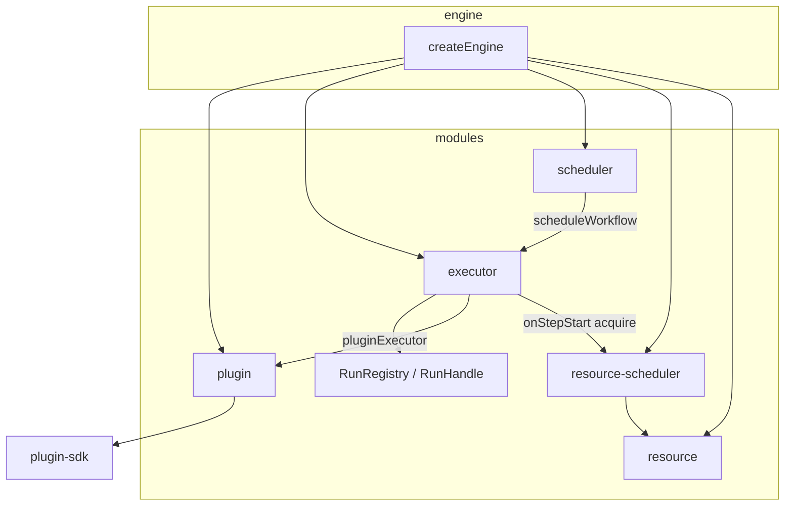

# @monai-devops/core-engine

monai-devops 工作流编排内核。负责 DAG 执行、任务调度、插件注册、资源池与 Run 生命周期控制；插件契约由 [`plugin-sdk`](../plugin-sdk) 定义，本包只依赖 SDK、不反向耦合。

**核心能力**

- 基于 `dependsOn` 的 DAG 编排（环检测、条件分支、并行与 failFast）
- 双层调度：workflow 级任务队列 + step 级资源等待队列
- 结构化生命周期事件（`WorkflowObserver`），供 server/CLI 落库与追踪
- Run 控制：取消（best-effort / hard）、暂停/恢复、进度快照
- 插件协作式取消（`AbortSignal` + `PluginCancelledError`）

## 架构


```mermaid
flowchart TB
  subgraph entry [engine]
    CE[createEngine]
  end
  subgraph modules [modules]
    PM[plugin]
    EX[executor]
    RR[RunRegistry / RunHandle]
    SCH[scheduler]
    RS[resource-scheduler]
    RES[resource]
  end
  SDK[plugin-sdk]
  CE --> PM
  CE --> EX
  CE --> SCH
  CE --> RS
  CE --> RES
  EX --> RR
  PM --> SDK
  EX -->|"pluginExecutor"| PM
  EX -->|"onStepStart acquire"| RS
  RS --> RES
  SCH -->|"scheduleWorkflow"| EX
```

推荐通过 **`createEngine`** 使用默认接线；各子模块也可单独创建，用于定制编排或测试。

## 与 plugin-sdk 的分工

| 类型                                       | 所在包      | 含义                                                                     |
| ------------------------------------------ | ----------- | ------------------------------------------------------------------------ |
| `PluginManifest`                           | plugin-sdk  | 插件注册元数据（name / version）                                         |
| `PluginConfig`                             | plugin-sdk  | 单次 `execute` 入参                                                      |
| `PluginContext`                            | plugin-sdk  | 单次执行上下文（索引签名，无编排字段）                                   |
| `PluginResult`                             | plugin-sdk  | 执行结果（含可选 `code`）                                                |
| `PluginFailureCode` / `PluginFailureCodes` | plugin-sdk  | 插件失败错误码常量                                                       |
| `PluginCancelledError`                     | plugin-sdk  | 插件协作取消时抛出，由 plugin 模块转为 `PLUGIN_CANCELLED` Result         |
| `ExecutionContext`                         | core-engine | 编排器注入的上下文（含 workflow / step / 前序结果等）                    |
| `WorkflowContextKeys`                      | core-engine | 注入字段名常量，供 `getContext` 读取                                     |
| `StepStatus` / `StepStatuses`              | core-engine | 步骤状态：`completed` / `skipped` / `failed`                             |
| `StepFailureKind` / `StepFailureKinds`     | core-engine | 失败分类：`plugin` / `resource` / `internal`                             |
| `SkipReason` / `SkipReasons`               | core-engine | 跳过原因（见错误模型）                                                   |

依赖方向：**core-engine → plugin-sdk**。插件实现只需依赖 SDK；若需读取编排字段，使用 `getContext(ctx, WorkflowContextKeys.xxx)`，字段由 executor 在运行时写入。

### ExecutionContext 与 WorkflowContextKeys

`ExecutionContext` 继承 `PluginContext`，executor 每步注入：

| 字段 | 键名（`WorkflowContextKeys`） | 说明 |
| ---- | ----------------------------- | ---- |
| `workflowId` | `workflowId` | 当前工作流 ID |
| `stepId` | `stepId` | 当前步骤 ID |
| `previousResults` | `previousResults` | 前序非 FAILED 步骤的 `result` map |
| `artifacts` | `artifacts` | 调用方可传入的共享产物 |
| `priority` | — | run 级调度优先级，步骤 `priority` 可覆盖 |
| `runId` | `runId` | 单次 run 标识；由 `workflowRunId` 第一参注入，调用方勿通过 context 传入 |
| `traceId` | `traceId` | 可选，供调用层追踪关联 |
| `logger` | `logger` | 步骤级 `PluginLogger`（`step:start` 后可用） |
| `signal` | `signal` | 可选 `AbortSignal`；hard cancel 或 `pauseRun({ abortInFlight: true })` 时注入 |

`WorkflowContextKeys` 同时 **re-export** `PluginContextKeys`（来自 plugin-sdk）。插件侧推荐用 `getLogger(context)` / `getAbortSignal(context)` 读取 `logger` 与 `signal`。

### workflowRunId 校验

`runWorkflow` / `executeWorkflow` / `scheduleWorkflow` 启动前调用 `assertValidWorkflowRunId`：

- 非空字符串，长度 ≤ 128
- 仅允许 `[A-Za-z0-9_-]+`，**不能含首尾空白**
- 非法时抛出 `WorkflowRunIdValidationError`，**不**发 `workflow:start`
- 同一 `workflowRunId` 不得并发执行两次活跃 Run，否则抛出 `RunAlreadyActiveError`

## 错误模型

各层失败表达方式统一如下：

| 层级       | 失败表达方式                                                             | 示例                               |
| ---------- | ------------------------------------------------------------------------ | ---------------------------------- |
| 插件边界   | `PluginResult { success: false, code?, message? }`                       | 业务失败、插件未找到、execute 异常 |
| 步骤编排   | `ExecutionResult { status: failed, failureKind, error?, pluginResult? }` | 插件失败、资源分配失败             |
| 步骤跳过   | `ExecutionResult { status: skipped, skipReason }`                        | 条件不满足、依赖失败、取消/暂停    |
| 工作流校验 | `throw WorkflowValidationError`                                          | 环依赖、无效 dependsOn（启动前）   |
| Run ID 校验 | `throw WorkflowRunIdValidationError`                                    | workflowRunId 格式非法（启动前）   |
| 并发冲突   | `throw RunAlreadyActiveError`                                            | 同一 workflowRunId 已有活跃 Run    |
| 资源注册   | `throw ResourceRegistrationError`                                      | engine 构造或 `registerResource` 时池已满 |
| 调度器     | `ScheduleResult { success: false, error }`                               | 整次 workflow 任务重试耗尽         |

**原则**：插件层永不 throw（协作取消用 `PluginCancelledError`，由 plugin 模块转为 Result）；基础设施钩子（如资源分配）可 throw `StepExecutionError`，由 executor 统一捕获并转为 `StepStatuses.FAILED`。

**常量（推荐用法，避免硬编码字符串）**

| 常量                 | 所在包      | 键                                                                 |
| -------------------- | ----------- | ------------------------------------------------------------------ |
| `PluginFailureCodes` | plugin-sdk  | `PLUGIN_NOT_FOUND`、`PLUGIN_CONFIG_INVALID`、`PLUGIN_EXECUTION_ERROR`、`PLUGIN_CANCELLED` |
| `StepStatuses`       | core-engine | `COMPLETED`、`SKIPPED`、`FAILED`                                   |
| `StepFailureKinds`   | core-engine | `PLUGIN`、`RESOURCE`、`INTERNAL`                                   |
| `SkipReasons`        | core-engine | `CONDITION_NOT_MET`、`DEPENDENCY_FAILED`、`WORKFLOW_ABORTED`、`USER_CANCELLED`、`PAUSE_INTERRUPTED` |

**WorkflowValidationError**（启动前抛出）

- 重复的步骤 ID
- `dependsOn` 引用不存在的步骤
- 存在循环依赖

**ResourceQueueCancelledError**（resource-scheduler 内部）

- failFast / 用户取消时 `cancelByWorkflowRunId` 取消排队中的资源等待
- `resourceScheduler.destroy()` 销毁调度器
- 由 executor 捕获并转为 `SKIPPED`（`WORKFLOW_ABORTED` 或 `USER_CANCELLED`）

**ResourceRegistrationError**（engine 配置/注册边界）

- `createEngine` 预注册 default 池或 `initialResources` 时池已满
- `engine.registerResource` 动态加槽超过 `maxResources`
- 低层 `createResourceManager().registerResource` 仍返回 `false`，不抛错

**WorkflowRunResult**

| 字段 | 说明 |
| ---- | ---- |
| `success` | `status === 'success'` 时为 `true`（跳过步骤不影响 success） |
| `status` | `'success'` \| `'failed'` \| `'cancelled'` |
| `workflowId` | 工作流定义 ID |
| `results` | 按步骤定义顺序排列的 `ExecutionResult[]` |

`status === 'cancelled'` 当且仅当中止原因为用户取消或 `destroy()`；failFast 导致的中止步骤为 `WORKFLOW_ABORTED`，整次 run 仍为 `failed`（若有步骤 FAILED）或 `success`。

```ts
import { PluginFailureCodes } from '@monai-devops/plugin-sdk';
import { StepStatuses, StepFailureKinds, SkipReasons } from '@monai-devops/core-engine';

const step = run.results[0];
if (step.status === StepStatuses.FAILED) {
  console.log(step.failureKind); // StepFailureKinds.PLUGIN 等
} else if (step.status === StepStatuses.SKIPPED) {
  console.log(step.skipReason); // SkipReasons.CONDITION_NOT_MET 等
}

if (step.pluginResult?.code === PluginFailureCodes.PLUGIN_CANCELLED) {
  /* 协作取消，步骤为 SKIPPED 而非 FAILED */
}
```

**ExecutionResult 字段**

| 字段           | 说明                                                                                 |
| -------------- | ------------------------------------------------------------------------------------ |
| `status`       | `StepStatuses.COMPLETED` \| `SKIPPED` \| `FAILED`                                    |
| `success`      | 与 status 同步：`status !== StepStatuses.FAILED`                                     |
| `failureKind`  | 失败时：`StepFailureKinds.PLUGIN` \| `RESOURCE` \| `INTERNAL`                        |
| `skipReason`   | 跳过时：见 `SkipReasons`                                                             |
| `pluginResult` | 插件返回的原始结果                                                                   |
| `error`        | 失败时的 Error 对象                                                                  |
| `result`       | 成功时为插件 data；跳过时保留 `{ skipped: true, reason }` 以兼容旧断言               |

**PluginFailureCodes**（plugin-sdk，`success: false` 时由 plugin 模块自动填充）

- `PLUGIN_NOT_FOUND` — 插件未注册
- `PLUGIN_CONFIG_INVALID` — 插件 config 校验失败（插件自行返回）
- `PLUGIN_EXECUTION_ERROR` — execute 抛出未捕获异常
- `PLUGIN_CANCELLED` — `PluginCancelledError` 或插件返回该 code；executor 转为 `SKIPPED` 而非 `FAILED`

## Run 控制

每个 `workflowRunId` 对应一个 **`RunHandle`**（由内部 **`RunRegistry`** 管理），跟踪控制态、in-flight 步骤与进度。`createEngine` / `createWorkflowExecutor` 对外暴露 cancel / pause / resume / getRunStatus API。

### RunControlStatus

| 状态 | 含义 |
| ---- | ---- |
| `running` | 正常调度与执行 |
| `pausing` | 已请求暂停，等待 in-flight 步骤结束 |
| `paused` | 已暂停，不再调度新步骤 |
| `cancelling` | 已请求取消，正在收尾 |
| `cancelled` / `finished` / `failed` | 终态（`getRunStatus` 在 unregister 后仍可从缓存读取） |
| `unknown` | `getRunStatus` 查无此 run |

控制操作经 `RunHandle` 内部串行队列（`controlChain`）处理，避免并发 cancel/pause 竞态。

### cancelRun

```ts
await engine.cancelRun(workflowRunId, { mode: 'best-effort' }); // 默认
await engine.cancelRun(workflowRunId, { mode: 'hard' });
```

| mode | 行为 |
| ---- | ---- |
| `best-effort`（默认） | 停止调度后续步骤；in-flight 步骤自然跑完 |
| `hard` | 向所有 in-flight 步骤注入 `AbortSignal`；插件应在检查点响应；超时见 `inFlightTimeoutMs` |

取消受理时发出 `workflow:cancelled`，并联动 `resourceScheduler.cancelByWorkflowRunId` 与 `scheduler.cancelScheduledTaskByWorkflowRunId`。未开始步骤补发 `step:finished`，`skipReason: USER_CANCELLED`。

### pauseRun / resumeRun

```ts
await engine.pauseRun(workflowRunId); // waitInFlight: true（默认）
await engine.pauseRun(workflowRunId, { waitInFlight: false });
await engine.pauseRun(workflowRunId, { abortInFlight: true }); // 等同 waitInFlight + 注入 AbortSignal
await engine.resumeRun(workflowRunId);
```

| 选项 | 默认 | 说明 |
| ---- | ---- | ---- |
| `waitInFlight` | `true` | 有 in-flight 时先进入 `pausing`，待其结束后变为 `paused` 并发出 `workflow:paused` |
| `abortInFlight` | `false` | 为 `true` 时强制 `waitInFlight` 并向 in-flight 注入 `AbortSignal`；被中断步骤为 `SKIPPED / PAUSE_INTERRUPTED` |

暂停期间调度循环阻塞于 `waitUntilResumed()`，恢复后发出 `workflow:resumed`。

### hard cancel 与 in-flight 超时

`ExecutorOptions.inFlightTimeoutMs`（默认 `30000`）在 hard cancel 或 `abortInFlight` 暂停时生效：signal 触发后，若插件在超时内未结束，步骤标记为 `SKIPPED`（`USER_CANCELLED` 或 `PAUSE_INTERRUPTED`），**不**记为 `FAILED`。超时后资源释放会推迟至插件 Promise settle，避免资源被提前归还池内。

插件协作取消示例（plugin-sdk）：

```ts
import { createPlugin, getAbortSignal, throwIfAborted, PluginCancelledError } from '@monai-devops/plugin-sdk';

const plugin = createPlugin({
  name: 'long-task',
  version: '1.0.0',
  execute: async (config, ctx) => {
    const signal = getAbortSignal(ctx);
    for (const chunk of work) {
      throwIfAborted(signal); // 或 signal?.addEventListener('abort', ...)
      await process(chunk);
    }
    return { success: true, data: {} };
  },
});
```

### getRunStatus

```ts
const snap = engine.getRunStatus(workflowRunId);
// { workflowRunId, status, inFlightSteps, progress?: { completed, total } }
```

## 模块说明

### engine（门面）

`createEngine(options?)` 创建引擎实例，串联 plugin、executor、scheduler、resource。

**EngineOptions**

| 选项               | 默认   | 说明                                                                 |
| ------------------ | ------ | -------------------------------------------------------------------- |
| `plugins`          | —      | 初始注册的 `PluginDefinition[]`                                      |
| `maxParallelSteps` | `1`    | 工作流步骤最大并行数                                                 |
| `failFast`         | `true` | 任一步失败后是否停止调度后续步骤                                     |
| `inFlightTimeoutMs`| `30000`| hard cancel / `abortInFlight` 后 in-flight 步骤超时（ms）            |
| `scheduler`        | —      | 传给 `createTaskScheduler` 的选项                                    |
| `resources`        | —      | 传给 `createResourceManager` 的选项（engine 强制 `autoCleanup: false`） |
| `initialResources` | —      | 启动时预注册的资源列表                                               |
| `defaultPoolSize`  | `5`    | `default` 类型资源池槽位数（未声明 `resourceType` 的步骤使用）     |
| `observer`         | —      | 工作流生命周期观察者，见「可观测性」                                 |

**默认资源池**：engine 启动时会注册 `defaultPoolSize` 个 `type: "default"` 的资源（id 形如 `default-0`）。步骤未在 `config.resourceType` 中指定类型时，经 resource-scheduler 从该池分配。

**workflowRunId 与资源分配**：`onStepStart` 使用内核注入的 `context.runId`（来自第一参 `workflowRunId`）调用 resource-scheduler。

**主要 API**

- `runWorkflow(workflowRunId, workflow, context?)` → `WorkflowRunResult`
- `scheduleWorkflow(workflowRunId, workflow, context?)` → `Promise<ScheduleResult>`（整次 workflow 作为调度任务）
- `cancelRun(workflowRunId, options?)` → `Promise<RunControlResult>`
- `pauseRun(workflowRunId, options?)` / `resumeRun(workflowRunId)` → `Promise<RunControlResult>`
- `getRunStatus(workflowRunId)` → `RunStatusSnapshot | undefined`
- `cancelScheduledTask(taskId)` / `getScheduledTaskId(workflowRunId)` → 调度层撤销（`cancelRun` 已联动 `cancelScheduledTaskByWorkflowRunId`）
- `registerPlugin` / `registerPlugins` / `unregisterPlugin` / `getPlugin` / `getPlugins` / `getPluginNames` / `hasPlugin`
- `registerResource(resource)` — 动态注册资源并唤醒等待队列；池满时抛 `ResourceRegistrationError`（`maxResources` 须覆盖 `defaultPoolSize + initialResources.length`）
- `getExecutor()` / `getScheduler()` / `getResourceManager()` / `getResourceScheduler()` — 高级用法
- `destroy()` — 取消所有活跃 Run 后释放 resource-scheduler、资源池定时器与执行历史

### executor（DAG 工作流）

基于 `dependsOn` 构建有向图，启动前做 **环检测**（Kahn），非法图抛出 `WorkflowValidationError`。

- **并行**：就绪步骤在 `maxParallelSteps` 限制下并行执行
- **failFast: true**（默认）：已有步骤失败后，不再调度未开始步骤；进行中的步骤会跑完
- **failFast: false**：依赖失败的下游标记为 `status: StepStatuses.SKIPPED`、`skipReason: SkipReasons.DEPENDENCY_FAILED`
- **条件**：结构化 `StepCondition`（`when` / `equals` / `exists`），不满足则 `status: StepStatuses.SKIPPED`、`skipReason: SkipReasons.CONDITION_NOT_MET`
- **failFast 中止**：仍在就绪队列但尚未开始的步骤补发 `step:finished`，`skipReason: SkipReasons.WORKFLOW_ABORTED`；因依赖失败而跳过的下游仍为 `DEPENDENCY_FAILED`
- **钩子**：`onStepStart` / `onStepComplete` / `onStepError`（engine 内用于资源分配；高级定制用）
- **观察者**：`observer.onEvent` 接收结构化生命周期事件（推荐调用层使用）

也可单独使用 `createWorkflowExecutor(options)`（别名 `createExecutor`），自行注入 `pluginExecutor` 与 `observer`。

**Executor 额外 API**（经 `getExecutor()` 获取）

| 方法 | 说明 |
| ---- | ---- |
| `executeStep(workflowRunId, step, context, meta?)` | 单步执行；无 `workflow:start` / `workflow:finished` |
| `cancelRun` / `pauseRun` / `resumeRun` / `getRunStatus` / `destroyActiveRuns` | Run 控制 API（engine 透传） |
| `getExecutionHistory(workflowRunId)` | 该 run 的步骤结果（按 `workflowRunId` 隔离） |
| `clearHistory()` | 清空历史（`destroy()` 时也会调用） |

**StepCondition 求值**（基于 `previousResults[when]`）

| 字段 | 行为 |
| ---- | ---- |
| `exists: true` | 值不为 `undefined` / `null` |
| `exists: false` | 值为 `undefined` 或 `null` |
| `equals` | 严格相等 `===` |
| 均未指定 | 值不为 `undefined` / `null` 即通过 |

**previousResults**：仅包含**非 FAILED** 步骤的 `result`；FAILED 步骤不会写入前序结果 map。

## 可观测性

执行过程中通过 **`WorkflowObserver`** 向调用层暴露结构化事件；engine **不包含**持久化、HTTP 或追踪 SDK，由 server/CLI 在 `onEvent` 中自行落库、打日志、接 OpenTelemetry。

### WorkflowObserver

```ts
import {
  createEngine,
  WorkflowEventTypes,
  type WorkflowLifecycleEvent,
  type WorkflowObserver,
} from '@monai-devops/core-engine';

const observer: WorkflowObserver = {
  onEvent: async (event: WorkflowLifecycleEvent) => {
    switch (event.type) {
      case WorkflowEventTypes.WORKFLOW_START:
        break;
      case WorkflowEventTypes.STEP_QUEUED:
        break;
      case WorkflowEventTypes.STEP_START:
        break;
      case WorkflowEventTypes.STEP_FINISHED:
        break;
      case WorkflowEventTypes.PLUGIN_LOG:
        break;
      case WorkflowEventTypes.WORKFLOW_CANCELLED:
        break;
      case WorkflowEventTypes.WORKFLOW_PAUSED:
        break;
      case WorkflowEventTypes.WORKFLOW_RESUMED:
        break;
      case WorkflowEventTypes.WORKFLOW_FINISHED:
        break;
    }
  },
};

const engine = createEngine({ plugins: [...], observer });

await engine.runWorkflow('550e8400-e29b-41d4-a716-446655440000', workflow, {
  traceId: 'trace-from-request',
});
```

### 事件类型

| 事件                | 触发时机                                                                |
| ------------------- | ----------------------------------------------------------------------- |
| `workflow:start`    | DAG 校验通过后、任一步骤开始前                                          |
| `step:queued`       | 步骤进入资源调度队列（条件跳过**不**触发）                              |
| `step:start`        | 资源分配成功后、插件执行前（条件跳过**不**触发）                        |
| `plugin:log`        | 插件通过 `getLogger(context)` 写日志；在 `step:start` 与 `step:finished` 之间 |
| `step:finished`     | 步骤结束（成功、失败、跳过均触发；失败只发此事件，不发单独 error 事件） |
| `workflow:cancelled`| 用户/destroy 取消受理时（尽力取消阶段）                                 |
| `workflow:paused`   | Run 进入 `paused` 控制态                                                |
| `workflow:resumed`  | Run 从 `paused` 恢复为 `running`                                        |
| `workflow:finished` | 所有步骤处理完毕；`result.status` 可为 `success` / `failed` / `cancelled` |

**plugin:log 语义**

- executor 在 `step:start` 后向插件 context 注入 `PluginLogger`（键名 `WorkflowContextKeys.logger`）
- 日志经 `createContextLogger` 串行 emit，**全部 flush 完成后**才发出 `step:finished`
- 并发 `log.info` 等调用顺序与调用顺序一致
- `onEvent` 处理 `plugin:log` 时若 **throw**，当前步骤标记为 `FAILED / INTERNAL`

每条事件顶层携带 **`workflowRunId`**，以及 **`WorkflowRunMeta`**：`workflowId`、可选 `traceId`、原始 `context`（不含实例 ID）。

- **`workflowRunId`**：调用方通过 `runWorkflow` / `executeWorkflow` 第一参传入；内核校验后注入每步 `ExecutionContext.runId`。
- **`traceId`**：通过 `context` 传入；供调用层日志/追踪关联，engine 不接入 OTel。

### 语义说明

- **并行步骤**：`step:finished` 顺序不保证，调用方按 `stepId` / `workflowRunId` 聚合。
- **DAG 非法**：抛出 `WorkflowValidationError`，**不**发 `workflow:start`。
- **workflowRunId 非法**：抛出 `WorkflowRunIdValidationError`，**不**发 `workflow:start`。
- **failFast**：仍在就绪队列但尚未开始的步骤会补发 `step:finished`（`skipReason: WORKFLOW_ABORTED`）；因依赖失败跳过的下游为 `DEPENDENCY_FAILED`。均写入最终 `result.results`。
- **单独 `executeStep`**：无 `workflow:start` / `workflow:finished`；第一参为 `workflowRunId`，仅在有 `observer` 且传入 `meta` 时发步骤事件。

### ExecutorOptions.observer

直接使用 `createWorkflowExecutor({ observer })` 时行为与经 `createEngine` 透传一致。`onStepStart` / `onStepComplete` / `onStepError` 保留给引擎内部（资源分配）或高级定制，对外推荐 `observer`。

### scheduler（任务队列 + 小顶堆）

待执行任务保存在 **小顶堆** [`utils/min-heap.ts`](./utils/min-heap.ts)（包入口不导出，仅供 scheduler 内部使用）。

| 操作        | 复杂度   |
| ----------- | -------- |
| 入队 `push` | O(log n) |
| 出队 `pop`  | O(log n) |

**优先级规则（务必注意）**

- `priority` **数值越小，越先执行**（`0` 先于 `10`），与「数值越大越优先」的系统相反
- 同 `priority` 时，按 `createdAt` **先入先出**

**SchedulerOptions**

| 选项             | 默认   | 说明             |
| ---------------- | ------ | ---------------- |
| `maxConcurrency` | `5`    | 同时运行的任务数 |
| `retryAttempts`  | `3`    | 失败重试次数（仅对 `execute` **抛错**生效；`retryable: false` 的任务不重试） |
| `retryDelay`     | `1000` | 重试间隔（ms）   |

`scheduleTask(task)` 返回 `Promise<ScheduleResult>`，任务完成后 resolve；`getQueueStatus()` 返回 `queueLength`、`runningTasks`、`maxConcurrency`。支持按 `workflowRunId` 取消排队任务（`cancelScheduledTaskByWorkflowRunId`）。`scheduleWorkflow` 提交的任务自带 `retryable: false`（工作流业务失败不 throw，整次重跑非幂等）。

### plugin（插件注册表）

`createPluginManager()`（别名 `createManager`）提供注册、卸载、`executePlugin(name, config, context)`。未找到插件或 execute 内未捕获异常时返回带 `PluginFailureCodes` 的 `{ success: false, message }`（不抛错）；`PluginCancelledError` 转为 `PLUGIN_CANCELLED`。engine 透传 Result，executor 将 `PLUGIN_CANCELLED` 转为 `SKIPPED`，其余失败转为 `ExecutionResult.status: StepStatuses.FAILED`。

额外导出 **`createContextLogger({ emit })`**：将 `PluginLogger` 桥接到自定义 emit（executor 内部用于 `plugin:log`）；返回 `{ logger, flush }`，`flush()` 等待已入队日志全部 emit。

| 方法 | 说明 |
| ---- | ---- |
| `clearPlugins()` | 清空注册表 |
| `getStats()` | `{ total, plugins }` |

### resource-scheduler（Step 级资源调度队列）

`createResourceStepScheduler` 按 **resourceType** 维护独立小顶堆队列，最小调度单元为单个 workflow 的单个 step（队列项 ID：`${workflowRunId}:${stepId}`）。

- **资源不足**：步骤挂起等待，**不**立即失败；`maxParallelSteps` 等待期间仍占用 inFlight 槽位
- **排序**：`priority` 数值越小越优先；同 priority 按入队时间 FIFO
- **优先级来源**：`step.priority ?? context.priority ?? 0`
- **failFast / 取消**：`cancelByWorkflowRunId` 取消同 run 下排队步骤，转为 `SKIPPED`
- **唤醒**：`releaseResource` 或 `registerResource` 触发 `onResourceAvailable` 回调后重新 `processQueue`
- **API**：`acquire` / `cancelByWorkflowRunId` / `getQueueStatus` / `notifyResourceAvailable` / `destroy`

### resource（资源池）

`createResourceManager` 管理 `available` / `allocated` / `released` 状态。

**ResourcePoolOptions**

| 选项 | 默认 | 说明 |
| ---- | ---- | ---- |
| `maxResources` | `10` | 池内资源数量上限 |
| `autoCleanup` | `true` | 为 `true` 时 `release` 后延迟删除；engine 构造时覆盖为 `false` |
| `cleanupInterval` | `60000` | 自动清理间隔（ms） |
| `onResourceAvailable` | — | 有空闲资源时回调（engine 用于唤醒 resource-scheduler） |

- 步骤 `config.resourceType` 为字符串时，engine 经 resource-scheduler `acquire` 分配、`onStepComplete` / `onStepError` 释放
- `autoCleanup: false`（engine 默认）时 `release` 将资源归还为 `available` 供复用
- 分配/释放对同一 id 使用互斥，避免并发竞态
- **API**：`registerResource` / `hasAvailable` / `allocateResource` / `releaseResource` / `getResource` / `getAllResources` / `getAvailableResources` / `cleanupResources` / `destroy`

## 快速开始

```ts
import { createEngine, WorkflowContextKeys } from '@monai-devops/core-engine';
import { createPlugin, getContext } from '@monai-devops/plugin-sdk';

const echoPlugin = createPlugin({
  name: 'echo',
  version: '1.0.0',
  execute: async (config, ctx) => {
    const stepId = getContext<string>(ctx, WorkflowContextKeys.stepId);
    return { success: true, data: { stepId, value: config.value } };
  },
});

const engine = createEngine({
  plugins: [echoPlugin],
  maxParallelSteps: 2,
  failFast: true,
});

const run = await engine.runWorkflow('demo-run-id', {
  id: 'demo',
  name: 'Demo Pipeline',
  steps: [
    { id: 'a', name: 'A', plugin: 'echo', config: { value: 1 } },
    { id: 'b', name: 'B', plugin: 'echo', config: { value: 2 } },
    {
      id: 'c',
      name: 'C',
      plugin: 'echo',
      config: { value: 3 },
      dependsOn: ['a', 'b'],
    },
  ],
});

console.log(run.status, run.success, run.results[0]?.status);
engine.destroy();
```

异步投递到调度器：

```ts
const scheduled = await engine.scheduleWorkflow('demo-async-run-id', {
  id: 'demo-async',
  name: 'Async',
  steps: [{ id: 's1', name: 'S1', plugin: 'echo', config: {} }],
});
// scheduled.result 为 WorkflowRunResult（scheduleTask 的 result 字段）
```

Run 控制：

```ts
const runPromise = engine.runWorkflow('long-run', workflow);
await engine.pauseRun('long-run');
const status = engine.getRunStatus('long-run'); // status: 'paused'
await engine.resumeRun('long-run');
// 或
await engine.cancelRun('long-run', { mode: 'hard' });
const result = await runPromise; // result.status === 'cancelled'
```

## 工作流定义要点

**WorkflowDefinition**

- `id` / `name`：工作流标识与展示名
- `steps`：`WorkflowStep[]`

**WorkflowStep**

| 字段        | 说明                                                       |
| ----------- | ---------------------------------------------------------- |
| `id`        | 步骤唯一 ID                                                |
| `name`      | 展示名                                                     |
| `plugin`    | 已注册插件名                                               |
| `config`    | `PluginConfig`，步骤入参                                   |
| `dependsOn` | 依赖的步骤 ID 列表                                         |
| `condition` | 可选，`{ when, equals?, exists? }`，`when` 指向前序步骤 ID |
| `priority`  | 可选，资源调度优先级，数值越小越优先；默认继承 run 级 `context.priority` 或 `0` |

**config 约定**

- `resourceType?: string` — 需要资源池时声明类型，由 engine 自动分配/释放

## 包导出

入口 [`index.ts`](./index.ts) 从包根 `@monai-devops/core-engine` 导出（无子路径 deep import）：

| 模块 | 主要导出 |
| ---- | -------- |
| `./engine` | `createEngine`、`EngineOptions` |
| `./executor` | `createWorkflowExecutor`（`createExecutor`）、`assertValidWorkflowRunId`、`RunHandle`、`RunRegistry`、`WorkflowDefinition`、`ExecutionContext`、`ExecutionResult`、`WorkflowRunResult`、Run 控制类型与 API |
| `./scheduler` | `createTaskScheduler`（`createScheduler`）、`Task`、`ScheduleResult` |
| `./plugin` | `createPluginManager`（`createManager`）、`createContextLogger` |
| `./resource` | `createResourceManager`、`Resource` |
| `./resource-scheduler` | `createResourceStepScheduler` |
| `./observer` | `WorkflowObserver`、`WorkflowLifecycleEvent`、`WorkflowRunMeta`、`WorkflowEventTypes` |
| `./context-keys` | `WorkflowContextKeys`（含 `PluginContextKeys` re-export） |
| `./errors` | `StepExecutionError`、`WorkflowValidationError`、`WorkflowRunIdValidationError`、`ResourceQueueCancelledError`、`ResourceRegistrationError`、`RunAlreadyActiveError`、`StepStatuses`、`StepFailureKinds`、`SkipReasons` 及对应类型 |

## 开发与测试

```bash
# 类型检查
pnpm --filter core-engine check-types

# 构建
pnpm --filter core-engine build

# 单元测试（递归 __tests__，见 scripts/run-tests.mjs）
pnpm --filter core-engine test
```

**要求**：Node.js ≥ 20。

测试覆盖：DAG 并行与 failFast、engine 集成、错误模型、observer（含 `plugin:log` 顺序与失败语义）、scheduler（含优先级、并发与取消）、min-heap、resource 生命周期、resource-scheduler 队列与 cancel、**executor run control**（cancel/pause/resume、hard cancel、parallel、依赖链 pause、`abortInFlight`、`RunAlreadyActiveError`）、`workflowRunId` 校验。

## 子模块独立使用

不必经过 `createEngine`，可按需组合：

```ts
import {
  createWorkflowExecutor,
  createTaskScheduler,
  createPluginManager,
} from '@monai-devops/core-engine';
```

## 后续规划

- 生产级工作流 HTTP API 与持久化（`apps/server` 已有 test-devops 闭环验证）
- 表达式级 `condition`（当前仅为结构化条件）
- 插件子进程 / 外部任务的强制回收策略（hard cancel 超时后的孤立任务）
